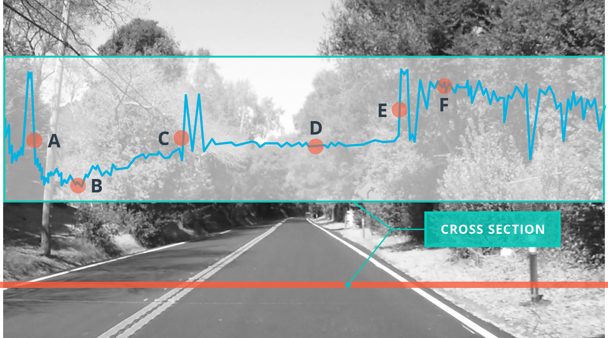

# Quiz: Canny Edge Detection

The red line in the plot shows where a cross section was took through the image. The wiggles in the blue line indicate changes in intensity along that cross section through the image. Check all letters along this cross section, where you expect to find strong edges.

> Note: Edges can be found where the pixel values are changing rapidly

- A
- B
- C
- D
- E
- F