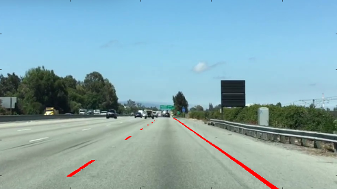

# Quiz Solution: Combining Color and Region Selections

After selecting `red_threshold = green_threshold = blue_threshold = 200`, the chosen vertices of the triangle were `left_bottom = [0, 539]`, `left_bottom = [0, 539]` and `apex = [475, 320]`, which produced the result shown below:

**Figure 1: The original image**

**Figure 2: Region and color selection applied**

**Figure 3: Lines Identified**