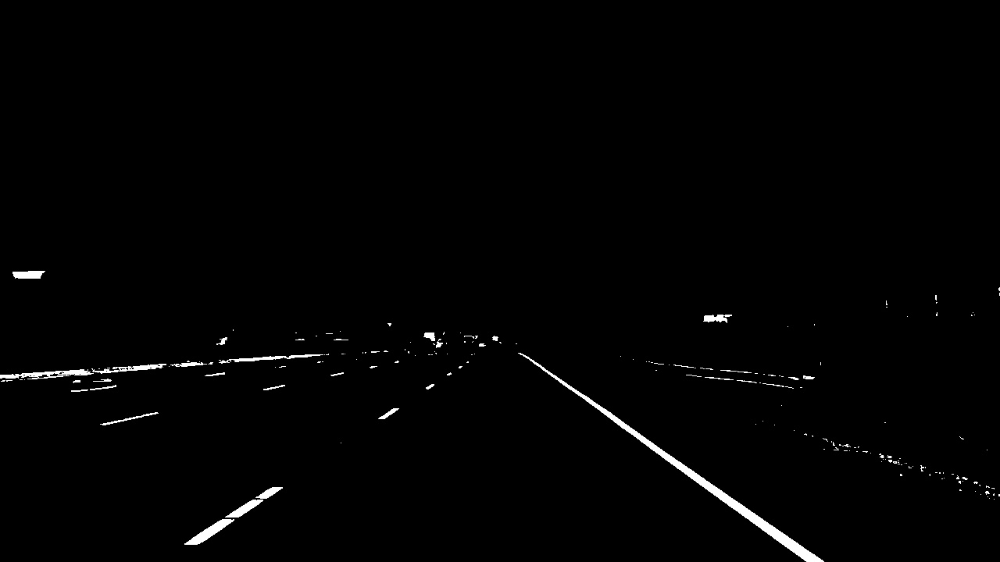

# Quiz: Color Selection

Modify the values of the variables `red_threshold`, `green_threshold` and `blue_threshold` until you retain as much of the lane lines as possible while getting rid of most of the other stuff. When you run the code, your image should output with an example image next to it.

**The original image**

**The color selection applied**

Make the appropriate changes to the python script [quiz.py](quiz.py)