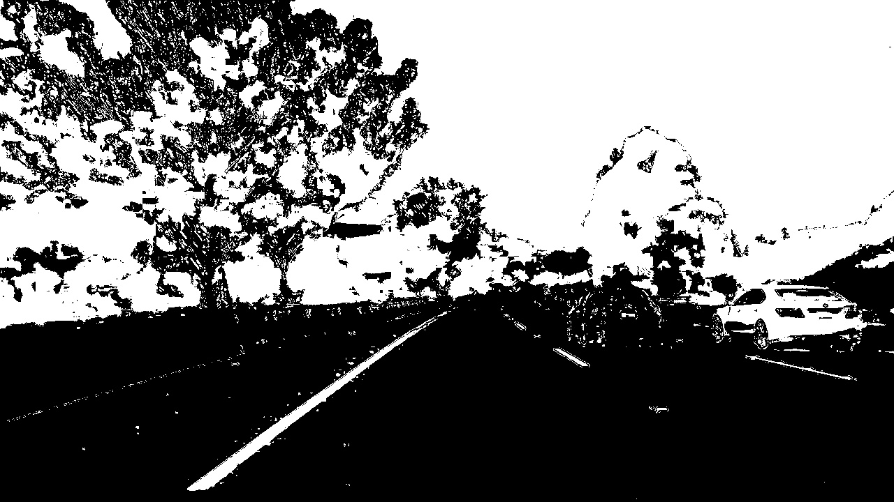
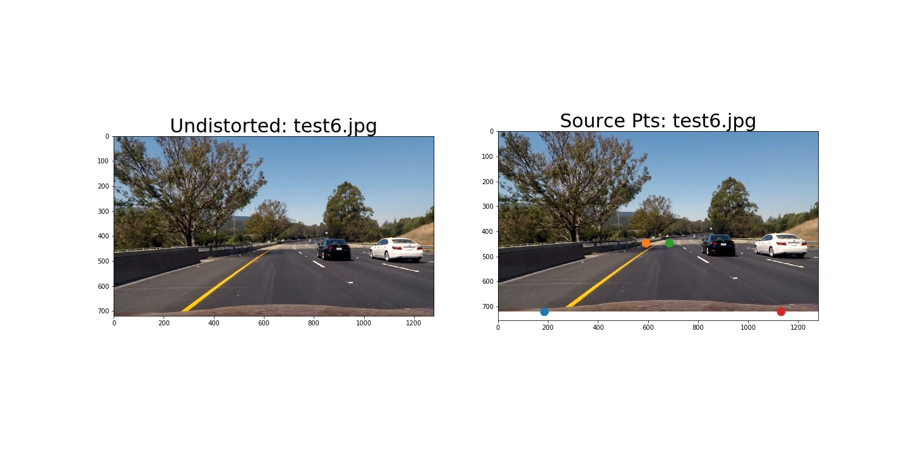
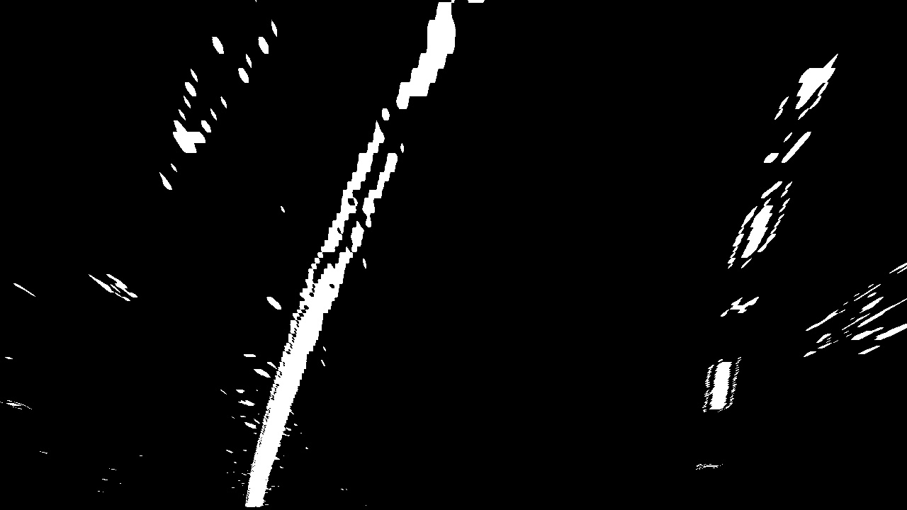

# Camera Calibration

Learn how to calibrate your camera to remove inherent distortions that can affect its perception of the world.

## The Challenges with Cameras

We are going to give you data that's more realistic, harder, you're going to find shades and curvature and you have to play around with new stuff.

You have to understand camera geometry and color spaces much more deeply on the way to become a computer vision expert.

## Welcome to Computer Vision

Robotics can be broken down into a three step cycle. The first step is to sense or perceive the world, the second step is to decide what to do based on that perception and the third step is to perform an action to carry out that decision. Computer vision is a major part of that perception step in that cycle. If you ask Sebastian, he will tell you that 80% of the challenge of building a self-driving car is perception.

This module is all about perception. Computer vision is the art and science of perceiving and understanding the world around you through images. In the case of self-driving cars, computer vision helps us detect lane markings, vehicles, pedestrians and other elements in the environment in order to navigate safely.

Later in this nanodegree program, you will be using laser and radar data for the task of perception. Why bother doing this at all with camera images when we have more sophisticated instruments at our disposal?

Self-driving cars deploy a suite of sophisticated sensors, but humans do the job of driving with just two eyes and one good brain. Let's take a closer look at why using cameras instead of other sensors might be an advantage in developing self-driving cars.

| Sensors | Spatial Resolution | 3D | Cost |
| ------- | ------------------ | -- | ---- |
| Radar + Lidar | Low | Yes | $$$ |
| Single Camera | High | No | $ |

Radar and Lidar see the world in 3D, which can be a big advantage for knowing where you are relative to your environment. A camera sees in 2D, but at much higher spatial resolution than Radar and Lidar such that it is actually possible to infer depth information from camera images. The big difference comes down to cost where cameras are significantly cheaper. It is possible that self-driving cars will be outfitted with a handful of cameras and a really smart algorithm to do the driving.

## Overview

You are going to write a better lane finding algorithm that deals with complex scenarios like curving lines, shadows and changes in the color of the pavement. You'll measure things like how much the lane is curving and where your vehicle is with respect to center. These are the measurements you ultimately need to make in order to control the car.

After that, you will implement vehicle detection and tracking. While deciding when to change lanes, when to accelerate and when to hit the brakes, knowing where the other vehicles are on the road is crucial to the decision-making process. Some people change lanes without looking and it does not end well.

The project for this module will come in two pieces. First the advanced lane finding piece and second the vehicle detection and tracking piece. At the end, you will combine these two pieces to simultaneously measure where the car is on the road, where the road is going and the location of other vehicles in your field of view.

## Getting Started

How should we get started finding lane lines?

Your ultimate goal is to measure some of the quantities that need to be known in order to control the car. For example, to steer a car, you will need to measure how much your lane is curving. To do that, you will need to map out the lanes in your camera images after transforming them to a different perspective. One way, you're looking down on the road from above. But, in order to get this perspective transformation right, you first have to correct for the effect of image distortion. Cameras do not create perfect images. Some of the objects in the images, especially the ones near the edges can get stretched or skewed in various ways and you need to correct for that. Step 1 is how to undistort your distorted camera images.

## Distortion Correction

When we talk about image distortion, we are talking about what happens when a camera looks at 3D objects in the real world and transforms them into a 2D image. This transformation is not perfect. For example, here is an image of a road and some images taken through different camera lenses that are slightly distorted. In these distorted images, you can see that the edges of the lanes are bent and sort of rounded or stretched outward. Distortion is changing what the shape and size of these objects appear to be. This is a problem because we are trying to accurately place the self-driving car in this world. Eventually we will want to look at the curve of a lane and steer the correct direction. But if the lane is distorted, we will get the wrong measurement for curvature and our steering angle will be wrong. So the first step in analyzing camera images is to undo this distortion so we can get correct and useful information out of them.

## Quiz: Effects of Distortion

Enter the [Effects of Distortion Quiz](quizzes/effects-of-distortion/quiz.md)

## Pinhole Camera Model

Before we get into the code and start correcting for distortion. First let's get some intuition on how this distortion occurs.

Here is a simple model of a camera called the pinhole camera model. When a camera forms an image, it is looking at the world similar to how our eyes do, by focusing the light that's reflected off of objects in the world. In this case through a small pinhole, the camera focuses the light that's reflected off of a 3D traffic sign and forms a 2D image at the back of the camera where a sensor or some film would be placed. In fact, the image it forms here will be upside down and reversed because rays of light that enter from the top of an object will continue on that angled path through the pinhole and end up at the bottom of the formed image. Similarly, light that reflects off the right side of an object will travel to the left of the formed image. In math this transformation from 3D object points, P of X, Y and Z to 2D image points, P of X and Y is done by a transformative matrix called the camera matrix. We will need the camera matrix to calibrate the camera. P ~ Cp.

However, real cameras do not use tiny pinholes, they use lenses to focus multiple light rays at a time, which allows them to quickly form images. But lenses can introduce distortion too. Light rays often bend too much or too little at the edges of a curved lens on a camera and this creates the effect we looked at earlier that distorts the edges of images, so that lines or objects appear more or less curved than they actually are. This is called **radial distortion** and it is the most common type of distortion. Another type is **tangential distortion** if a camera's lens is not aligned perfectly parallel to the imaging plane where the camera film or sensor is, this makes an image look tilted, so that some objects appear further away or closer than they actually are.

There are examples of lenses that purposely distort images like fisheye or wide angle lenses, which keep radial distortion for stylistic effect. But for our purposes, we are using these images to position our self driving car and eventually steer it in the right direction. So, we need undistorted images that accurately reflect our real world surroundings.

This distortion can be captured by 5 numbers called distortion coefficients whose values reflect the amount of tangential distortion in an image. In severly distorted cases, sometimes even more than 5 coefficients are required to capture the amount of distortion. If we know these coefficients, we can use them to calibrate our camera and undistort our images. The mathematical details for correcting distortion are in the notes below.

**Distortion Coefficients and Correction**

There are three coefficients needed to correct for **radial distortion**: k1, k2 and k3. One can use a correction formula to correct the appearance of radially distorted points in an image.

In the following equations, (x, y) is a point in a distorted image. To undistort these points, OpenCV calculates **r**, which is the distance between a point in an undistorted (corrected) image (Xcorrected, Ycorrected) and the center of the image distortion, which is often the center of that image (Xc, Yc). This center (Xc, Yc) is sometimes referred to as the ***distortion center***. 

> Note: the distortion coefficient **k3** is required to accurately reflect _major_ radial distortion (like in wide angle lenses). However, for minor radial distortion, which most regular camera lenses have, k3 has a value close to or equal to zero and is negligible. So in OpenCV, you can choose to ignore this coefficient, this is why it appears at the end of the distortion values array: [k1, k2, p1, p2, k3]. In this course, we will use it in all calibration calculations so our calculations apply to a _wider_ variety of lenses (wider, like wide angle) and can correct for both minor and major radial distortion.

Points in a distorted and undistorted (corrected) image. The point (x, y) is a single point in a distorted image and (x_corrected, y_corrected) is where that point will appear in the undistorted (corrected) image.

Radial distortion correction:

~~~
X_distorted = X_ideal(1 + k1r^2 + k2r^4 + k3r^6)
Y_distorted = Y_ideal(1 + k1r^2 + k2r^4 + k3r^6)
~~~

There are two more coefficients that account for **tangential distortion**: p1 and p2. This distortion can be corrected using a different correction formula.

Tangential distortion correction:

~~~
X_corrected = X + [2p1xy + p2(r^2 + 2x^2)]
Y_corrected = Y + [p1(r^2 + 2y^2) + 2p2xy]
~~~

Next we will see how to get these coefficients and calibrate a camera.

## Quiz: Image Formation

Enter the [Image Formation Quiz](quizzes/image-formation/quiz.md)

## Measuring Distortion

Distortion changes the size and shapes of objects in an image, but how do we calibrate for that?

Well we can take pictures of known shapes, then we will be able to detect and correct any distortion errors. We can choose any shape to calibrate our camera and we will use a chessboard. A chessboard is great for calibration because of its regular high contrast pattern makes it easy to detect automatically. We also know what an undistorted flat chessboard looks like. So, if we use our chessboard to take multiple pictures of a chessboard against a flat surface, then we will be able to detect any distortion by looking at the difference between the apparent size and the shape of the squares in these images and the size and shape that they actually are. Then we will use that information to calibrate our camera, create a transform that maps these distorted points to undistorted points and finally undistort any images.

Let's see how to do this all using Python and OpenCV.

## Finding Corners

You will use the OpenCV functions `findChessboaardCorners()` and `drawChessboaardCorners()` to automatically find and draw corners in an image of a chessboard pattern. 

To learn more about these OpenCV functions, visit the documentation.

In the following exercise, count the number of corners in any given row and enter that value in `nx`. Then count the numberr of corners in a given column and store that in `ny`. Keep in mind corners are only points where two black and two white squares intersect. Words only count inside corners, not outside corners.

~~~python
import numpy as np
import cv2
import matplotlib.pyplot as plt
import matplotlib.image as mpimg

# prepare object points
# corners are points when two black/white squares intersect

# Enter the number of corners in any given row
nx = 8
ny = 6

fname = 'calilbration_test.png'
img = cv2.imread(fname)

# convert to grayscale 
gray = cv2.cvtColor(img, cv2.COLOR_BGR2GRAY)

# Find the chessboard corners
ret, corners = cv2.findChessboardCorners(gray, (nx, ny), None)

# If found, draw corners
if ret == True:
    # Draw and display the corners
    cv2.drawChessboardCorners(img, (nx, ny), corners, ret)
    plt.imshow(img)
~~~

**Solution**

You can count these in the image above - there are eight inside corners for x (nx = 8) and six inside corners for y (ny = 6).

## Calibrating Your Camera

We'll go through the camera calibration steps in a Jupyter notebook. The first step is to read in calibration images of a chessboard. It is recommended to use at least 20 images to get a reliable calibration. For this example, we have a lot of examples in this calibration images folder.
They are all images of a chessboard taken at different angles and distances.
There's also a test image. I'll eventually want to test my camera calibration and undistortion on. Each chessboard has 8x6 corners to detect. I'll go through the calibration steps for the first calibration image in detail.

First you can see I've done my numpy, cv and plotting imports.

~~~python
import numpy as np
import cv2
import matplotlib.pyplot as plt
import matplotlib.image as mpimg
%matplotlib inline
~~~

Then I will read in the first image calibration1.jpg and display it.

~~~python
img = mpimg.imread('images/calibration/calibration1.jpg')
plt.imshow(img)
~~~

I'll map the coordinates of the corners in this 2D image, which I will
call it's image points to the 3D coordinates of the real undistorted
chessboard corners, which I will call object points.

So, I will set up two empty arrays to hold these points: object points and image points. 

The object points will all be the same just the known object coordinates
of the chessboard corners for an 8x6 board. These points will be 3D
coordinates, x,y,z from the top left corner (0,0,0) to bottom right (7,5,0)
The z coordinate will be zero for every point since the board is on a
flat image plane. X and Y will be all the coordinates of the corners.

~~~python
objpoints = [] # 3D points in real world space
imgpoints = [] # 2D points in image plane
~~~

I'll prepare these object points by creating 6x8 points in an array each with 3 columns for the x,y,z coordinates of each corner. I'll initialize these all as zeros using numpy's zero function. 

~~~python
objp = np.zeros((6*8, 3), np.float32)
~~~

The z coordinate will stay zero, so I'll leave that as it is but for our first two columns x and y, I'll use numpy's mgrid function to generate the coordinates I want. mgrid returns the coordinate values for a given grid size. I'll shape those coordinates back into two columns, one for x and one for y.

~~~python
objp[:,:,2] = np.mgrid[0:8,0:6].T.reshape(-1,2) # x,y coordinates
~~~

Next to create the image points, I want to look at the distorted calibration image and detect the corners of the board. OpenCV gives us an easy way to detect chessboard corners with a function called `findChessboardCorners()` that returns the corners found in a grayscale image. So, I will convert this image to grayscale, then pass that into the `findChessboardCorners()` function. This takes in our grayscale image along with the dimensions of the chessboard corners. In this case, 8x6 and the last parameter is for any flags. There are no flags in this example.

~~~python
# convert image to grayscale
gray = cv2.cvtColor(img, cv2.COLOR_BGR2GRAY)
# detect chessboard corners
ret, corners = cv2.findChessboardCorners(gray, (8,6), None)
~~~

If this function detects corners, I will append those points to the image points array. I will also add our prepared object points, objp to the object points array. These object points will be the same for all of the calibration images since they represent a real chessboard. Next, I will also draw the detected corners with a call to `drawChessboardCorners()` that takes in our image, corner dimensions and corner points and I will display these corners, so we can see what was detected in an interactive window.

~~~python
# if corners are found, add object points, image points
if ret == True:
    imgpoints.append(corners)
    objpoints.append(objp)

    # draw and display the corners
    img = cv2.drawChessboardCorners(img, (8,6), corners, ret)
    plt.imshow(img)
~~~

When we look at the image, it looks like the points were detected accurately. The next step is to do this for all the calibration images. I can read in all the calibration images by importing the glob api, which helps read in images with a consistent filename like calibration1, 2, 3 and son. Then I will iterate through each image file detecting corners and appending points to the object and image points arrays. Then later we will be able to use the object points and image points to calibrate this camera. I will show you the OpenCV functions you need to calibrate the camera and undistort images.

~~~python
for fname in images:
    # read in each image
    img = mpimg.imread(fname)

    # Convert image to grayscale
    gray = cv2.cvtColor(img, cv2.COLOR_BGR2GRAY)

    # Find the chessboard corners
    ret, corners = cv2.findChessboardCorners(gray, (8, 6), None)

    # if corners are found, add object points, image points
    if ret == True:
        imgpoints.append(corners)
        objpoints.append(objp)

        # draw and display the corners
        img = cv2.drawChessboardCorners(img, (8,6), corners, ret)
        plt.imshow(img)    
~~~

To calibrate a camera, OpenCV gives us the `calibrateCamera()` function:

~~~python
cv2.calibrateCamera(objpoints, imgpoints, gray.shape[::-1], None, None)
~~~

This takes in our object points, image points and our shape of the image. The shape of the image is just the height and width. To retrieve the shape values, we can get them from the grayscale image array using `gray.shape[::-1]`. Another way to retrieve the image shape is directly from the color image's first two values using `img.shape[1::-1]`. By using these inputs (object points, image points, image shape), it calculates and returns the distortion coefficients `dist` and the camera matrix `mtx` that we need to transform 3D object points to 2D image points. It also returns the position of the camera in the world with values for a rotation `rvecs` and translation `tvecs` vectors.

> Note: the shape of a color image willinclude three values -- height, width and the number of color channels. For example, (960, 1280, 3)

The next function you will need is undistort:

~~~python
dst = cv2.undistort(img, mtx, dist, None, mtx)
~~~

This function takes in an undistorted image `img`, our camera matrix `mtx` and distortion coefficients `dist`. It returns an undistorted often called destination image `dst`.

## Correcting for Distortion

**Figure 1:** Original and Undistorted Image

Here you will get the chance to try camera calibration and distortion correction.

There are two main steps in this process: use chessboard images to obtain image points and object points, then use the OpenCV functions `cv2.calibrateCamera()` and `cv2.undistort()` to compute the calibration and undistortion.

Unfortunately, we can't perform the extraction of object points and image points in the browser quiz editor, so we provide these for you in the quiz below.

Try computing the calibration and undistortion in the exercise below:

~~~python
import pickle
import cv2
import numpy as np
import matplotlib.pyplot as plt
import matplotlib.image as mpimg

# Read in the saved objpoints and imgpoints
dist_pickle = pickle.load( open( "wide_dist_pickle.p", "rb" ) )
objpoints = dist_pickle["objpoints"]
imgpoints = dist_pickle["imgpoints"]

# Read in an image
img = cv2.imread('test_image.png')

# TODO: Write a function that takes an image, object points, and image points
# performs the camera calibration, image distortion correction and 
# returns the undistorted image
def cal_undistort(img, objpoints, imgpoints):
    # Use cv2.calibrateCamera() and cv2.undistort()
    ret, mtx, dist, rvecs, tvecs = cv2.calibrateCamera(objpoints, imgpoints, img.shape[1::-1], None, None)
    undist = cv2.undistort(img, mtx, dist, None, mtx)
    return undist

undistorted = cal_undistort(img, objpoints, imgpoints)

f, (ax1, ax2) = plt.subplots(1, 2, figsize=(24, 9))
f.tight_layout()
ax1.imshow(img)
ax1.set_title('Original Image', fontsize=50)
ax2.imshow(undistorted)
ax2.set_title('Undistorted Image', fontsize=50)
plt.subplots_adjust(left=0., right=1, top=0.9, bottom=0.)
~~~

One Example Solution:

~~~python
def cal_undistort(img, objpoints, imgpoints):
    ret, mtx, dist, rvecs, tvecs = cv2.calibrateCamera(objpoints, imgpoints, img.shape[1:], None, None)
    undist = cv2.undistort(img, mtx, dist, None, mtx)
    return undist
~~~

> Solution note: The quiz is loading the image as channels first, so we use `img.shape[1:]` to get the height and width. This should be adjusted as necessary, such as is seen on the previous page for a grayscale image.

### Challenge: Calibrate your own camera!

If you're up for a challenge, go ahead and try these steps on your own camera images. Just print out the [chessboard pattern](https://docs.opencv.org/2.4/_downloads/pattern.png), stick it to a flat surface and take 20 or 30 pictures of it. Make sure to take pictures of the pattern over the entire field of view of your camera, particularly near the edges.

To extract object points and image points, fork the Jupyter notebook and images in the repostory: **[CarND-Camera-Calibration](https://github.com/udacity/CarND-Camera-Calibration)**. If you're following along with the code in the notebook, be sure you set the right size for your chessboard, the link is to a 9x6 pattern, while before we were using an 8x6.

## Lane Curvature

Now that we have learned about camera calibration and distortion correction, we can start to extract really useful information from images of the road. One really important piece of information is lane curvature. 

How do you drive on the highway?

You take a look at the road in front of you and the cars around you. You press the gas or break to go with the flow and based on how much the lane is curving left or right, you turn the steering wheel to stay in that lane.

How does this work for a self-driving car?

Self-driving cars need to be told the correct steering angle to turn, left or right. This angle can be calculated if you know a few things about the speed and dynamics of the car and how much the lane is curving.

How to determine the lane curvature?

We will go through the following steps to determine the lane curvature:

1\. Read in the image

2\. We will detect the lane lines using masking and thresholding techniques.

3\. We will perform a perspective transform to get a bird's eye view of the lane, which will let us fit a polynomial to the lane lines, which we could not do before.

**Figure 2:** Source Points for Perspective Transform

**Figure 3:** Destination Points for Perspective Transform

**Figure 4:** Perspective Transform Result

Then one way to calculate the curvature of a lane line is to fit a 2nd degree polynomial to that line and from this you can easily extract useful information.

For a lane line that is close to vertical, you can fit a line using this formula: **f(y) = Ay^2 + By + C**, where A, B and C are coefficients.

**A** gives you the curvature of the lane line.

**B** gives you the heading or direction that the line is pointing.

**C** gives you the position of the line based on how far away it is from the very left of an image (y = 0).

## Perspective Transform

In an image, perspective is a phenomenon where an object appears smaller the farther away it is from a viewpoint like a camera. Parallel lines appear to converge to a point. It is seen from everything from camera images to art.

Many artists use perspective to give the right impression of an object's size, depth and position when viewed from a particular point. Let's look at perspective at this image of the road:

As you can see, the lane looks smaller and smaller the farther away it gets from the camera. The background scenery also appears smaller than the trees closer to the camera in the foreground. Mathematically, we can characterize perspective by saying that in real world coordinates (x,y,z) the greater the magnitude of the object's z coordinate or distance from the camera, the smaller it will appear in a 2D image.

The perspective transform uses this information to transform an image, it essentially transforms the apparent z coordinate of the object points, which in turn changes that object's 2D representation.

A perspective transform warps the image and effectively drags points towards or pushes them away from the camera to change the apparent perspective. For example, to change the image above into a bird's eye view scene, we can apply a perspective transform that zooms in on the farther away objects. This is very useful because some tasks like finding the lane curvature of a lane are easier to perform on a bird's eye view of an image.

Take the above image, if we look at these lane edges, the left line looks like it is leaning and curving toward the right, but the right lane line looks like it is leaning and curving toward the left without much of a curve. By doing a perspective transform and viewing this same image from above, we can see that the lanes are parallel and both curve about the same amount to the right.

So, a perspective transform lets us change our perspective to view the same scene from different viewpoints and angles. This could be viewing a scene from the side of a camera from below the camera or looking down on the road from above. Doing a bird's eye view transform is especially helpful for road images because it will also allow us to match a car's location directly with a map since maps display roads and scenary from a top down view.

The process to applying perspective transform will be similar to how we applied undistortion, but this time instead of mapping object points to image points, we want to map the source points in a given image to different desired image destination points with a new perspective.

**Figure 2:** Source Points for Perspective Transform

**Figure 3:** Destination Points for Perspective Transform

This perspective can be done for all kinds of different viewpoints whether that is from above with a map or different camera angles.

## Quiz: Curvature and Perspective

Enter the [Curvature and Perspective quiz](quizzes/curvature-perspectives/quiz.md)

## Transform a Stop Sign

Here's an image of a stop sign that is viewed from an angle and I will show you how to create and apply a perspective transform, so it looks like we are viewing this sign from the front. 

Remember we care about the perspective transform because the software we write will eventually do this to images of a road so that you can find the lane curvature.

**Figure 2:** Source Points for Perspective Transform

**Figure 3:** Destination Points for Perspective Transform

We are using an example of a traffic sign here mainly because it is easiest to see that you performed a perspective transform correctly on images of text or other distinct reference points.

To create a perspective transform, we will first select four points that define a rectangle on a plane in this image. Four points are enough to define a linear transformation from one perspective to another. In this case, we are selecting points that define a plane on the surface of the stop sign. We will also select where we want those same 4 points to appear in our transformed often called warped image. Then we can use OpenCV functions to calculate the transform that maps the points in the original image to the warped image with a different perspective.

Here is some reference code to skim through, then we will dive into all the code.

Compute the perspective transform, M, given source and destination points:

~~~python
M = cv2.getPerspectiveTransform(src, dst)
~~~

Compute the inverse perspective transform:

~~~python
Minv = cv2.getPerspectiveTransform(dst, src)
~~~

Warp an image using the perspective transform, M:

~~~python
warped = cv2.warpPerspective(img, M, img_size, flags=cv2.INTER_LINEAR)
~~~

Perspective Transform example code:

~~~python
import numpy as np
import cv2
import matplotlib.pyplot as plt
import matplotlib.image as mpimg
%matplotlib qt

# Read and display the original image
img = mpimg.immread('../road_images_video/stopsign.jpg')

plt.imshow(img)

# Manually create 4 source points on source image
plt.plot(850, 320, '.') # top right
plt.plot(865, 450, '.') # bottom right
plt.plot(533, 350, '.') # bottom left
plt.plot(535, 210, '.') # top left
~~~

I will put those 4 coordinates into a function called warped that takes in an image and returns the warped image. You can see the same 4 coordinates used from earlier placed into array of points named **src** for source image. Next I will define a desired rectangle plane for the warped image and I will choose 4 different points that are where I want source points to end up. This time I chose the destination points by eyeballing a rectangle in that same image and picking the 4 points that define it from the top right corner around to the top left. So, these 4 points define a desired rectangle and I am putting these points in my warped function in a point array named **dst** for destination. Now that I have my source and destination points, I can compute the perspective transform, which is a matrix returned by the function **getPerspectiveTransform()**. **cv2.getPerspectiveTransform()** takes in our 4 source points and 4 destination points and returns the mapping as a perspective matrix, which I will call M. You can also get the inverse perspective transform to unwarp the image by switching the source and destination points in this function, which would reverse the transform. Next I need to apply the transform **M** to the original image to get the warped image and I do that with a call to **cv2.warpPerspective()**. **cv2.warpPerspective()** takes in our image, our matrix M, the size we want our warped image to be, which will be left as the same size as our original image and how to interpolate points, which is just filling in missing points as it fills in an image and that will be put in as LINEAR INTERPOLATION. This function returns a perspective warped image based on this matrix M and the given image. Finally, I will return the warped image.:

~~~python
# Define perspective transform function
def warp(img):
    # Define calibration box in source (original) and destination (desired or warped) coordinates
    img_size = (img.shape[1], img.shape[0])
    # Four source coordinates
    src = np.float32(
        [[850, 320],
         [865, 450],
         [533, 350],
         [535, 210]]
    )
    # Four desired coordinates
    dst = np.float32(
        [[870, 240],
         [870, 370],
         [520, 370],
         [520, 240]]
    )
    # Compute the perspective transform M
    M = cv2.getPerspectiveTransform(src, dst)
    # Could Compute the inverse by swapping the input parameters
    M = cv2.getPerspectiveTransform(src, dst)
    # Create warped image - uses linear interpolation
    warped = cv2.warpPerspective(img, M, img_size, flags=cv2.INTER_LINEAR)

    return warped
~~~

Now let's see what happens when I apply the warped function to an image.

~~~python
# Get perspective transform
warped_im = warp(img)

# Visualize undistortion
f, (ax1, ax2) = plt.subplots(1, 2, figsize=(20,10))

ax1.set_title('Source image')
ax1.imshow(img)
ax2.set_title('Warped image')
ax2.imshow(warped_im)
~~~

You should see the original stop sign image and the warped stop sign image.

> Note: When applying perspective transform, choosing four source points manually as we did earlier is often not the best option. There are many other ways to select source points. For example, many perspective transform algorithms will programmatically detect four source points in an image based on edge or corner detection and analyzing attributes like color and surrounding pixels.

## Quiz: Intuitions

Enter the [Intuitions quiz](quizzes/intuitions/quiz-solution.md)

## Undistort and Transform Perspective

Enterr the [Undistort and Transform Perspective quiz](quizzes/undistort-transform/quiz.md)

## Coming Up

Nice work so far! You've learned a lot about how cameras work, the distortions they cause, and how to correct for that distortion. You've also learned about perspective transformation - a great method to help you see a view from a different angle than the original image.

While you'll still be using the earlier concepts later on, we'll be shifting into color and gradient thresholds, a way of determining where certain objects occur in images that have already been undistorted and perspective transformed. From there, you'll learn how to identify the lane lines themselves.