# Gradient and Color Spaces

Learn how to use gradient thresholds and different color spaces to more easily identify lane markings on the road.

In the introduction module, you used canny edge detection to find pixels that were likely to be part of a line in an image. Canny is great at finding all possible lines in an image, but for lane detection, this gave us a lot of edges on scenary, cars and other objects that we ended up discarding. Realistically with lane finding, we know ahead of time that the lines we are looking for tend to be close to vertical. How can we take advantage of that fact? We can use gradients in a smarter way to detect steep edges that are more likely to be lanes in the first place. With canny, we were actually taking a derivative with respect to x and y and the process of finding edges, but let's stop and look at what those individual derivatives look like for an image of the road.

## Sobel Operator

Applying the Sobel operator to an image is a way of taking the derivative of the image in the x or y direction. The operators for **Sobelx** and **Sobely** look like this:

~~~
Sx = (-1 0 1)
     (-2 0 2)
     (-1 0 1)

Sy = (-1 -2 -1)
     ( 0  0  0)
     ( 1  0  1)
~~~

These are examples of Sobel operators with a kernel size of 3 (implying a 3x3 operator in each case). This is the minimum size, but the kernel size can be any odd number. A larger kernel implies taking the gradient over a larger region of the image or, in other words, a smoother gradient.

To understand how these operators take the derivative, think of overlaying either one on a 3 x 3 region of an image. If the image is flat across that region (ex. there is little change in values across the given region), then the result (summing the element-wise product of the operator and corresponding image pixels) will be zero.

~~~
gradient = sigma(region * Sx)
~~~

For example, given:

~~~
region = (2 2 2)
         (2 2 2)
         (2 2 2)
    
Sx = (-1 0 1)
     (-2 0 2)
     (-1 0 1)
~~~

The element-wise product would be:

~~~
(-2 0 2)
(-4 0 4)
(-2 0 2)
~~~

In which case, the sum of this matrix is 0, implying a flat gradient (in the x-direction in this calculation, although the y-direction is also zero in this example)

If, instead for example, you apply the Sx operator to a region of the image where values are rising from left to right, then the result will be positive implying a positive derivative.

Given:

~~~
region = (1 2 3)
         (1 2 3)
         (1 2 3)
    
Sx = (-1 0 1)
     (-2 0 2)
     (-1 0 1)
~~~

The element-wise product would be:

~~~
(-1 0 3)
(-2 0 6)
(-1 0 3)
~~~

This time, the sum of this matrix is 8, meaning a gradient exists in the x-direction. Note in this example image region, if you applied the Sy operator, the result would be a gradient of 0 in the y-direction, as the values are not varying from top to bottom.

### Visual Example

If we apply the Sobel x and y operators to this image:

And then we take the absolute value of Sobel x (left) and Sobel y (right), we get the result:

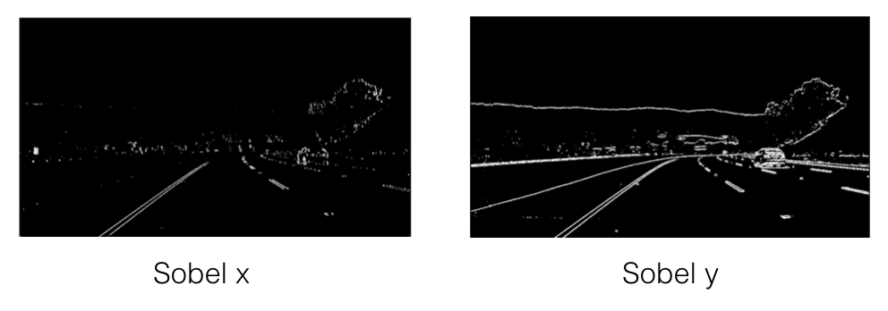

**x vs. y**

In the above images, you can see the gradients taken in both the x and y directions detect the lane lines and pick up other edges. Taking the gradient in the x direction emphasizes edges closer to vertical. Alternatively, taking the gradient in the y direction emphsaizes edges closer to horizontal.

In the upcoming exercises, you will write functions to take various thresholds of the x and y gradients. Here's some code that might be useful:

**Examples of Useful Code**

You need to pass a single color channel to `cv2.Sobel()` function, so first convert it to grayscale:

~~~python
gray = cv2.cvtColor(im, cv2.COLOR_RGB2GRAY)
~~~

Make sure you use the correct grayscale conversion depending on how you've read in your images. Use `cv2.COLOR_RGB2GRAY`  if you've read in an image using `mpimmg.imread()`. Use `cv2.COLOR_BGR2GRAY` if you've read in an image using `cv2.imread()`.

Calculalte the derivative in the x direction (the 1,0 at the end dentoes x direction):

~~~python
sobelx = cv2.Sobel(gray, cv2.CV_64F, 1, 0)
~~~

Calculate the derivative in the y direction (the 0, 1 at the end denotes y direction):

~~~python
sobely = cv2.Sobel(gray, cv2.CV_64F, 0, 1)
~~~

Calculate the absolute value of the x directive:

~~~python
abs_sobelx = np.absolute(sobelx)
~~~

Convert the absolute value image to 8-bit:

~~~python
scaled_sobel = np.uint8(255*abs_sobelx/np.max(abs_sobelx))
~~~

> **Note**: It's not entirely necessary to convert to 8-bit (range from 0 to 255) but inn practice, it can be useful in the event you've written a function to apply a particular threshold and want to work the same on input images of different scales like jpg vs png. You could just as well choose a different standard range of values like 0 to 1 etc.

Create a binary threshold to select pixels based on gradient strength:

~~~python
thresh_min = 20
thresh_max = 100
sxbinary = np.zeros_like(scaled_sobel)
sxbinary[(scaled_sobel >= thresh_min) & (scaled_sobel <= thresh_max)] = 1
plt.imshow(sxbinary, cmap='gray')
~~~

Result image:

Pixels have a value of 1 or 0 based on the strength of the x gradient.

## Quiz: Applying Sobel

Enter the [Applying Sobel quiz](quizzes/applying-sobel/quiz.md).

## Quiz: Magnitude of the Gradient

Enter the [Magnitude of the Gradient quiz](quizzes/magnitude-gradient/quiz.md)

## Quiz: Direction of the Gradient

Enter the [Direction of the Gradient quiz](quizzes/direction-gradient/quiz.md)

## Combining Thresholds

If you play around with the thresholds in the last exericse, you will find that you can start to identify the lane lines by gradient direction alone by setting the threshold around `thresh = (0.7, 1.3)`, but there's still a lot of noisee in the resulting image.

Now consider how you can use various aspects of your gradient measurements (x, y, magnitude, direction) to isolate lane-line pixels. Specifically, think about how you can use thresholds of the x and y gradients, the overall gradient magnitude and the gradient direction to focus on pixels that are likely to be part of the lane lines.

### Challenge

In the project at the end of this section, you'll want to experiment with thresholding various aspects of the gradient, so now would be a great time to start coding it up on your local machine! Grab the image we've been working with for the last three quizzes [signs-vehicles-xygrad.png](images/signs-vehicles-xygrad.png) or a smaller jpg [signs-vehicles-xygrad.jpg](images/signs-vehicles-xygrad.jpg).

Combine the selection thresholds from the last 3 quizzes to write a piece of code like the following where you can play with various thresholds and see the output.

~~~python
def abs_sobel_thresh(img, orient='x', sobel_kernel=3, thresh=(0, 255)):
    # Calculate directional gradient
    # Apply threshold
    return grad_binary

def mag_thresh(image, sobel_kernel=3, mag_thresh=(0, 255)):
    # Calculate gradient magnitude
    # Apply threshold
    return mag_binary

def dir_threshold(image, sobel_kernel=3, thresh=(0, np.pi/2)):
    # Calculate gradient direction
    # Apply threshold
    return dir_binary

# Choose a Sobel kernel size
ksize = 3 # Choose a larger odd number to smooth gradient measurements

# Apply each of the thresholding functions
gradx = abs_sobel_thresh(image, orient='x', sobel_kernel=ksize, thresh=(0, 255))
grady = abs_sobel_thresh(image, orient='y', sobel_kernel=ksize, thresh=(0, 255))
mag_binary = mag_thresh(image, sobel_kernel=ksize, mag_thresh=(0, 255))
dir_binary = dir_threshold(image, sobel_kernel=ksize, thresh=(0, np.pi/2))
~~~

Try different combinations and see what you get.

For example, here is a selection for pixels where both the x and y gradients meet the threshold criteria, or the gradient magnitude and direction are both within their threshold values.

~~~python
combined = np.zeros_like(dir_binary)
combined[((gradx == 1) & (grady == 1)) | ((mag_binary == 1) & (dir_binary == 1))] = 1
~~~

### Output

Here is an example of a binary result from multiple thresholds:

## Color Spaces

In our introductory lesson, we converted our road images to grayscale before detecting edges, but in making this conversion, we lose valuable color information. For example, in this image:

when we convert it to grayscale, the yellow line almost disappears:

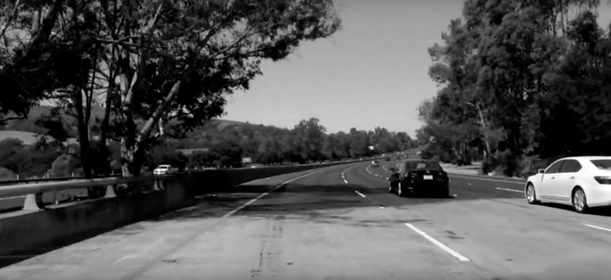

In this section, we will investigate color spaces, which give us more information about an image than grayscale alone. For example, we will see when we switch to another color space for the original image above, we can get the yellow line back.

A **color space** is a specific organization of colors; color spaces provide a way to categorize colors and represent them in digital images.

## Color Thresholding

For the road images you have seen, you know they are all composed of **red, green, blue** or **RGB**. 

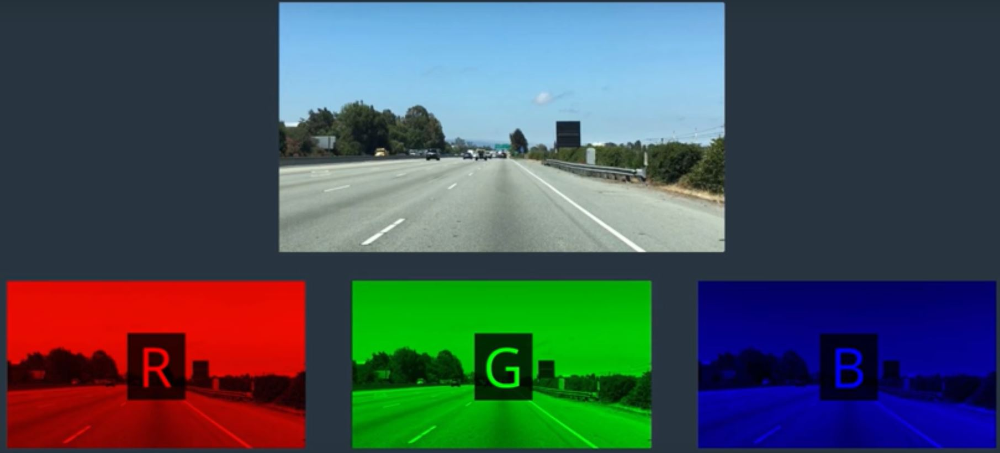

In the past you have used some combination of masking and color thresholds on these rgb values to pick out bright white lane pixels. This lane detection can work well alongside gradient detection, which relies on grayscale intensity measurements.

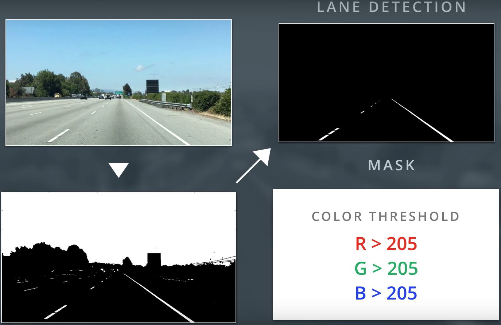

However, rgb thresholding does not work well in images with varying lighting conditions or when lanes are a different color like yellow.

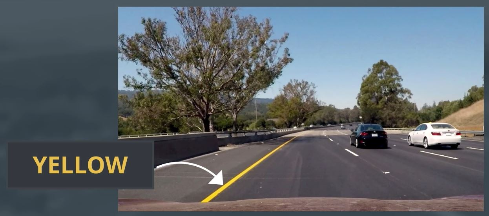

> Note: RGB thresholding works best on white lane pixels.

Take this image of a road, we can break it down into its separate rgb components often called channels. Below are the three channels represented in grayscale intensity. The brighter pixels indicate higher values of red, green or blue respectively:

Looking at the lane lines, you can see that the red and green channels are high for both the white and yellow lane lines. The red and green channels do detect white and yellow lane lines.

But if we look at the blue channel, there is almost no blue component in the yellow lane. The blue channel does not detect the yellow lane line.

So, the red and green channels will be the most useful for isolating both white and yellow lane pixels, but you can also see that the red and green values change under different levels of brightness at the back of the image.

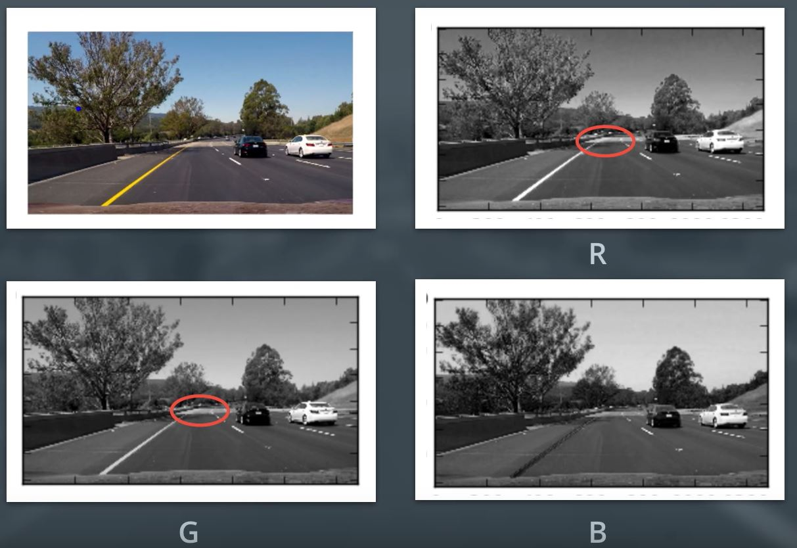

They get lower under shadow and don't consistently recognize the lane under extreme brightness.

Let's see if there is a better way to represent these lanes. There are many other ways to represent the colors in an image besides just composed of red, green and blue values. These different color representations are often called color spaces:

**RGB** is red, green, blue color space. You can think of this as a 3D space, in this case a cube, where any color can be represented by a 3D coordinate of RGB values:

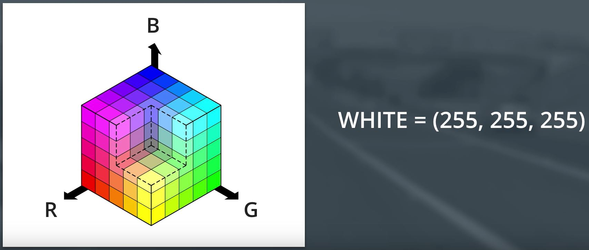

For example, white has the coordinate (255,255,255), which has the max value for red, green and blue.

> **NOTE**: If you read in an image using `matplotlib.image.imread()` you wil get an RGB image, but if you read in using OpenCV `cv2.imread()` this will give you a BGR image.

There is also **HSV** color space for Hue, Saturation and Value. There is also **HLS** for Hue, Lightness and Saturation. You can generally think of **Hue** as the value that represents color independent of any change in brightness. So if you imagine a basic red paint color, then add some white to it or some black to make that color lighter or darker -- the underlying color remains the same and the hue for all of these colors will be the same. **Lightness** and **Value** represent different ways to measure the relative lightness or darkness of a color. For example, a dark red will have a similar hue, but much lower value for lightness than a light red. **Saturation** also plays a part in this; saturation is a measurement of colorfulness. So, as colors get lighter and closer to white, they have a lower saturation value, whereas colors that are the most intense, like a bright primary color (imagine a bright red, blue, or yellow) have a high saturation value. You can get a better idea of these values by looking at the 3D color spaces below:

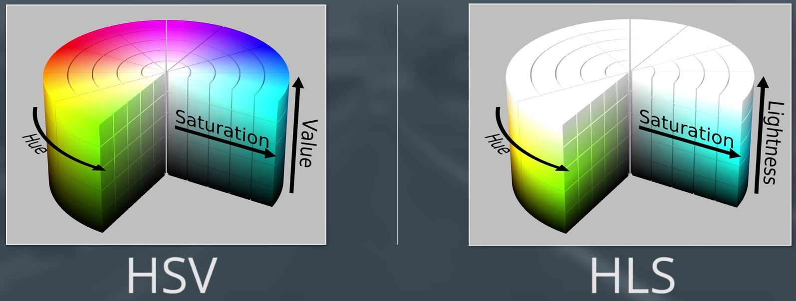

> Note: Most of these different color spaces were either inspired by human vision system and/or developed for efficient use in television screen displays and computer graphics. 

These are some of the most commonly used color spaces in image analysis. For both of these H has a range from 0 to 179 for degrees around the cylindrical color space. **You can see details about the mathematical conversion from RGB to HLS space in the notes below.**

We will be going through an example in HLS color space. This isolates the lightness or L component of each pixel in an image. This is the component that varies the most under different lighting conditions, but the H and S channels stay fairly consistent under shadow or excessive brightness and if we use these channels only and discard the L channel, we should be able to detect different colors of lane lines more reliably than in the RGB color space.

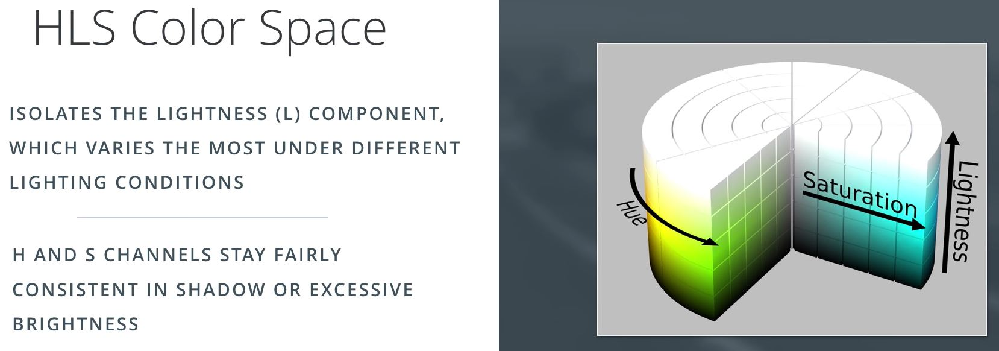

Here is that same RGB road image converted to HLS color space:

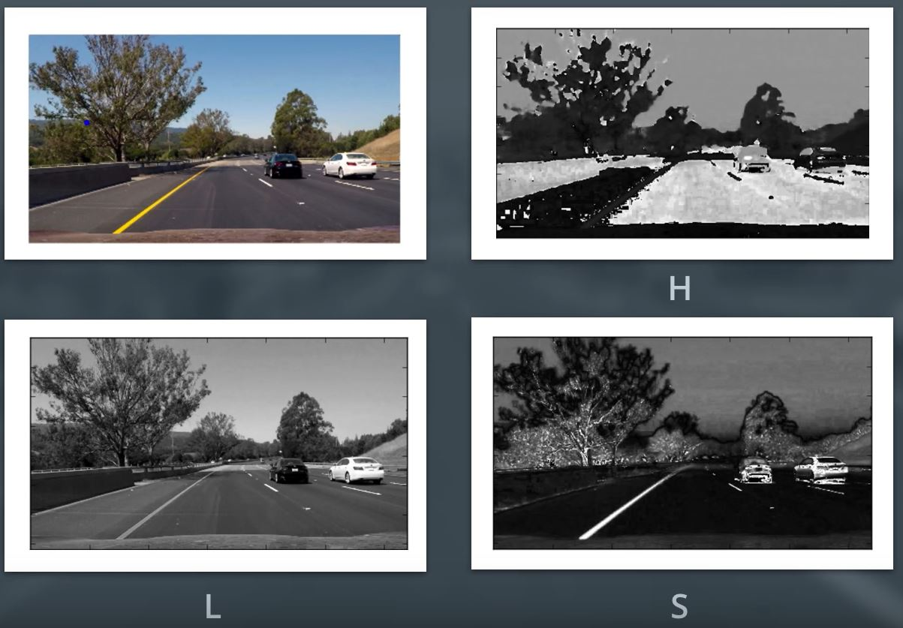

If we break it down into the separate HLS channels, we can see the difference between HLS and RGB color space. From looking at the S channel, it detects lane lines pretty well as well as the dark sections of the H channel.

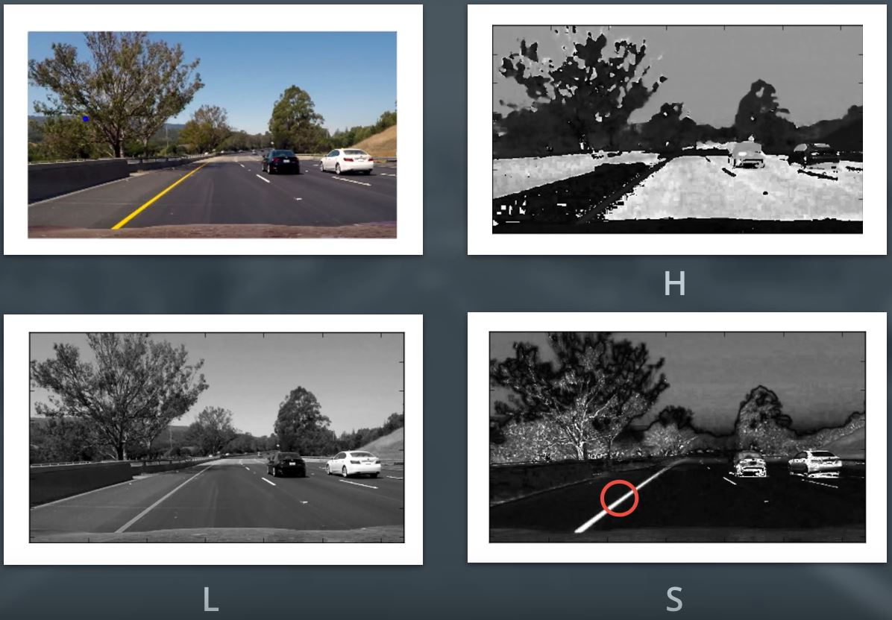

We can use these channels to create a smart color threshold that reliably detects lane line pixels of different colors. Let's see an example of color thresholding in code next.

In the code example, I used HLS space to help detect lane lines of different colors under different lighting conditions.

OpenCV provides a function `hls = cv2.cvtColor(im, cv2.COLOR_RGB2HLS)` that converts images from one color space to another. If you're interested in the math behind this conversion, take a look at the equations below; note all this math is for converting 8-bit images, which is the format for most road images in this course. These equations convert one color at a time from RGB to HLS.

### Constants

~~~python
Vmax <-- max(R,G,B)

Vmin <-- min(R,G,B)
~~~

These are the maximum and minimum values across all three RGB values for a given color (by pixel).

Note in these equations, it would be necessary to divide the RGB values by 255 such they fall in the range (0,1) but OpenCV will perform this for you `cv2.cvtColor()`. **L** and **S** are scaled back up after the transformations take place, while **H** is halved for use in 8-bit images (see below).

### H channel conversion equations

There are three different equations, which one is used depends on the value of Vmax whether that's R, G or B.

~~~python
H <-- (30(G-B)/(Vmax-Vmin)), if Vmax = R

H <-- 60 + (30(B-R)/(Vmax-Vmin)), if Vmax = G

H <-- 120 + (30(R-G)/(Vmax-Vmin)), if Vmax = B
~~~

**NOTE**: In OpenCV, for 8-bit images, the range of H is from 0-179. It's typically from 0-359 for degrees around the cylindrical colorspace, but this number is divided in half, so the range can be represented in an 8-bit image whosee color values range from 0-255.

### L channel conversion equation

~~~python
L <-- (Vmax + Vmin)/2
~~~

### S channel conversion equation

There are two possible equations; one is used depending on the value of L

~~~python
S <-- (Vmax - Vmin)/(Vmax + Vmin), if L < 0.5

S <-- (Vmax - Vmin)/2-(Vmax + Vmin), if L >= 0.5
~~~

## Quiz: HLS Intuitions

Enter the [HLS Intuitions quiz](quizzes/hls-intuitions/quiz.md).

## HLS and Color Thresholds

You have now seen that various color thresholds can be applied to find the lane lines in images. Here we'll explore this a bit further and look at a couple examples to see why a color space like HLS can be more robust. Let's first take another look at some of the images you saw in the last video.

Here I'll read in the same original image (the image above), convert to grayscale, and apply a threshold that identifies the lines:

~~~python
import numpy as np
import cv2
import matplotlib.pyplot as plt
import matplotlib.image as mpimg

image = mpimg.imread('images/original.jpg')
thresh = (180, 255)
gray = cv2.cvtColor(image, cv2.COLOR_RGB2GRAY)
binary = np.zeros_like(gray)
binary[(gray > thresh[0]) & (gray <= thresh[1])] = 1
~~~

Here is the result:

You might have also explored thresholding individual RGB color channels. You can take a look at them side by side to see which ones do a better job of picking up the lane lines:

~~~python
R = image[:,:,0]
G = image[:,:,1]
B = image[:,:,2]
~~~

The R channel does a reasonable job of highlighting the lines, and you can apply threshold to find lane-line pixels:

~~~python
thresh = (200, 255)
binary = np.zeros_like(R)
binary[(R > thresh[0]) & (R <= thresh[1])] = 1
~~~

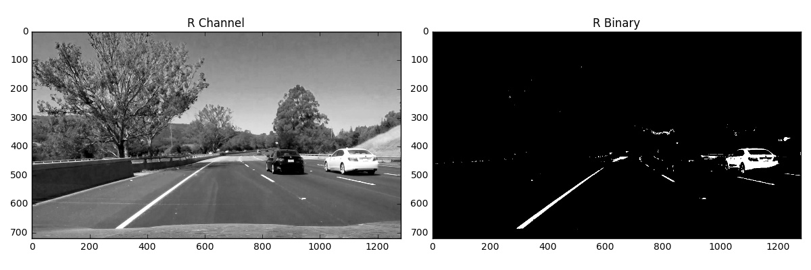

In this lesson, we're looking at different color spaces. While there are several that worth exploring, here we will look specifically at HLS. When we separate the H, L and S channels we get the following result:

~~~python
hls = cv2.cvtColor(image, cv2.COLOR_RGB2HLS)
H = hls[:,:,0]
L = hls[:,:,1]
S = hls[:,:,2]
~~~

The S channel picks up the lines well, so let's try applying a threshold there:

~~~python
thresh = (90, 255)
binary = np.zeros_like(S)
binary[(S > thresh[0]) & (S <= thresh[1])] = 1
~~~

You can also see that in the H channel, the lane lines appear dark, so we could try a low threshold there and obtain the following result:

~~~python
thresh = (15, 100)
binary = np.zeros_like(H)
binary[(H > thresh[0]) & (H <= thresh[1])] = 1
~~~

From these examples, you can see that the S channel is probably your best bet. It's cleaner than the H channel result and a bit better than the R channel or simple grayscaling. But it's not clear that one method is far superior to the others.

In each case, I've tweaked the threshold parameters to do as good a job as possible of picking the lines. Where we can really see a difference in results, however, is when we step to a new frame, where there are shadows and different colors in the pavement.

Look at the same thresholds applied to each of these four channels for this image:

Here's how the various channels and binaries (with the same threshold values as above) look:

Now you can see that, the S channel is still doing a fairly robust job of picking up the lines under very different color and contrast conditions, while the other selections look messy. You could tweak the thresholds and get closer in the other channels, but the S channel is preferable because it is more robust to changing conditions.

It's worth noting, however, that the R channel still does rather well on the white lines, perhaps even better than the S channel. As with gradients, it's worth considering how you might combine various color thresholds to make the most robust identification of the lines.

## Quiz: HLS Color Threshold

Enter [HLS Color Threshold](quizzes/hls/quiz.md).

## Quiz: Color and Gradient

Enter [Color and Gradient](quizzes/color-gradient/quiz.md).