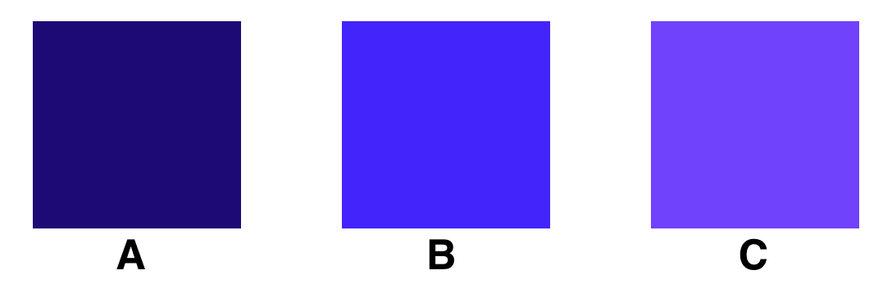

# Quiz: HLS Intuitions

**Figure 1:** Color options: A, B, C

1\. Considering the colors pictured above, in HLS color space, which of these options will have the _lowest_ L value?

- A
- B
- C

2\. Considering the same three images, in which of the HLS color channels will these three images have approximately the same value?

- H
- L
- S