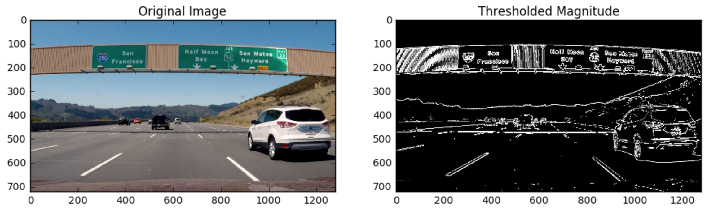

# Quiz Solution: Magnitude of the Gradient

With the result of the last quiz, you can take the gradient in x or y and set thresholds to identify pixels within a certain gradient range. If you play around with thresholds a bit, you'll find the x-gradient does a cleaner job of picking up the lane lines, but you can see the lines in the y-gradient as well.

In this next exercise, your goal is to apply a threshold to the overall magnitude of the gradient in both x and y.

The mangnitude or absolute value of the gradient is just the square root of the squares of the individual x and y gradients. For a gradient in both x and y directions, the magnitude is the square root of the sum of the squares.

~~~python
abs_sobelx = sqrt((sobelx)^2)
abs_sobely = sqrt((sobely)^2)
abs_sobelxy = sqrt((sobelx)^2 + (sobely)^2)
~~~

It is also worth considering the size of the region in the image over which you'll be taking the gradient. You can modify the kernel size for the Sobel operator to change the size of this region. Taking the gradient over larger regions can smooth over noisy intensity fluctuations on small scales. The default Sobel kernel size is 3, but here you'll define a new function takes kernel size as a parameter.

It's important to note here the kernel size should be an odd number. Since we are searching for the gradient around a given pixel, we want to have an equal number of pixels in each direction of the region from this central pixel with one additional pixel in each direction, while a filter size five has an additional two pixels outward from the central pixel in each direction.

Tthe function you'll define for the exercise below should take in an image and optional Sobel kernel size as well as thresholds for gradient magnitude. Next, you'll compute the gradient magnitude, apply a threshold and create a binary output image showing where thresholds were met.

**Steps to take in this exercise**

1\. Fill out the function in the editor below to return a thresholded gradient magnitude. Again, you can apply exclusive (`<, >`) or inclusive (`<= >=`) thresholds.

2\. Test that your function returns output similar to the example below for `sobel_kernel = 9, mag_thresh = (30, 100)`

You can download the image used in this quiz [signs_vehicles_xygrad.png](../../images/signs_vehicles_xygrad.png)

Here's an example of the output you're going for:

James Code Solution:

~~~python
import numpy as np
import cv2
import math
import matplotlib.pyplot as plt
import matplotlib.image as mpimg
import pickle

# Read in an image
image = mpimg.imread('signs_vehicles_xygrad.png')

# Define a function that applies Sobel x and y, 
# then computes the magnitude of the gradient
# and applies a threshold
def mag_thresh(img, sobel_kernel=3, mag_thresh=(0, 255)):
    
    # Apply the following steps to img
    # 1) Convert to grayscale
    gray = cv2.cvtColor(img, cv2.COLOR_RGB2GRAY)
    # 2) Take the gradient in x and y separately
    # 1, 0 is for the X direction
    sobelx = cv2.Sobel(gray, cv2.CV_64F, 1, 0, ksize = sobel_kernel)
    # 0, 1 is for the Y direction
    sobely = cv2.Sobel(gray, cv2.CV_64F, 0, 1, ksize = sobel_kernel)
    # 3) Calculate the magnitude 
    abs_sobelxy = np.sqrt( (sobelx**2) + (sobely**2) )
    # 4) Scale to 8-bit (0 - 255) and convert to type = np.uint8
    # scaled_sobel = np.uint8(255*abs_sobelxy/np.max(abs_sobelxy))
    # 2 equations below do same thing as above equation
    scale_factor = np.max(abs_sobelxy)/255
    scaled_sobel = (abs_sobelxy/scale_factor).astype(np.uint8) 
    # 5) Create a binary mask where mag thresholds are met
    binary_output = np.zeros_like(scaled_sobel)
    #binary_output[mag_thresh.low <= scaled_sobel <= mag_thresh.high] = 1
    binary_output[(scaled_sobel >= mag_thresh[0]) & (scaled_sobel <= mag_thresh[1])] = 1
    # 6) Return this mask as your binary_output image
    return binary_output
    
# Run the function
mag_binary = mag_thresh(image, sobel_kernel=9, mag_thresh=(30, 100))
# Plot the result
f, (ax1, ax2) = plt.subplots(1, 2, figsize=(24, 9))
f.tight_layout()
ax1.imshow(image)
ax1.set_title('Original Image', fontsize=50)
ax2.imshow(mag_binary, cmap='gray')
ax2.set_title('Thresholded Magnitude', fontsize=50)
plt.subplots_adjust(left=0., right=1, top=0.9, bottom=0.)
~~~

Udacity Code Solution:

~~~python
# Define a function to return the magnitude of the gradient
# for a given sobel kernel size and threshold values
def mag_thresh(img, sobel_kernel=3, mag_thresh=(0, 255)):
    # Convert to grayscale
    gray = cv2.cvtColor(img, cv2.COLOR_RGB2GRAY)
    # Take both Sobel x and y gradients
    sobelx = cv2.Sobel(gray, cv2.CV_64F, 1, 0, ksize=sobel_kernel)
    sobely = cv2.Sobel(gray, cv2.CV_64F, 0, 1, ksize=sobel_kernel)
    # Calculate the gradient magnitude
    gradmag = np.sqrt(sobelx**2 + sobely**2)
    # Rescale to 8 bit
    scale_factor = np.max(gradmag)/255 
    gradmag = (gradmag/scale_factor).astype(np.uint8) 
    # Create a binary image of ones where threshold is met, zeros otherwise
    binary_output = np.zeros_like(gradmag)
    binary_output[(gradmag >= mag_thresh[0]) & (gradmag <= mag_thresh[1])] = 1

    # Return the binary image
    return binary_output
~~~