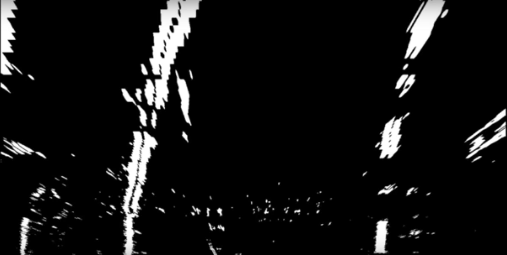
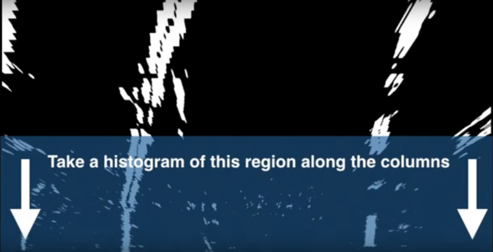
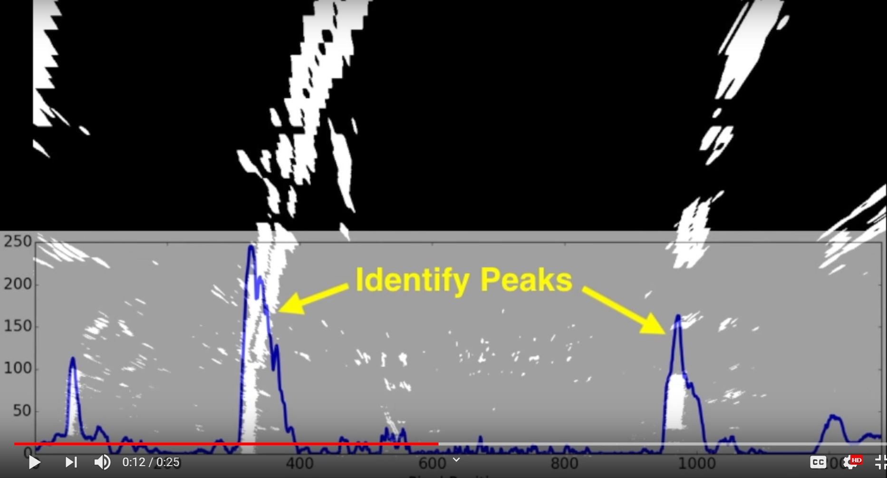
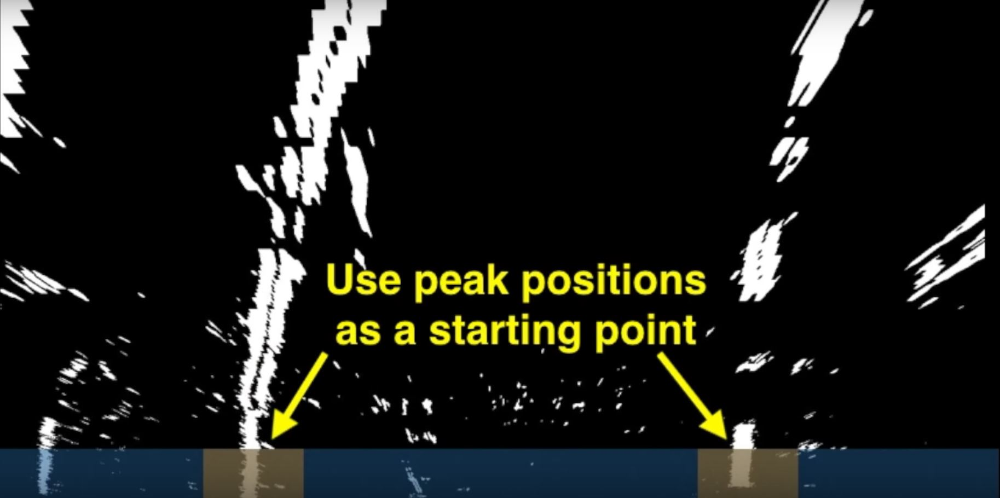
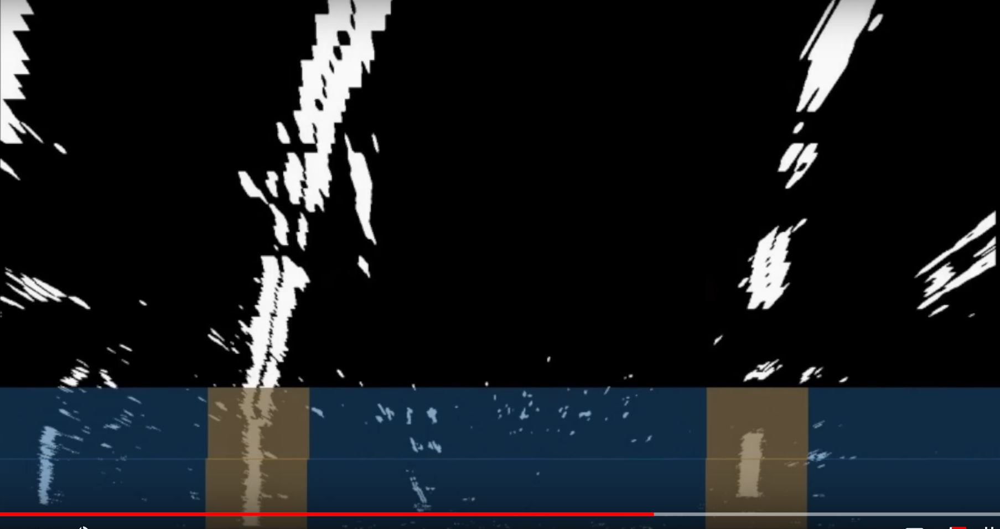
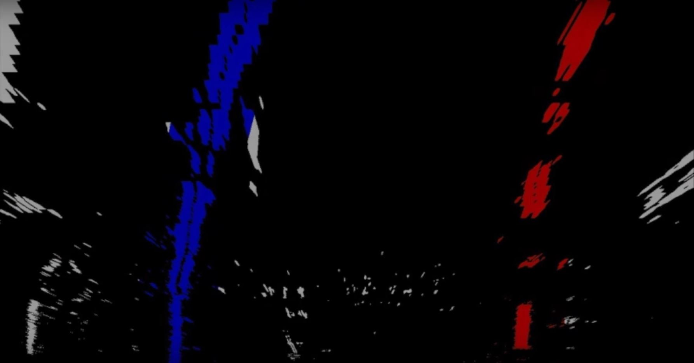

# Advanced Computer Vision

Discover more advanced computer vision techniques to improve upon your lane lines algorithm!

## Project Steps

Let's review the steps you will take to map out the lane on an image of the road.

1\. Camera Calibration

2\. Distortion Correction

3\. Color & Gradient Threshold

4\. Perspective Transform

We still need to determine which pixels are lane line pixels and then determine the line shape and position, so we can complete the remaining steps:

5\. Detect Lane Lines

6\. Determine the Lane Curvature

## Processing Each Image

In the project at the end of this module, the first thing you'll do is compute the camera calibration matrix and distortion coefficients. You only need to compute these once and then you'll apply them to undistort each new frame. Next, you'll apply thresholds to create a binary image and then apply a perspective transform.

### Thresholding

You'll want to try out various combinations of color and gradient thresholds to generate a binary image where the lane lines are clearly visible. There's more than one way to achieve a good result, but for example, gven the image above, the output you're going for should look something like this:

### Perspective Transform

Next you want to identify four source points for your perspective transform. In this case, you can assume the road is a flat plane. This isn't strictly true,, but it can serve as an approximation for this project. You would like to pick four points in a trapezoidal shape (similar to region masking) that would represent a rectangle when looking down on the road from above.

The easiest way to do this is to investigate an image where the lane lines are straight and find four points lying along the lines that after perspective transform make the lines look straight and vertical from a bird's eye view perspective.

### Aim for Straight Lane Lines Result

### Now for Curved Lines

Those same four source points will now work to transform any image (again, under the assumption that the road is flat and the camera perspective hasn't changed). When applying the transform to new images, the test of whether or not you got the transform correct is that the lane lines should appear parallel in the warped images, whether they are straight or curved.

Here's an example of applying a perspective transform to your thresholded binary image using the same source and destination points as above showing that the curved lines are parallel in the transformed image:

## Finding the Lines

### Histogram Peaks

#### Locate the Lane Lines

**Figure 1:** Thresholded and Perspective Transformed Image

You now have a thresholded warped image and you're ready to map out the lane lines! There are many ways you could go about this, but here's one example of how you might do it:

**Line Finding Method: Peaks in a Histogram**

After applying calibration, thresholding and a perspective transform to a road image, you should have a binary image where the lane lines stand out clearly. However, you still need to decide explicitly which pixels are part of the lines and which belong to the left line and which belong to the right line.

### Quiz: Histogram Peaks

Enter the [Histogram Peaks quiz](quizzes/histogram-peaks/quiz.md).

### Sliding Window

With the histogram obtained from the quiz, we are adding up the pixel values along each column in the image. In our thresholded binary image, pixels are either 0 or 1, so the two most prominent peaks in this histogram will be good indicators of the x-position of the base of the lane lines. We can use that as a starting point for where to search for the lines. From that point, we can use a sliding window, placed around the line centers to find and follow the lines up to the top of the frame.

**A Short Animation Showing Sliding Window**

You have the binry top down view image:

Take a histogram of this region along the columns:

~~~python
histogram = np.sum(img[img.shape[0]/2:,:], axis=0)
~~~

Plot the histogram in a graph, identify the peaks:

The peaks are good starting points for where the lane lines start:

Start sliding window up, first 1 row up:

Keep sliding window up until you get to last row n:

Then color lane lines:

#### Implement Sliding Windows and Fit a Polynomial

As shown in the previous animation, we can use the two highest peaks from our histogram as a starting point for determining where the lane lines are and then use sliding windows moving upward in the image (further along the road) to determine where the lane lines go.

**Split the histogram for the two lines**

The first step we'll take is to split the histogram into two sides, one for each lane line:

~~~python
import numpy as np
import cv2
import matplotlib.pyplot as plt

# Assuming you have created a warped binary image called "binary_warped"
# Take a histogram of the bottom half of the image
histogram = np.sum(binary_warped[binary_warped.shape[0]//2:,:], axis = 0)
# Create an output image ot draw on and visualize the result
out_img = np.dstack((binary_warped, binary_warped, binary_warped))*255
# Find the peak of the left and right halves of the histogram
# These will be the starting point for the left and right lines
midpoint = np.int(histogram.shape[0]//2)
leftx_base = np.argmax(histogram[:midpoint])
rightx_base = np.argmax(histogram[midpoint:]) + midpoint
~~~

Note that in the above, we also create `out_img` to help with visualizing our output later on.

**Set up windows and window hyperparameters**

Our next step is to set a few hyperparameters related to our sliding windows, and set them up to iterate across the binary activations in the image. We have some base hyperparameters below, but don't forget to try out different values in your own implementation to see what works best!

~~~python
# HYPERPARAMETERS
# Choose the number of sliding windows
nwindows = 9
# Set the width of the windows +/- margin
margin = 100
# Set minimum number of pixels found to recenter window
minpix = 50

# Set height of windows - based on nwindows above and image shape
window_height = np.int(binary_warped.shape[0]//nwindows)
# Identify the x and y positions of all nonzero (ex. activated) pixels in the image
nonzero = binary_warped.nonzero()
nonzeroy = np.array(nonzero[0])
nonzerox = np.array(nonzero[1])
# Current positions to be updated later for each window in nwindows
leftx_current = leftx_base
rightx_current = rightx_base

# Create empty lists to receive left and right lane pixel indices
left_lane_inds = []
right_lane_inds = []
~~~

**Iterate through `nwindows` to track curvature**

Now we've set up what the windows look like and have a starting point, we'll want to loop for `nwindows` with the given window sliding left or right if it finds the mean position of activated pixels within the window to have shifted.

You'll implement this part in the quiz below, but here's a few steps to get you started:

1\. Loop through each window in `nwindows`

2\. Find the boundaries of our current window. This is based on a combination of the current window's starting point (`leftx_current`, `rightx_current`) as well as the `margin` you set in the hyperparameters.

3\. Use `cv2.rectangle` to draw these window boundaries onto our visualization image `out_img`. This is required for the quiz, but you can skip this step in practice if you don't need to visualize where the windows are.

4\. Now we know the boundaries of our window, find out which activated pixels from `nonzeroy` and `nonzerox` above actually fall into the window.

5\. Append these to our lists `left_lane_inds` and `right_lane_inds`.

6\. If the number of pixels you found in step 4 are greater than your hyperparameter `minpix`, recenter our window (ex. `leftx_current` or `rightx_current`) based on the mean position of these pixels.

**Fit a polynomial**

Now we have found all our pixels belonging to each line through the sliding window method, it's time to fit a polynomial to the line. First, we have a couple small steps to ready our pixels.

~~~python
# Concatenate the arrays of indices (previously was a list of lists of pixels)
left_lane_inds = np.concatenate(left_lane_inds)
right_lane_inds = np.concatenate(right_lane_inds)

# Extract left and right line pixel positions
leftx = nonzerox[left_lane_inds]
lefty = nonzeroy[left_lane_inds]
rightx = nonzerox[right_lane_inds]
righty = nonzeroy[right_lane_inds]
~~~

We'll let you implement the function for the polynomial in the quiz using `np.polyfit`:

~~~python
# Assume we have `left_fit` and `right_fit` from `np.polyfit` before
# Generate x and y values for plotting
ploty = np.linspace(0, binary_warped.shape[0]-1, binary_warped.shape[0])
left_fitx = left_fit[0]*ploty**2 + left_fit[1]*ploty + left_fit[2]
right_fitx = right_fit[0]*ploty**2 + right_fit[1]*ploty + right_fit[2]
~~~

Take note of _how_ we fit the lines aboe - while normally you calculate a y-value for a given x, here we do the opposite. Why? Because we expect our lane lines to be (mostly) vertically-oriented.

**Visualization**

Once you reach this point, you're done! But here is how you can visualize the result as well:

~~~python
out_img[lefty, leftx] = [255,0,0]
out_img[righty, rightx] = [0,0,255]

plt.imshow(out_img)
plt.plot(left_fitx, ploty, color='yellow')
plt.plot(right_fitx, ploty, color='yellow')
plt.xlim(0, 1280)
plt.ylim(720, 0)
~~~

### Quiz: Sliding Window

Enter the [Sliding Window quiz](quizzes/sliding-window/quiz.md)

### Search from Prior

You've built an algorithm that uses sliding windows to track the lane lines out into the distance. However, using the full algorithm from before and starting fresh on every frame may seem inefficient, as the lane lines don't necessarily move a lot from frame to frame.

In the next frame of video you don't need to do a blind search again, but instead you can just search in a margin around the previous lane line position like in the above image. The green shaded area shows where we searched for the lines this time. So, once you know where the lines are in one frame of video, you can do a highly targeted search for them in the next frame.

This is equivalent to using a customized region of interest for each frame of video and should help you track the lanes through sharp curves and tricky conditions. If you lose track of the lines, go back to your sliding windows search or other method to rediscover them.

Let's walk through one way to do this and then you'll build it out in the quiz.

**Use the previous polynomial to skip the sliding window**

In the previous quiz, we used `left_lane_inds` and `right_lane_inds` to hold the pixel values contained within the boundaries of a given sliding window. This time, we will take the polynomial functions we fit before (`left_fit` and `right_fit`) along with a hyperparameter `margin` to determine which activated pixels fall into the green shaded areas from the above image. Not this `margin` can be a different value than the one originally used for your sliding windows!

To implement this in the quiz, you'll want to grab only those pixels with x-values that are +/- your `margin` from your polynomial lines. Note you'll only need to implement `left_lane_inds` and `right_lane_inds` in the quiz - most of the surrounding code, ignoring iterating through the windows, is the same as before!

The way we'll visualize this is a bit different than last time around, however, make sure to pay attention to that if you want to visualize this step while working on your project.

### Quiz: Search from Prior

Enter the [Search from Prior quiz](quizzes/search-prior/quiz.md)

**Fitting on Large Curves**

One thing to consider in our current implementation of sliding window search is what happens when we arrive at the left or right edge of an image, such as when there is a large curve on the road ahead. If `minpix` is not achieved (ex. the curve ran off the image), the starting position of our next window doesn't change, so it is just positioned directly above the previous window. This will repeat for however many windows are left in `nwindows` stacking the sliding windows vertically against the side of the image and likely leading to an imperfect polynomial fit.

Can you think of a way to solve this issue? If you want to tackle the curves on the harder challenge video as part of the project, you might want to include this in your lane finding algorithm.

## Measuring Curvature I

You have a thresholded image where you've estimated which pixels belong to the left and right lane lines (shown in red and blue) and you've fit a polynomoial to those pixel positions. Next we'll compute the radius of curvature of the fit.

Here I have fit the left and right lines with a second order polynomial shown in green.

In the last exercise, you located the lane line pixels, used their x and y pixel positions to fit a second order polynomial curve:

~~~python
f(y) = Ay^2 + By + C
~~~

You're fitting for `f(y)` rather than `f(x)` because the lane lines in the warped image are near vertical and may have the same x value for more than one y value.

### Radius of Curvature

The radius of curvature ([tutorial](https://www.intmath.com/applications-differentiation/8-radius-curvature.php)) at any point x of the function `x = f(y)` is given as follows:

~~~python
Rcurve = ([1 + (dx/dy)^2]^(3/2))/ (|((d^2)x)/(dy^2)|)
~~~

In the case of the second order polynomial above, the first and second derivatives are:

~~~
f'(y) = dx/dy = 2Ay + B

f"(y) = (d^2)x/dy^2 = 2A
~~~

So, our equation for radius of curvature becomes:

~~~pythoon
Rcurve = ((1 + (2Ay + B)^2)^(3/2))/|2A|
~~~

The y values of your image increase from top to bottom, for example, you wanted to measure the radius of curvature closest to your vehicle, you could evaluate the formula above at the `y` value corresponding to the bottom of your image, or in Python, at 

~~~python
yvalue = image.shape[0]
~~~

### Implementing the Calculation

**Generate some fake data first**

Most of the code below is just to generate some fake data to visualize with -everything up until the actual plotting of the data below should be replaced with your algorithms from before in your own implementation!

~~~python
import numpy as np
import matplotlib.pyplot as plt
# Generate some fake data to represent lane-line pixels
ploty = np.linspace(0, 719, num=720)# to cover same y-range as image
quadratic_coeff = 3e-4 # arbitrary quadratic coefficient
# For each y position generate random x position within +/-50 pix
# of the line base position in each case (x=200 for left, and x=900 for right)
leftx = np.array([200 + (y**2)*quadratic_coeff + np.random.randint(-50, high=51) 
                              for y in ploty])
rightx = np.array([900 + (y**2)*quadratic_coeff + np.random.randint(-50, high=51) 
                                for y in ploty])

leftx = leftx[::-1]  # Reverse to match top-to-bottom in y
rightx = rightx[::-1]  # Reverse to match top-to-bottom in y

# Fit a second order polynomial to pixel positions in each fake lane line
left_fit = np.polyfit(ploty, leftx, 2)
left_fitx = left_fit[0]*ploty**2 + left_fit[1]*ploty + left_fit[2]
right_fit = np.polyfit(ploty, rightx, 2)
right_fitx = right_fit[0]*ploty**2 + right_fit[1]*ploty + right_fit[2]

# Plot up the fake data
mark_size = 3
plt.plot(leftx, ploty, 'o', color='red', markersize=mark_size)
plt.plot(rightx, ploty, 'o', color='blue', markersize=mark_size)
plt.xlim(0, 1280)
plt.ylim(0, 720)
plt.plot(left_fitx, ploty, color='green', linewidth=3)
plt.plot(right_fitx, ploty, color='green', linewidth=3)
plt.gca().invert_yaxis() # to visualize as we do the images
~~~

### Quiz: Radius of Curvature

Enter the [Radius of Curvature quiz](quizzes/radius-curvature/quiz.md)

## Measuring Curvature II

### From Pixels to Real-World

You've calculated the radius of curvature for our lane lines. But now we need to stop and think... We've calculated the radius of curvature based on pixel values, so the radius we are reporting is in pixel space, which is not the same as real world space. So, we actually need to repeat this calculation after converting our x and y values to real world space.

This involves measuring how long and wide the section of lane is tht we're projecting in our warped image. We could do this in detail by measuring out the physical lane in the field of the view of the camera, but for this project, you can assume that if you're projecting a section of lane similar to the images above, the lane is about 30 meters long and 3.7 meters wide. Or if you prefer to derive a conversion from pixel space to world space in your own images, compare your images with U.S. regulations that require a minium lane width of 12 feet or 3.7 meters and the dashed lane lines are 10 feet or 3 meters long each.

Let's say our camera image has 720 relevant pixels in the y-dimension (remember, our image is perspective transformed!) and we'll say 700 relevant pixels in the x-dimension (our example of fake generated data above used from 200 pixels on the left to 900 on the right, or 700). Therefore, to convert from pixels to real-world meter measurements, we can use:

~~~python
# Define conversions in x and y from pixels space to meters
ym_per_pix = 30/720 # meters per pixel in y dimension
xm_per_pix = 3.7/700 # meters per pixel in x dimension
~~~

In the quiz below, use the above conversions to adjust your calculation from before to give real-world lane curvature values. Once again, you'll focus on the `left_curverad` and `right_curverad` values within the new `measure_curvature_real()` function. However, you will also need to adjust how you use `np.polyfit()` within `generate_data()` in order for this to work. How do you need to change thse to convert to meters?

### Quiz: Pixels to Real-World

Enter the [Pixels to Real-World quiz](quizzes/pixels-real-world/quiz.md).

> **NOTE**: An insightful student has suggested an alternative approach which may scale more efficiently. Once the parabola coefficients are obtained, in pixels, convert them into meters. For example, if the parabola is `x = a*(y**2) +b*y+c`; and `mx` and `my` are the scale for the x and y axis, respectively in meters/pixel; then the scaled parabola is `x = mx / (my ** 2) * a*(y**2)+(mx/my)*b*y+c`

Check out the [U.S government specifications for highway curvature](http://onlinemanuals.txdot.gov/txdotmanuals/rdw/horizontal_alignment.htm#BGBHGEGC) to see how your numbers compare. There's no need to worry about absolute accuracy in this case, but your results should be "order of magnitude" correct.

## Additional Resources on Computer Vision

You've reached the end of the computer vision content! We're also providing some additional resources and recent research on the topic that you can come back to if you have time later on.

Reading research papers is a great way to get exposure to the latest and greatest in the field, as well as expand your learning. However, just like the project ahead, it's often best to _learn by doing_ - if you find a paper that excites you, try to implement it yourself.

### Lane Finding with Semantic Segmentation

The below papers and resources concern a technique called semantic segmentation, where each pixel of an image gets classified individually!

[Fully Convolutional Networks for Semantic Segmentation](https://arxiv.org/abs/1605.06211) by E. Shelhamer, J. Long and T. Darrell

Abstract: Convolutional networks are powerful visual models that yield hierarchies of features. We show that convolutional networks by themselves, trained end-to-end, pixels-to-pixels, improve on the previous best result in semantic segmentation. Our key insight is to build "fully convolutional" networks that take input of arbitrary size and produce correspondingly-sized output with efficient inference and learning. We define and detail the space of fully convolutional networks, explain their application to spatially dense prediction tasks, and draw connections to prior models. We adapt contemporary classification networks (AlexNet, the VGG net, and GoogLeNet) into fully convolutional networks and transfer their learned representations by fine-tuning to the segmentation task. We then define a skip architecture that combines semantic information from a deep, coarse layer with appearance information from a shallow, fine layer to produce accurate and detailed segmentations. [...]

You can use the [KITTI road dataset](http://www.cvlibs.net/datasets/kitti/eval_road.php) with the above technique for a model that can detect open space on the road.

[Lane Detection with Deep Learning (Part 1)](https://towardsdatascience.com/lane-detection-with-deep-learning-part-1-9e096f3320b7) and [(Part 2)](https://towardsdatascience.com/lane-detection-with-deep-learning-part-2-3ba559b5c5af) by M. Virgo

Summary: Udacity SDC student (and now Udacian!) investigates using a deep learning approach to lane detection in order to improve upon the Advanced Lane Finding project, eventually building a model with a fully convolutional neural network that detects the road is a wider variety of situations and at faster speed.

### Other Lane Finding Techniques

The below paper uses a multi-task model to identify lane and road markings, as well as vanishing point of the road, in order to build a robust model.

[VPGNet: Vanishing Point Guided Network for Lane and Road Marking Detection and Recognition](https://arxiv.org/abs/1710.06288) by S. Lee, et. al.

Abstract: In this paper, we propose a unified end-to-end trainable multi-task network that jointly handles lane and road marking detection and recognition that is guided by a vanishing point under adverse weather conditions. We tackle rainy and low illumination conditions [...] At night, color distortion occurs under limited illumination. As a result, no benchmark dataset exists and only a few developed algorithms work under poor weather conditions. To address this shortcoming, we build up a lane and road marking benchmark which consists of about 20,000 images with 17 lane and road marking classes under four different scenarios: no rain, rain, heavy rain, and night. We train and evaluate several versions of the proposed multi-task network and validate the importance of each task. The resulting approach, VPGNet, can detect and classify lanes and road markings, and predict a vanishing point with a single forward pass. Experimental results show that our approach achieves high accuracy and robustness under various conditions in real-time (20 fps). [...]

### Vehicle Detection

The below paper builds a model to both detect vehicles as well as estimate their dimensions along the road.

[Learning to Map Vehicles into Bird's Eye View](https://arxiv.org/abs/1706.08442) by A. Palazzi, et. al.

Abstract: Awareness of the road scene is an essential component for both autonomous vehicles and Advances Driver Assistance Systems and is gaining importance both for the academia and car companies. This paper presents a way to learn a semantic-aware transformation which maps detections from a dashboard camera view onto a broader bird's eye occupancy map of the scene. To this end, a huge synthetic dataset featuring 1M couples of frames, taken from both car dashboard and bird's eye view, has been collected and automatically annotated. A deep-network is then trained to warp detections from the first to the second view. We demonstrate the effectiveness of our model against several baselines and observe that is able to generalize on real-world data despite having been trained solely on synthetic ones.

You may have noticed a lot of the papers above include deep learning techniques, which are now commonly used in many computer vision applications. More on deep learning is coming up!