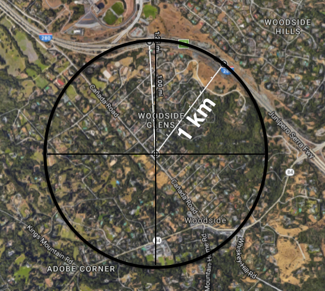

# Project: Advanced Lane Finding

Write a software pipeline to identify the lane boundaries in a video from a front-facing camera on a car.

## Becoming an Expert

Now we are going to make this project a bit more challenging and real world than the previous project by giving you a stretch of a highway that has lighting changes, color changes, underpasses and it is a much more realistic scenario.

I can tell you in terms of state of the art, if you do a really good job here with camera alone, you basically are reaching the state of the art in Computer Vision and self-driving cars.

## Tips and Tricks for the Project

In this lesson, you've acquired some new tools to help you find and track the lane lines. By all means, you are welcome and encouraged to use the techniques you used in the very first project. Here are some tips for the upcoming project.

### Camera Calibration

The calibration images in the lesson exercise were taken with a different camera setting and a different chessboard pattern than the calibration images for the project. **You need to set your chessboard size to 9x6 for the project** instead of 8x6 as in the lesson.

### Do your curvature values make sense?

We're not expecting anything like perfection for this project, but a good check on whether or not your perspective transform worked as expected, your conversion from pixel space to world space was correct, and that you successfully calculated the radius of curvature is whether or not your results are roughly consistent with reality.

Here is an image from Google maps of where the project video was made (just northwest of the Udacity office!). Here, I've drawn a circle to coincide with the first left curve in the project video. This is a very rough estimate, but as you can see, the radius of that circle is approximately 1 km. You don't need to tune your algorithm to report exactly a radius of 1 km in the project, but if you're reporting 10 km or 0.1 km, you know there might be something wrong with your calculations!

Here are some other tips and tricks for building a robust pipeline:

### Offset

You can assume the camera is mounted at the center of the car, such that the lane center is the midpoint at the bottom of the image between the two lines you've detected. The offset of the lane center from the center of the image (converted from pixels to meters) is your distance from the center of the lane.

### Tracking

After you've tuned your pipeline on test images, you'll run on a video stream, just like in the first project. In this case, however, you're going to keep track of things like where your last several detections of the lane lines were and what the curvature was, so you can properly treat new detections. To do this, it's useful to define a `Line()` class to keep track of all the interesting parameters you measure from frame to frame. Here's an example:

~~~python
# Define a class to receive the characteristics of each line detection
class Line():
    def __init__(self):
        # was the line detected in the last iteration?
        self.detected = False  
        # x values of the last n fits of the line
        self.recent_xfitted = [] 
        #average x values of the fitted line over the last n iterations
        self.bestx = None     
        #polynomial coefficients averaged over the last n iterations
        self.best_fit = None  
        #polynomial coefficients for the most recent fit
        self.current_fit = [np.array([False])]  
        #radius of curvature of the line in some units
        self.radius_of_curvature = None 
        #distance in meters of vehicle center from the line
        self.line_base_pos = None 
        #difference in fit coefficients between last and new fits
        self.diffs = np.array([0,0,0], dtype='float') 
        #x values for detected line pixels
        self.allx = None  
        #y values for detected line pixels
        self.ally = None
~~~

You can create an instance of the `Line()` class for the left and right lane lines to keep track of recent detections and to perform sanity checks.

### Sanity Check

Ok, so your algorithm found some lines. Before moving on, you should check that the detection makes sense. To confirm that your detected lane lines are real, you might consider:

- Checking that they have similar curvature
- Checking that they are separated by approximately the right distance horizontally
- Checking that they are roughly parallel

### Look-Ahead Filter

Once you've found the lane lines in one frame of video, and you are reasonably confident they are actually the lines you are looking for, you don't need to search blindly in the next frame. You can simply search within a window around the previous detection.

For example, if you fit a polynomial, then for each y position, you have an x position that represents the lane center from the last frame. Search for the new line within +/- some margin around the old line center.

If you need a reminder on how this works, make sure to go back and check the Finding the Lines: Search from Prior quiz from last lesson!

Then check that your new line detections makes sense (i.e. expected curvature, separation, and slope).

### Reset

If your sanity checks reveal that the lane lines you've detected are problematic for some reason, you can simply assume it was a bad or difficult frame of video, retain the previous positions from the frame prior and step to the next frame to search again. If you lose the lines for several frames in a row, you should probably start searching from scratch using a histogram and sliding window, or another method, to re-establish your measurement.

### Smoothing

Even when everything is working, your line detections will jump around from frame to frame a bit and it can be preferable to smooth over the last n frames of video to obtain a cleaner result. Each time you get a new high-confidence measurement, you can append it to the list of recent measurements and then take an average over n past measurements to obtain the lane position you want to draw onto the image.

### Drawing

Once you have a good measurement of the line positions in warped space, it's time to project your measurement back down onto the road! Let's suppose, as in the previous example, you have a warped binary image called `warped`, and you have fit the lines with a polynomial and have arrays called `ploty`, `left_fitx` and `right_fitx`, which represent the x and y pixel values of the lines. You can then project those lines onto the original image as follows:

~~~python
# Create an image to draw the lines on
warp_zero = np.zeros_like(warped).astype(np.uint8)
color_warp = np.dstack((warp_zero, warp_zero, warp_zero))

# Recast the x and y points into usable format for cv2.fillPoly()
pts_left = np.array([np.transpose(np.vstack([left_fitx, ploty]))])
pts_right = np.array([np.flipud(np.transpose(np.vstack([right_fitx, ploty])))])
pts = np.hstack((pts_left, pts_right))

# Draw the lane onto the warped blank image
cv2.fillPoly(color_warp, np.int_([pts]), (0,255, 0))

# Warp the blank back to original image space using inverse perspective matrix (Minv)
newwarp = cv2.warpPerspective(color_warp, Minv, (image.shape[1], image.shape[0])) 
# Combine the result with the original image
result = cv2.addWeighted(undist, 1, newwarp, 0.3, 0)
plt.imshow(result)
~~~

**Figure 1:** Original (undistorted) image with lane area drawn

## Onward to the Project

With the tools we've learned so far, will we be able to build a better lane mapping algorithm for this project?

Yes by using these advanced techniques, I am able to map out the lane and track its position while measuring the lane curvature and the position of my vehicle with respect to center in each frame.

Now its your turn to come up with an implementation.

## Project Instructions

### The Goal of this Project

In this project, your goal is to write a software pipeline to identify the lane boundaries in a video from a front-facing camera on a car. The camera calibration images, test road images, and project videos are available in the project repository [CarND-Advanced-Lane-Lines](https://github.com/udacity/CarND-Advanced-Lane-Lines).

### The Writeup

The writeup will be the primary output you submit (along with your code of course).

A great writeup should include the rubric points as well as your description of how you addressed each point. You should include a detailed description of the code used in each step (with line-number references and code snippets where appropriate) and links to other supporting documents or external references. You should also include images in your writeup to illustrate how your code works.

All that said, please be concise! We're not looking for you to write a book, just a brief description of how you passed each rubric point, and references to the relevant code :)

You are not required to use Markdown for your writeup. If you use another method, please just submit a PDF of your writeup.

### The Code

Your code should stand on its own as readable material. Explain in code comments, as well as in your writeup, how your code works and why you wrote it that way.

Make it easy for a reviewer to understand your code.

You are more than welcome to use code from the lesson. But if you copy something explain how it works and why you used it.

### Commit to GitHub

Students are highly encouraged to commit their project to a GitHub repo. To do this, you must change the upstream of the current repository and add your credentials. We have supplied a bash script to help you do this. Please open up a terminal, navigate to the project repository, and enter: `./set_git.sh`, then follow the prompts. This will set the upstream remote to your own repository and add your email and username to the git configuration. At this time we are not configuring passwords, so you will need to enter your username and password for each push. Since credentials are not persistent, it will be necessary to run this script each time you open, refresh, or reset the workspace.

### What It Takes to Pass

Read the [project rubric](rubric.md) for details on the requirements for a passing submission.

Your writeup should include each rubric point and your description of how you addressed that point in your submission. The repository folder in the workspace provides an example template (`write_up_template.md`), for your write up. This template can also be found on GitHub example template.

There is no starter code provided, but you are welcome to use code from the lesson and quizzes as you like. You may complete the project in a Jupyter notebook, but it's not required. Feel free to build it as a standalone project.

To help the reviewer evaluate your project, please save example images from each stage of your pipeline to the `output_images` folder and provide in your writeup a description of each image. Please also save your output video and include it with your submission.

### Evaluation

Once you have completed your project, double check the [Project Rubric](rubric.md) to make sure you have addressed all the rubric points. Your project will be evaluated by a Udacity reviewer according to that same rubric.

Your project must "meet specifications" in each category in order for your submission to pass. If you are happy with your submission, then you are ready to submit! If you see room for improvement in any category in which you do not meet specifications, keep working!

### Submission

### Project Submission if run on local machine

You may submit a link to your GitHub repo for the project.

In either case, remember to include example images for each stage of your pipeline and your final output video in your submission.

## Share Your Success

Share on Twitter

Share on Facebook

Share on LinkedIn

## Project Submission

### Project Submission Checklist

Before submitting your project, please review and confirm the following items.

- I am confident all rubric items have been met and my project will pass as submitted. (If not, I will discuss with my mentor prior to submitting.)

- Project builds correctly without errors and runs.

- All required functionality exists and my project behaves as expected per the project's specifications.