# Neural Networks

Build and train neural networks from linear and logistic regression to backpropagation and multilayer perceptron networks.

## Neural Network Intuition

Perhaps the hottest topic right now is Artificial Intelligence and when people talk about this, they usually mean Machine Learning, specifically neural networks.

Neural networks should be familiar to you, a big neural network is your brain, which has 10 to the 11 neurons. What people have done in the last decades kind of abstracted this big mass in your brain into a basis of equations that emulate a network of artificial neurons. Then people have invented ways to train these systems based on data. So, rather than instructing a machine with rules like a piece of software, these neural networks are trained based on data.

So, you're going to learn the basics now: perceptron, backpropagation, terminology that doesn't make sense yet, but by the end of this unit you should be able to write and code and train your own neural network.

## Introduction to Deep Learning

Here you're going to learn one of the most exciting tools in self-driving car development, deep neural networks. At the end of this module, you'll create a project that demonstrates real world application of the skills you need to become a self-driving car engineer.

In the project, you'll train a deep neural network to drive a car in a simulator. First you'll drive and record training laps in simulation and then you'll build and train a deep neural network that learns from the way you drive.

A deep neural network is just a term that describes a big multi-layer neural network. A neural network is a machine learning algorithm that you can train using input like camera images or sensor readings and generate output like what the steering angle the car should take or how fast it should go. The idea is the neural network learns from observing the world. You don't have to teach it anything specific.

Deep learning is just another term for using deep neural networks to problems and it's become really important for self-driving cars. But deep learning is relatively new, until the last few years, computers simply weren't fast enough to train deep neural networks effectively. Now however, automotive manufacturers can apply deep learning techniques to drive cars in real time.

Because deep learning is so new, automotive engineers and researchers are still experimenting with just how far it can take us, but deep learning has already revolutionized segments of autonomous driving like computer vision and it has the potential to entirely change the way we develop self-driving cars.

## Starting Machine Learning

Some of the most recent breakthroughs in the performance of self-driving cars have come from machine learning. Two of my Udacity colleagues: Luis and Mat are machine learning experts. In this lesson, they are going to introduce you to the foundational concepts in the fields of machine learning and deep neural networks. Afterward, we'll build on those concepts and apply them to self-driving cars.

Luis Serrano leads the Machine Learning Nanodegree program at Udacity. Machine Learning is a field of artificial intelligence that relies on computers to learn about the environment from data instead of relying on the rules set by computer programmers.

Mat Leonard leads the Deep Learning Nanodegree program. Deep learning is an approach to machine learning that uses deep neural networks. Deep learning uses this one tool to accomplish an amazing array of objectives from speech recognition to driving a car.

You'll start learning about the perceptron, which is the fundamental unit of a neural network. Then you'll learn how to combine these units into a simple neural network. Before you start learning about neural networks, let's go over the basics of machine learning.

We'll get started with something less complex than self-driving cars. Housing prices.

## A note on Deep Learning

The following lessons contain introductory and intermediate material on neural networks, building a neural network from scratch, using TensorFlow and Convolutional Neural Networks:

- Neural Networks
- TensorFlow
- Deep Neural Networks
- Convolutional Neural Networks

## Quiz: Housing Prices

Enter the [Housing Prices quiz](quizzes/housing-prices/quiz.md)

You can think of **linear regression** as a painter who will look at your data and draw the best fitting line through it.

## Linear to Logistic Regression

Linear regression helps predict values on a continuous spectrum, like predicting what the price of a house will be.

How about classifying data among discrete classes?

- Determining whether a patient has cancer
- Identifying the species of a fish
- Figuring out who's talking on a conference call

Classification problems are important for self-driving cars. Self-driving cars might need to classify whether an object crossing the road is a car, pedestrian and a bicycle. Or they might need to identify which type of traffic sign is coming up or what a stop light is indicating.

In the next video, Luis will demonstrate a classification algorithm called "logistic regression". He'll use logistic regression to predict whether a student will be accepted to a university.

Linear regression leads to logistic regression and ultimately neural networks, a more advanced classification tool.

## Classification Problems

We'll start by defining what we mean by classification problems and applying it to a simple example.

Enter the [Classification Problems quiz](quizzes/classification/quiz.md)

## Linear Boundaries

Let's add some math. We'll label the horizontal axis corresponding to test with variable X1 and the vertical axis corrsponding to the grades by X2. So, this boundary line that separates the blue and red points is going to have a linear equation.

**Boundary A Line**:

~~~
2X1 - X2 - 18 = 0
~~~

What does this equation mean?

It means that our method for accepting or rejecting students says the following:

~~~
Score = 2*Test + Grades - 18
~~~

and when a student comes in, we check their score and if there score is a positive number, we accept the student, but if it is a negative number, we reject the student. This is called a prediction:

**Prediction**:

~~~
Score > 0: Accept
Score < 0: Reject
~~~

That is it. That linear equation is our model.

In a more general case, our boundary will be in the form:

**General Boundary A Line**:

~~~
w1x1 + w2x2 + b = 0
~~~

We will abbreviate this equation in vector notation as 

~~~
Wx + b = 0
~~~

where W is the vector w1 and w2 and x is the vector x1 and x2:

~~~
W = (w1, w2)
x = (x1, x2)
~~~

and we simply take the product of the two vectors. We will refer to **x** as the input and **W** as the weights and **b** as the bias. Now for student coordinates x1 and x2, we will denote the label as y and the label is what we are trying to predict. So if the student gets accepted (mainly the point is blue), then the label is `y = 1` and if the student gets rejected (mainly the point is red), then the label is `y = 0`:

~~~
y = label: 0 or 1
~~~

Finally, our prediction is going to be called y hat and it will be what the algorithm predicts the label will be. In this case, y hat is 1 if the algorithm predicts the student gets accepted, which means the point lies over the line. y hat is 0 if the algorithm that the student get rejected, which means the point is under the line. In math terms, y hat is 1 if `Wx + b >= 0` and y hat is 0 if `Wx + b < 0`.

## Quiz: Linear Boundaries

Enter the [Linear Boundaries quiz](quizzes/linear-boundaries/quiz.md)

## Higher Dimensions

You may be wondering what happens if we have something more than just test and grades like the ranking of the student in the class? How do we fit 3 columns of data? Now the only difference is that we won't be working in 2 dimensions, now we will be working in 3 dimensions.

So, now we have 3 axis: X1 for the test, X2 for the grades and X3 for the class ranking. Our data will look like the following:

A bunch of blue and red points flying around in 3D and our equation won't be a line in 2 dimensions, but a plane in 3 dimensions. The equation will be similar as before:

**Boundary: A Plane**:

~~~
w1x1 + w2x2 + w3x3 + b = 0
~~~

This equation can still be abbreviated as:

~~~
Wx + b = 0
~~~

except our vectors will now have 3 entries instead of 2 and our prediction will still be y hat equals 1 if `Wx + b >= 0` and y hat equals 0 if `Wx + b < 0`.

What if we have many columns like n of them? Well it is the same thing, now our data just lives in **n-dimensional space**. 

~~~
x1, x2,...,xn
~~~

It can be difficult to picture things in more than 3 dimensions, but if we can imagine that the points are things with just n coordinates called x1, x2, x3 all the way up to xn with our labels being y, then our boundary is just a n-1 dimensional hyperplane, which is the high dimensional equivalent of a line in 2D or a plane in 3D and the equation of this **n-1 dimensional hyperplane** is:

**Boundary:**

~~~
w1x1 + w2x2 + wnxn + b = 0
~~~

which we can still abbreviate to:

~~~
Wx + b = 0
~~~

where our vectors now have n entries and our prediction are still the same as before. It is y hat equals 1 if `Wx + b >= 0` and y hat equals 0 if `Wx + b < 0`

## Quiz: Higher Dimensions

Ente the [Higher Dimensions quiz](quizzes/higher-dimensions/quiz.md)

## Perceptrons

A **perceptron** is an encoding of our equation into a small graph. 

**Notation 1**:

The first way we build it is the following: we have our data and boundary line and we fit it inside a node and we add small nodes for the inputs, which are test and grades:

and what the perceptron does is plots the point **(7,6)** and checks if the point is in the positive or negative area. 

If the point is in the positive area, then the perceptron returns a yes:

If the point is in the negative area, then the perceptron returns a no.

Let's recall our equation `score = 2*Test + 1*Grades - 18` and that our prediction consists of accepting the student if our score is positive or 0 and rejecting them if the score is negative. These weights `2, 1, -18` are what define the linear equation and we will use them as labels in the graph. The `2` and the `1` will label the edges coming from x1 and x2 respectively and the bias unit `-18` will label the node. Thus, when we see a node with these labels, we can think of the linear equation they generate.

**Notation 2**:

Another way to grab this node is to consider the bias as part of the input. Now since **W1** gets multiplied by **x1** and **W2** by **x2**, it is natural to think that **b** gets multiplied by **1**. So, we will have a **b** labeling an edge coming from a **1**. Then what the node does is it multiplies the values coming from the incoming nodes by the values and the corresponding edges. Then it adds them and checks if the result is greater than or equal to 0. If the result is, then the node returns a yes or value of 1 and if it isn't, then the node returns a no or a value of 0.

We will be using both notations throughout this course. Although the second one will be used more often. In the general case, this is how the nodes look: we will have our **node** to the right and our inputs on the left going into the node with values **x1** up to **xn** and **1** and edges with weights **W1** up to **Wn** and **b** corresponding to the bias unit. Then the node calculates the linear equation `Wx + b`, which is the summation from `i = 1` to **n** of `WiXi + b`. This node then checks if the value is 0 or bigger and if it is, then the node returns a value of one for yes and if not, then it returns a value of 0 for no.

Know that we are using an implicit function called a **step function**, which returns a 1 if the input is positive or 0 and it returns 0 if the input is negative.

**step function**:

~~~
y = 1 if x >= 0
y = 0 if x < 0
~~~

So in reality, these perceptrons can be seen as a combination of nodes where the first node calculates the linear equation on the inputs on the weights

and the second node applies the step function to the result

This can be graphed as follows: the summation sign represents the linear function in the first node and the drawing represents the step function in the second node.

In the future, we will use different step functions, so this is why it is useful to specify it in the node.

So as we have seen, there are two ways to represent perceptrons: the one on the left has a bias unit coming from an input node with a value of 1 and the one on the right has the bias inside the node.

## Quiz: Perceptrons

Enter the [Perceptrons quiz](quizzes/perceptrons/quiz.md)

## Perceptrons II

### Perceptron

Now you've seen how a simple neural network makes decisions: by takinng in input data, processing that information and finally producing an output in the form of a decision!

Let's take a deeper dive into the university admission example to learn more about processing the input data.

Data, like test scores and grades are fed into a network of interconnected nodes. These individual nodes are called [perceptrons](https://en.wikipedia.org/wiki/Perceptron), or artificial neurons, and they are the basic unit of a neural network. Each one looks at input data and decides how to categorize that data. In the example above, the input either passes a threshold for grades and test scores or doesn't, and so the two categories are: yes (passed the threshold) and no (didn't pass the threshold). These categories then combine to form a decision -- for example, if both nodes produce a "yes" output, then this student gains admission into the university.

Let's zoom in even further and look at how a single perceptron processes input data.

The perceptron above is one of the two perceptrons from the video that help determine whether or not a student is accepted to a university. It decides whether a student's grades are high enough to be accepted to the university. You might be wondering: "How does it know whether grades or test scores are more important in making this acceptance decision?" Well, when we initialize a neural network, we don't know what information will be most important in making a decision. It's up to the neural network to _learn for itself_ which data is most important and adjust how it considers that data.

It does this with something called **weights**.

### Weights

When input comes into a perceptron, it gets multiplied by a weight value that is assigned to this particular input. For example, the perceptron above has two inputs, `tests` for test scores and `grades`, so it has two associated weights that can be adjusted individually. These weights start out as random values, and as the neural network learns more about what kind of input data leads to a student being accepted into a university, the network adjusts the weights base on any errors in categorization that results from the previous weights. This is called **training** the neural network.

A higher weight means the neural network considers that input more important than other inputs and lower weight means that the data is considered less important. An extreme example would be if test scores had no affect at all on university acceptance; then the weight of the test score input would be zero and it would have no affect on the output of the perceptron.

### Summing the Input Data

Each input to a perceptron has an associated weight that represents its importance. These weights are determined during the learning process of a neural network, called training. In the next step, the weighted input data are summed to produce a single value that will help determine the final output - whether a student is accepted to a university or not. Let's see a concrete example of this:

We weight `x_test` by `w_test` and add it to `x_grades` weighted by `w_grades`.

When writing equations related to neural networks, the weights will always be represented by some type of the letter **w**. It will usually look like a ***W*** when it represents a **matrix** of weights or a _w_ when it represents an **individual** weight, and it may include some additional information in the form of a subscript to specify _which_ weights (you'll see more on that next). But rememberr, when you see the letter **w**, think **weights**.

In this example, we'll use ***w_grades*** for the weight of `grades` and ***w_test*** for the weight of `test`.

For the image above, let's say that the weights are: `w_grades = -1`, `w_test = -0.2`. You don't have to be concerned with the actual values, but their relative values are important. ***w_grades*** is 5 times larger than ***w_test***, which means the neural network considers `grades` input 5 times more important than `test` in determining whether a student will be accepted into a university.

The perceptron applies these weights to the inputs and sums them in a process known as **linear combination**. In our case, this looks like `w_grades * x_grades + w_test * x_test = -1 * x_grades - 0.2 * x_test`.

Now to make our equation less wordy, let's replace the explicit names with numbers. Let's use 1 for ***grades*** and 2 for ***tests***. So now our equation becomes:

~~~
w1*x1 + w2*x2
~~~

In this example, we just have 2 simple inputs: grades and tests. Let's imagine we instead had `m` different inputs and we labeled them `x1,x2,...,xm`. Let's also say that the weight corresponding to x1 is w1 and so on. In that case, we would express the linear combination succintly as:

~~~
summation(m, i=1, w_i * x_i) 
~~~

Here the Greek letter Sigma is used to represent **summation**. It simply means to evaluate the equation to the right multiple times and add up the results. In this case, the equation it will sum is 

~~~
w_i * x_i
~~~

But where do we get w_i and x_i?

The summation above means to iterate over all i values from 1 to m.

So to put summation equation above together:

- Start at i = 1
- Evalute w1 * x1 and remember the results
- Move to i = 2
- Evaluate w2 * x2 and add these results to w1 * x1
- Continue repeating that process until i = m, where m is the number of inputs

### Calculating the Output with an Activation Function

Finally, the result of the perceptron's summation is turned into an output signal! This is done by feeding the linear combination into an **activation function**.

Activation functions are functions that decide, given the inputs into the node, what should be the node's output? Because it's the activation function that decides the actual output, we often refer to the outputs of a layer as its "activations".

One of the simplest activation functions is the **Heaviside step function**. This function returns a **0** if the linear combination is less than 0. It returns a **1** if the linear combination is positive or equal to zero. The [Heaviside step function](https://en.wikipedia.org/wiki/Heaviside_step_function) is shown below, where h is the calculated linear combination:

The Heaviside Step Function

In the university acceptance example above, we used the weights `w_grades = -1, w_test = -0.2`. Since ***w_grades*** and ***w_test*** are negative values, the activation function will only return a 1 if grades and test are 0! This is because the range of values from the linear combination using these weights and inputs are `(−∞,0]` (ex. negative infinity to 0, including 0 itself).

It's easiest to see this with an example in two dimensions. In the following graph, imagine any points along the line or in the shaded area represent all the possible inputs to our node. Also imagine that the value along the y-axis is the result of performing the linear combination on these inputs and the appropriate weights. It's this result that gets passed to the activation function.

Now remember that the step activation function returns 1 for any inputs greater than or equal to zero. As you can see in the image, only one point has a y-value greater than or equal to zero - the point right at the origin (0,0):

Now we certainly want more than one possible grade/test combination to result in acceptance, so we need to adjust the results passed to our activation function so it activates - that is, returns 1 - for more inputs. Specifically, we need to find a way so all the scores we'd like to consider acceptable for admission produce values greater than or equal to zero when linearly combined with the weights into our node.

One way to get our function to return 1 for more inputs is to add a value to the results of our linear combination, called a **bias**.

A bias, represented in equations as _b_, lets us move values in one direction or another.

For example, the following diagram shows the previous hypothetical function with an added bias of +3. The blue shaded area shows all the values that now activate the function. But notice that these are produced with the same inputs as the values shown shaded in grey - just adjusted higher by adding the bias term:

Of course, with neural networks we won't know in advance what values to pick for biases. That's ok because like the weights, the bias can also be updated and changed by the neural network during training. So after adding a bias, we now have a complete perceptron formula:

Perceptron Formula

This formula returns 1 if the input (x1,x2,...,xm) belongs to the accepted-to-university category or returns 0 if it doesn't. The input is made up of one or more [real numbers](https://en.wikipedia.org/wiki/Real_number), each one represented by xi, where m is the number of inputs.

Then the neural network starts to learn! Initially, the weights (_wi_) and bias (_b_) are assigned a random value and then they are updated using a learning algorithm like gradient descent. The weights and biases change so that the next training example is more accurately categorized and patterns in data are "learned" by the neural network.

Now you have a good understanding of perceptrons, let's put that knowledge to use. In the next section, you'll create the AND perceptron from the _Why Neural Networks?_ section by setting the values for weights and bias. 

## Why "Neural Networks"?

Why are these objects called neural networks?

Well the reason they are called neural networks is because perceptrons kind of look like neurons in the brain. On the left, we have a perceptron with 4 inputs `1, 0, 4, 2` and what the perceptron does is it calculates some equation on the input and decides to return a 1 or 0.

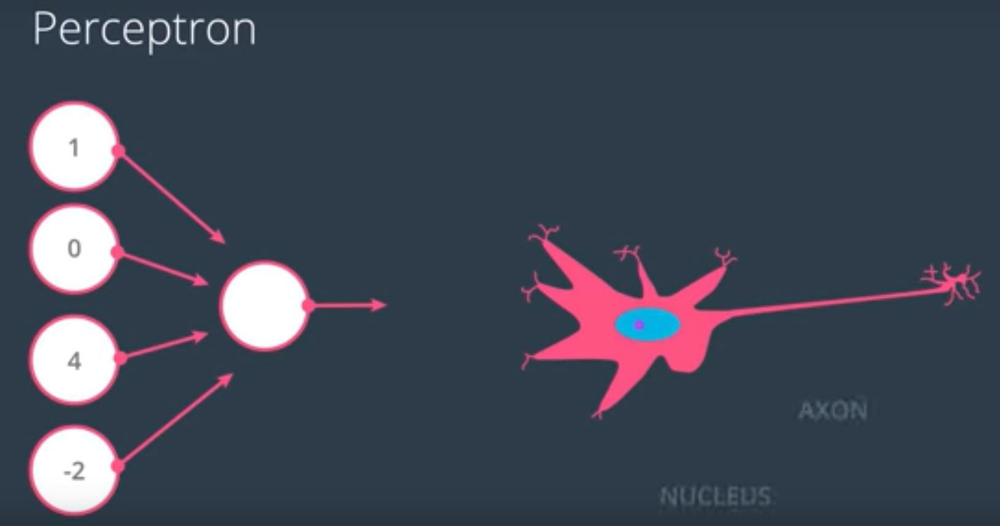

Perceptron with 4 inputs `1, 0, 4, 2`

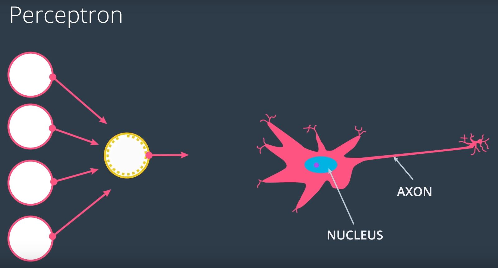

Perceptron calculates the equation on the input

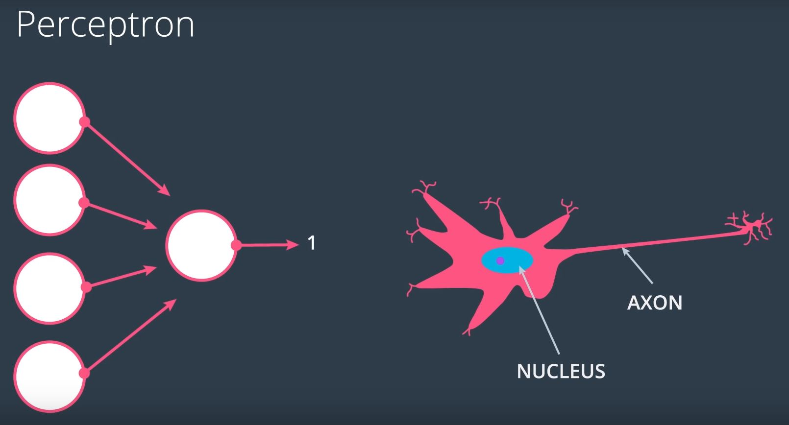

Perceptron decides toreturn a 1 or 0

In a similar way neurons take inputs coming from the dendrites. These inputs are nervous impulses, so what the neuron does is it does something with the nervous impulses and it decides if it outputs a nervous impulse or not through the axon.

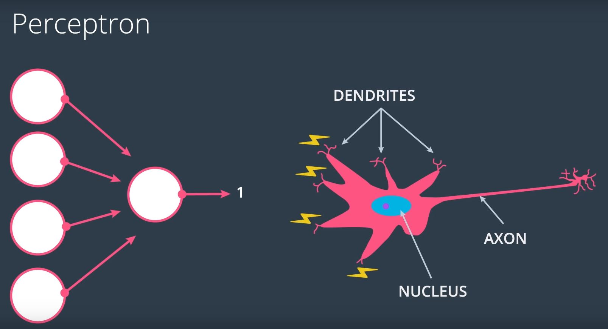

Neurons take inputs from the dendrites **nervous impulses**

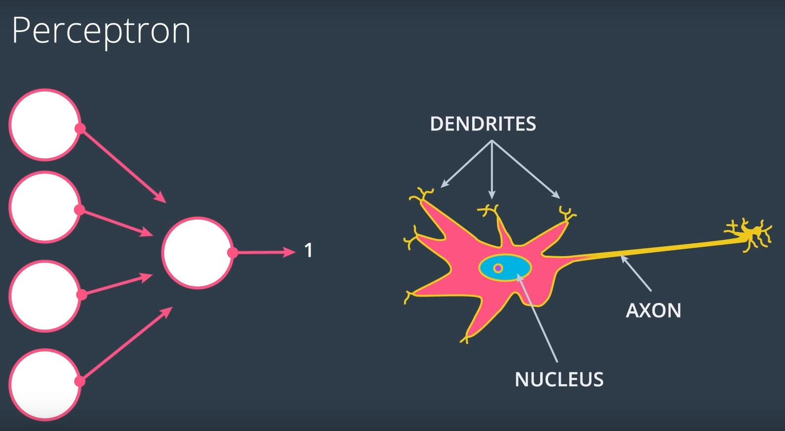

Neuron does something with the nervous impulses

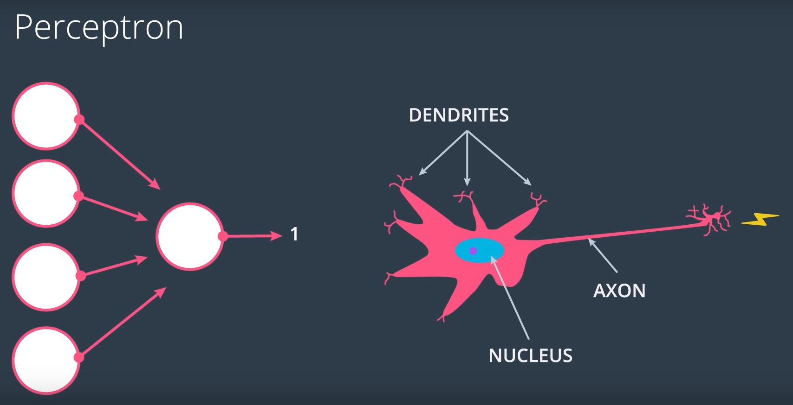

Neuron decides if it outputs a nervous impulse or not through the axon

The way we will be creating neural networks later in this lesson is by concatenating these perceptrons, so we will be mimicing the way the brain takes neurons by taking the output from one and turning it into the input for another one.

## Perceptrons as Logical Operators

We'll see one of the many great applications of perceptrons as logical operators! You'll have the chance to create the perceptrons for the most common of these: **AND, OR, NOT** operators. Then we'll see what to do about the elusive **XOR** operator. Let's dive in!

### AND Perceptron

Some logical operators can be represented by perceptrons. We have the AND operator and it takes two inputs and returns an output. The inputs can be true or false, but the output is only true if both inputs are true. The following table shows each input combination along with the output result for the **AND** logical operator:

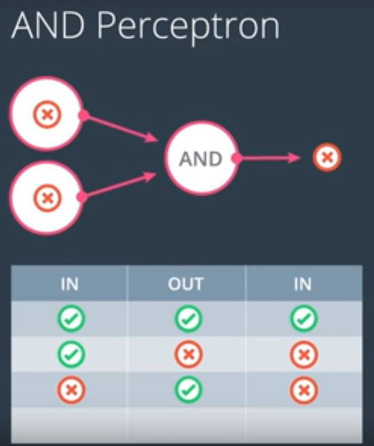

So how do we turn this into a perceptron?

First we turn the table of true and false into a table of 1s and 0s where 1 corresponds to true and 0 corresponds to false. Now we draw the perceptron, which works just as before. It has a line defined by weights and bias. It has a positive area colored by blue and a negative area colored red. What this perceptron is going to do is plot each point and if the point falls in the positive area, then it returns a 1 and if it falls in the negative area, then it returns a 0.

For example, the **(1,1)** gets plotted in the positive area, so it returns a 1.

The **(1, 0)** gets plotted in the negative area, so the perceptron returns a 0. The  **(0, 1)** gets plotted in the negative area, so the perceptron returns a 0. The  **(0, 0)** gets plotted in the negative area, so the perceptron returns a 0.

### Quiz: AND Perceptron

Enter the [AND Perceptron quiz](quizzes/and-perceptron/quiz.md)

### OR Perceptron

Other logical operators can also be turned into perceptrons. For example, the OR operator returns true if any of its two inputs is true. The true and false table gets turned into a table of 1s and 0s. The 1s and 0s table then gets turned into a perceptron. This OR perceptron is similar to the AND perceptron except the line is shifted down and has different weights and bias:

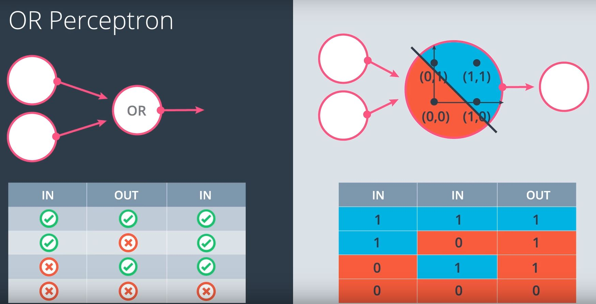

### Quiz: OR Perceptron

Enter the [OR Perceptron quiz](quizzes/or-perceptron/quiz.md)

### NOT Perceptron

Unlike the other perceptrons we looked at, the NOT operation only cares about one input. The operation returns a `0` if the input is `1` and a `1` if it's a `0`. The other inputs to the perceptron are ignored.

### Quiz: NOT Perceptron

Enter the [NOT Perceptron quiz](quizzes/not-perceptron/quiz.md)

### XOR Perceptron

XOR operator returns a true if exactly 1 of the inputs is true and the other 1 is false. 

### Quiz: XOR Perceptron

Enter the [XOR Perceptron](quizzes/xor-perceptron/quiz.md)

## Perceptron Trick

In the last section you used your logic and your mathematical knowledge to create perceptrons for some of the most common logical operators. In real life, we can't be building these perceptrons ourselves. The idea is we give them the result, they build themselves. For this, here's a neat trick that will help us.

### Quiz 1: Perceptron Trick

Enter the [Perceptron Trick quiz 1](quizzes/perceptron-trick-1/quiz.md)

### Quiz 2: Perceptron Trick

Enter the [Perceptron Trick quiz 2](quizzes/perceptron-trick-2/quiz.md)

## Perceptron Algorithm

We start with a random equation that will determine some line and two regions, the positive and negative region. Now we will move this line around to get a better fit. Now we ask all the points how they are doing. The 4 correctly classified points say I'm good and the 2 incorrectly classified points say come closer.

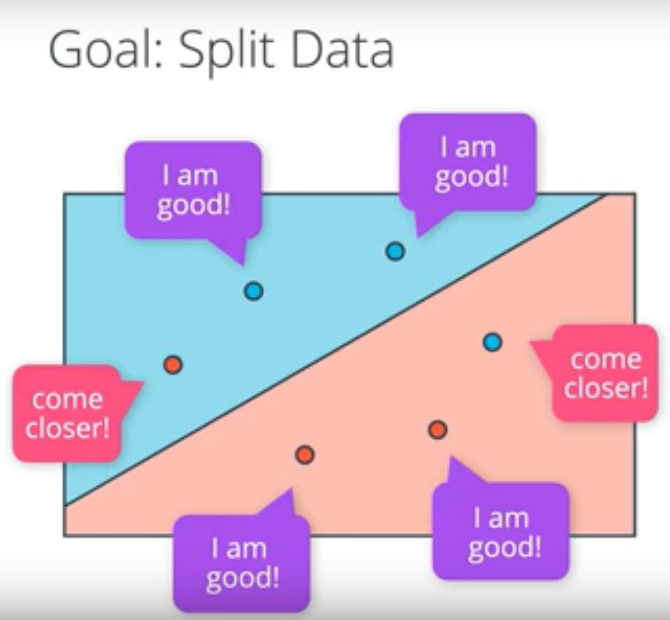

Let's listen to the point on the right and apply the trick to make the line closer to the point.

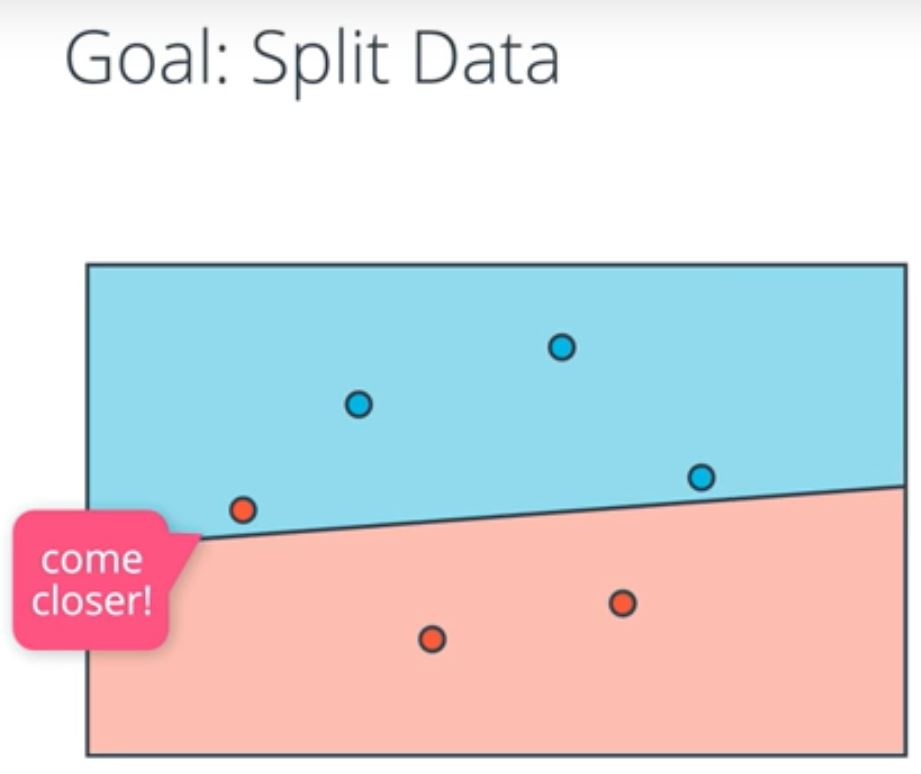

Now we listen to the point on the left and the line goes closer to it, classifying the point correctly.

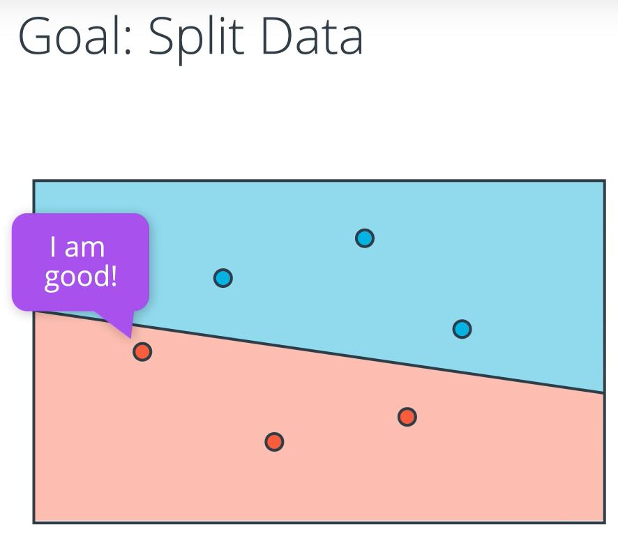

Now every point is classified. Let's write the pseudocode for this perceptron algorithm:

1\. Start with random weights: `w1, ..., wn, b`

2\. For every misclassified point (x1, ..., xn):

    2.1\. if prediction = 0:

        `a positive point in the negative area`

        we update the weights as follows:

        For i = 1 ... n

            - Change wi + axi

            `where a = alpha is the learning rate`

        Change b to b + a

            `moves the line closer to the misclassified point`

    2.2\. if prediction = 1:

        `a negative point in the positive area`

        we update the weights in a similar, subtract instead of add

        For i = 1 ... n

            - Change wi - axi

        Change b to b - a

            `line moves closer to the misclassified point`

Now we repeat this step until we have no errors or a number of errors that is small.
        
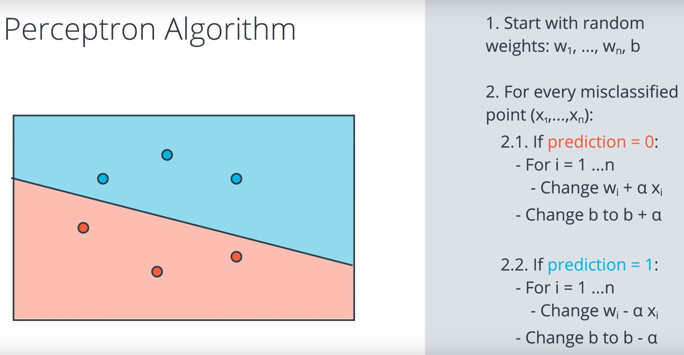

> **NOTE**: There's a error in the image, Wi should be updated to Wi = Wi += axi

### Quiz: Perceptron Algorithm

Enter the [Perceptron Algorithm quiz](quizzes/perceptron-algorithm)

## Error Function

The way we will solve our problems from now on is with the help of an error function. An **error** function is something that tells us how far we are from the solution. For example, if I am located here to the right and a plant is located to the left, an error function will tell us the distance from the plant. Our goal would then be to look around ourselves and check in which direction we can take a step to get closer to the plant, take that step and then repeat.

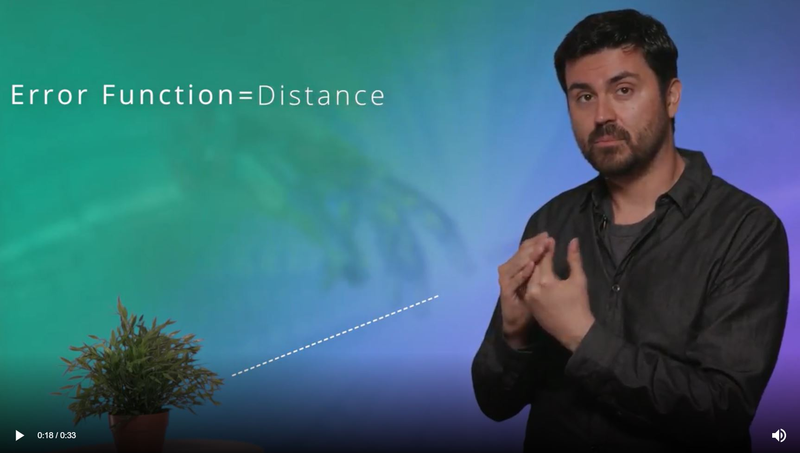

## Log-loss Error Function

Here is a realization of the error function. We are standing on top of mount errorist and want to descend, but it is not that easy because it's cloudy and the mountain is very big, so we can't really see the big picture. What we will do to go down is look around us and consider all the possible directions in which we can walk. Then we pick a direction that makes us descend the most.

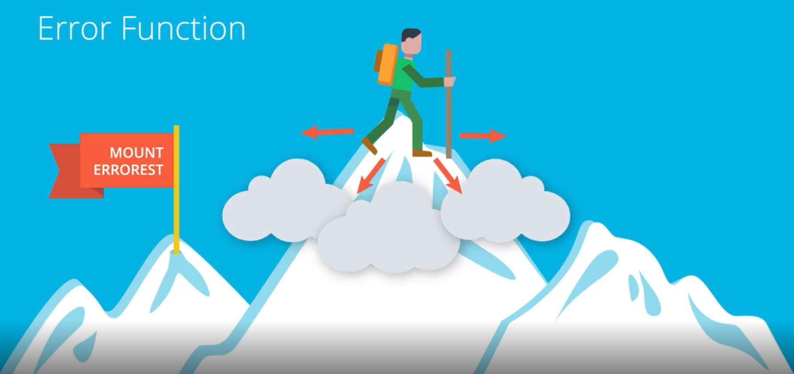

We take a step in that direction. Thus, we decrease the height.

Once we take a step, we start the process again and again always decreasing the height until we go all the way down the mountain.

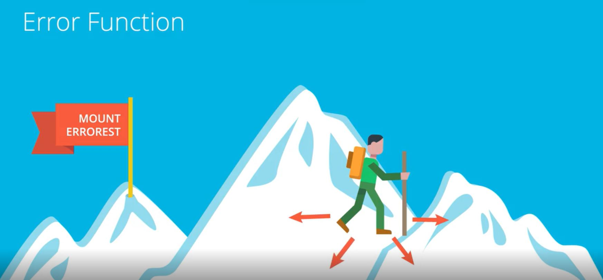

In this case, the key metric we use to solve the problem is the height. We will call the height the error. The error is what is telling us how badly we are doing at the moment and how far we are from an ideal solution.

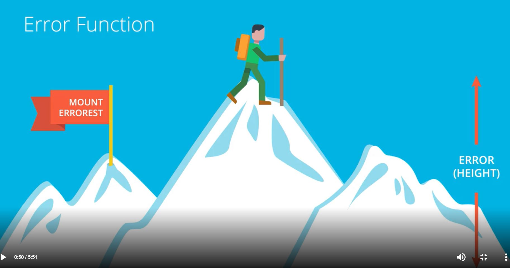

If it constantly takes steps to decrease the error, then we will eventually solve our problem, descending from mount errorist. You may be thinking, wait that doesn't necessarily solve the problem, what if I get stuck in a valley (a local minimum) that is not the bottom of the mountain? This happens a lot in machine learning. We will see ways later to solve this problem. It's also worth noting that many times, a local minimum will give us a pretty good solution to a problem. This method, which we will study later is called gradient descent.

Let's try another approach to solve a problem. What would be a good error function here? What would be a good way to tell the computer how badly it is doing? So, here is the line with our positive and negative area. The question is how do we tell the computer how far it is from a perfect solution? Well maybe we can count the number of mistakes. That is our height (our error):

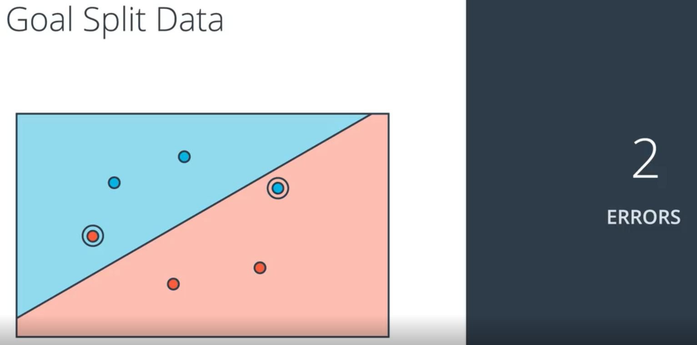

So just as we did to descend the mountain, we look around all the directions we can move the line in order to decrease our error. Let's say we move the line in the following direction:

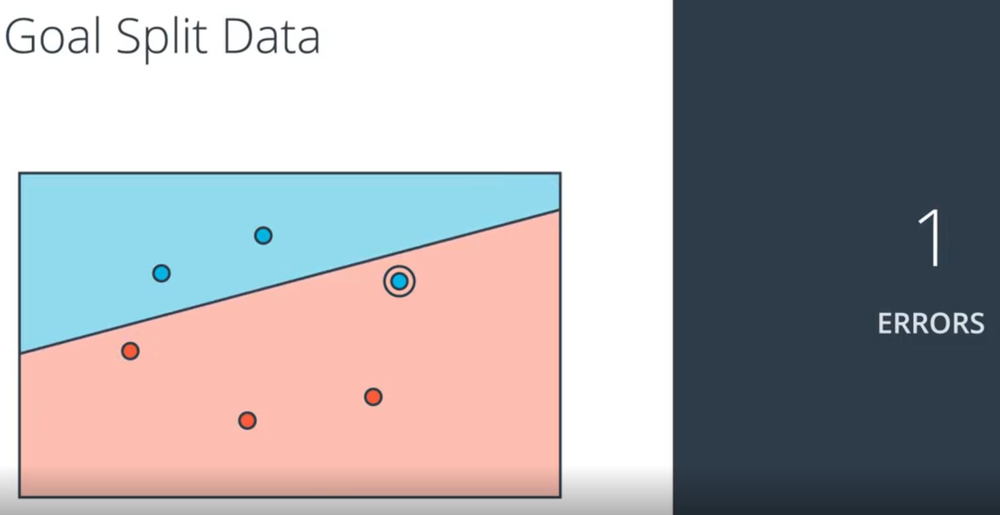

We'll decrease the number of errors to 1, then if we're moving in that direction, we'll decrease the number of errors to 0.

Then we are done right? Almost. There is a small problem with that approach. In our algorithms, we will be taking very small steps and the reason for this is calculus because our tiny steps will be calculated by derivatives. What happens if we take very small steps here? We start with 2 errors, then move a tiny amount and the result is we are still at 2 errors:

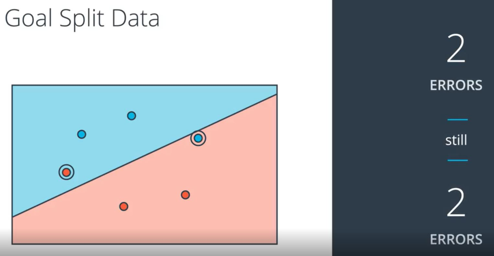

Then we move a tiny amount and we are still at 2 errors. We move another tiny amount and we are still at 2 errors.

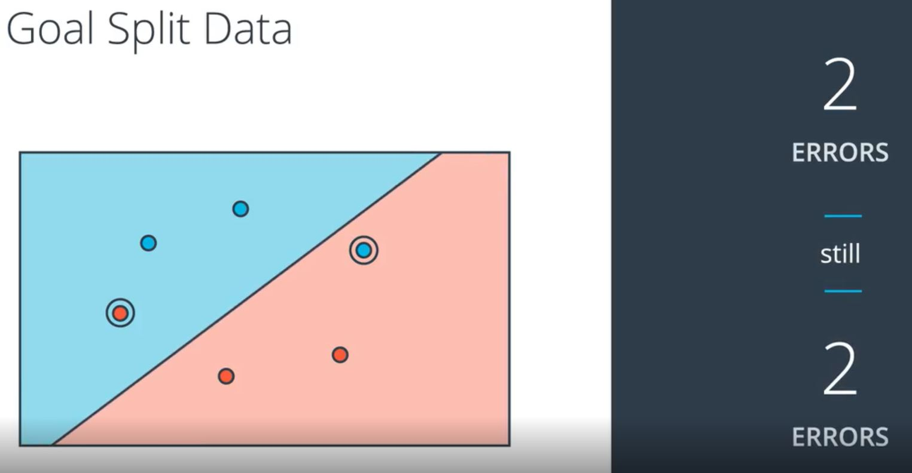

We move again and again. 

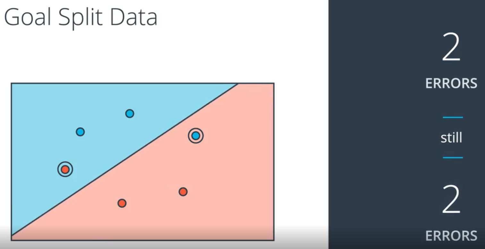
 
So there is not much we can do here. This is the equivalent to using gradient descent to try to descend an aztec pyramid with flat steps. If we are standing here in the 2nd floor for 2 errors and we look around ourselves, we will always see 2 errors and we will get confused and not know what to do.

On the other hand in mount errorist, we can detect very small variations in height and we can figure out in what direction it can decrease the most:

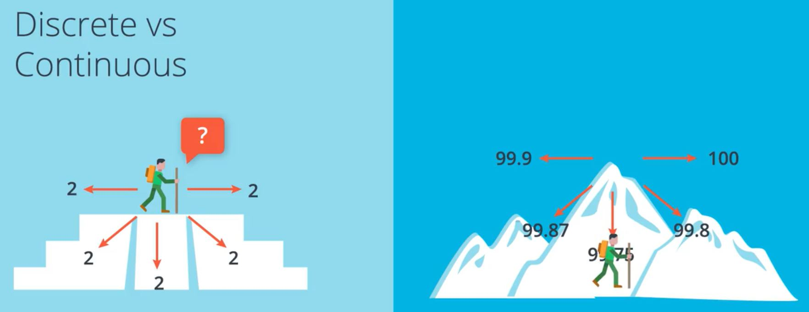

In math terms, this means that in order for us to do gradient descent, our error function cannot be discrete. It should be continuous:

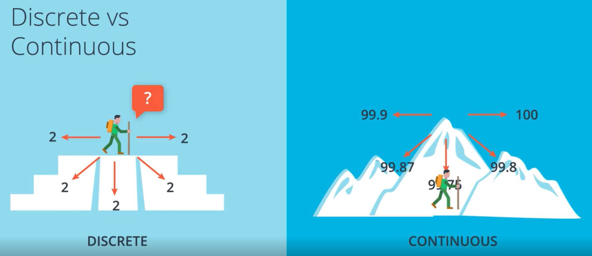

Mount errorist is continuous since small variations in our position will translate to small variations in the height but the Aztec pyramid does not since the high jumps from 2 to 1 and then from 1 to 0. As a matter of fact, our error functions need to be differentiable, but we'll see that later.

So, what we need to do here is to construct an error function that is continuous and we'll do this as follows. Here are 6 points with 4 of them correctly classified (2 blue, 2 red) and 2 of them incorrectly classified. That is this red point at the very left and this blue point at the very right. The error function is going to assign a large penalty to the 2 incorrectly classified points and small penalties to the 4 correctly classified points.

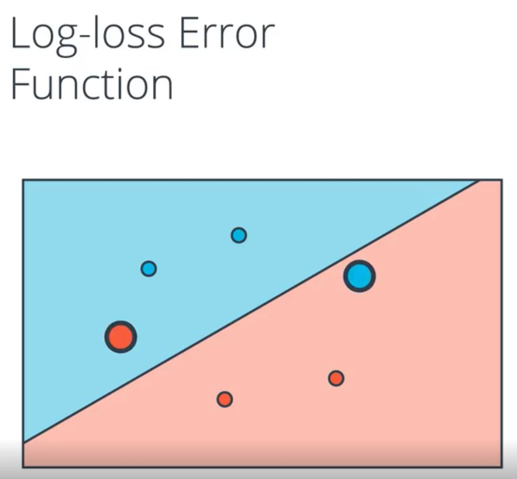

Here we are representing the size of the point as the penalty. The penalty is the distance from the boundary when the point is misclassified and almost 0 when the point is correctly classified. We learn the formula for the error later in the class. So, we obtain the total error by adding all the errors to the corresponding points and here we have a large number since the 2 misclassified points add a large amount to the error:

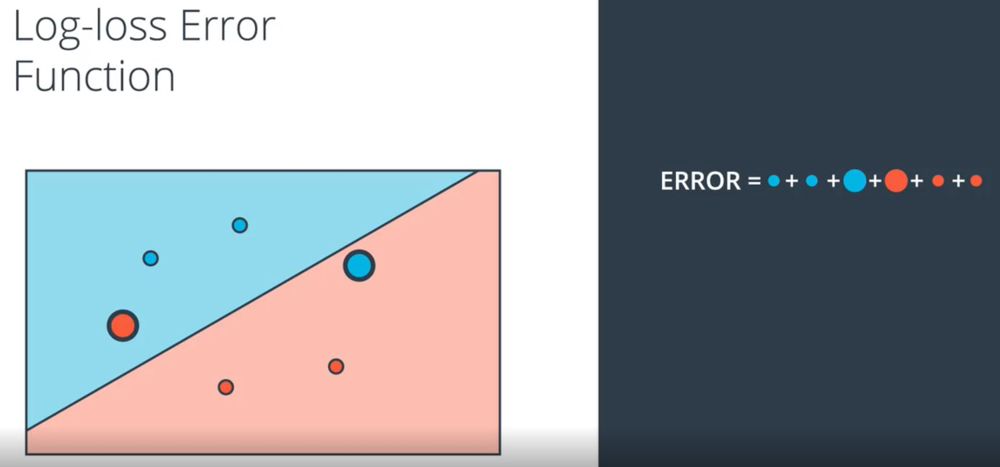

The idea now is to move the line around to decrease this error, but now we can do it since we can make tiny changes to the parameters of the line, which will amount to very tiny changes in the error function. So, if we move the line in the following direction, we can see that some errors decrease and some slightly increase, but in general when we consider the sum, the sum gets smaller and we can see that since we correctly classified the 2 points that were misclassified before:

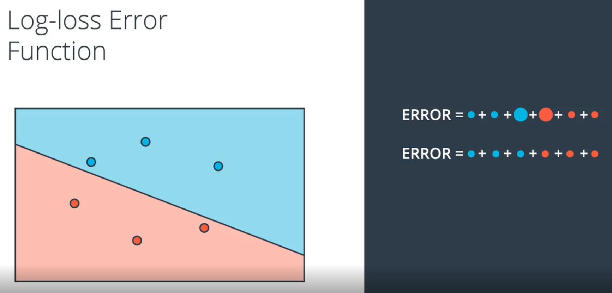

So, once we are able to build an error function with this property, we can now use gradient descent to solve our problem:

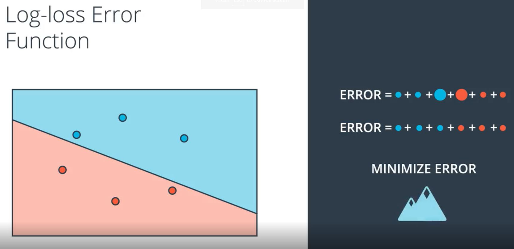

So, here is the full picture. We are at the summit of mount errorist. We are quite high up because our error is quite large. As you can see the error is the height, which is the sum of the blue and red areas:

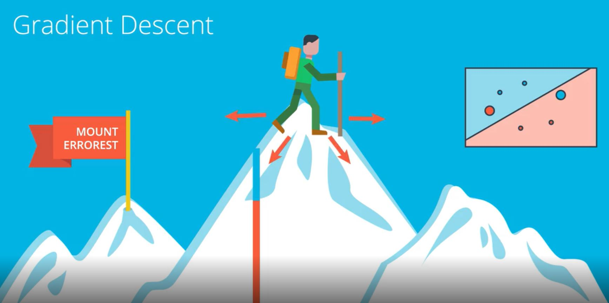

We explore around to see what direction brings us down the most or equivalent, what direction can we move the line to reduce the error the most and we take a step in that direction. So in the mountain, we go down 1 step and in the graph we've reduced the error a bit by correctly classifying one of the points.

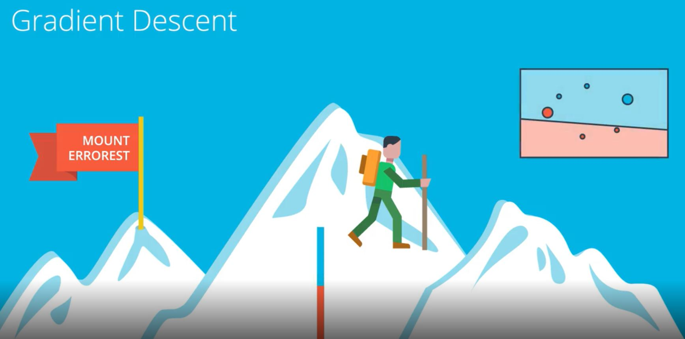

Now we do it again. We calculate the error, we look around ourselves to seeing what direction we descend the most, we take a step in that direction and that brings us down the mountain. So, on the left we have reduced the height and successfully descended from the mountain and on the right we have reduced the error to its minimum possible value and successfully classified our points:

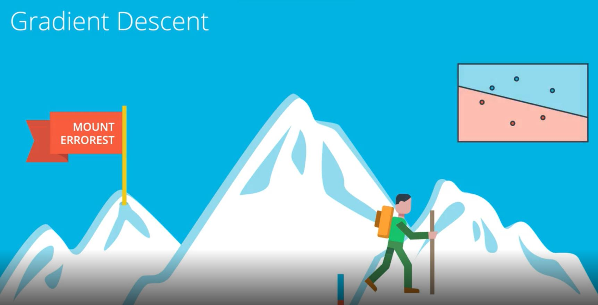

Now the question. How do we define this error function? We will do that next, but let's do a quiz.

### Quiz: Log-Loss Error Function

Enter the [Log-Loss Error Function quiz](quizzes/log-loss-error-function/quiz.md).

## Discrete vs Continuous

In the last section, we learned that continuous error functions are better than discrete error functions when it comes to optimizing. For this, we need to switch from discrete to continuous predictions. We'll now learn how to do that.

The prediction is the answer we get from the algorithm. A discrete answer will be a yes/no while a continuous answer will be a number between 0 and 1, usually a probability.

In the running example, we have our students. The discrete algorithm will tell us if a student is accepted/rejected with a 1 for accepted and 0 for rejected. On the other hand, the farther a point is from the black line, the more drastic these probabilities are. The points well into the blue area get very high probabilities, such as this point with an 85% of being blue and points in the red region are given very low probabilities, such as this point on the bottom given a 20% of being blue. The points over the line are all given a 50% of being blue. As you can see the probability is a function of the distance from the line.

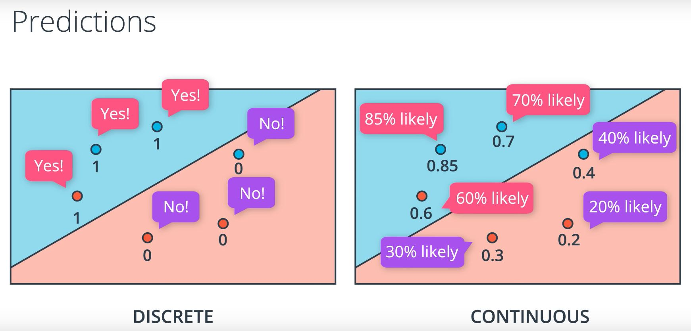

The way we change from discrete predictions to continuous is to change our activation function from the step function to the sigmoid function. The **sigmoid** function is a function, which for large  positive numbers will give us values close to 1 and for large negative numbers will give us values close to 0 and for numbers close to 0, it will give you values close to 0.5. You can see the sigmoid formula:

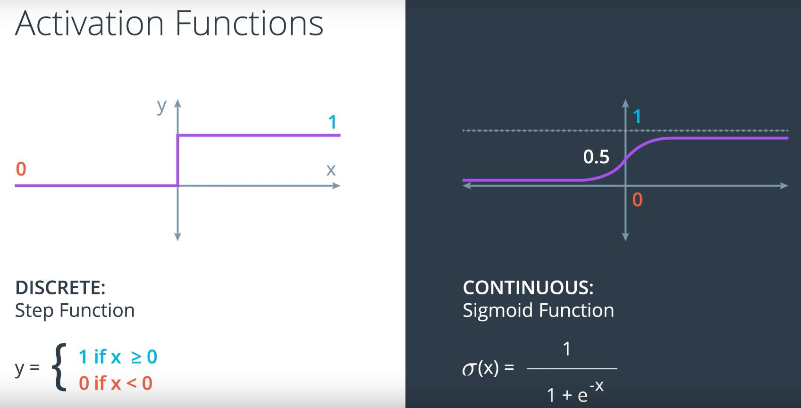

So before, our model consisted of a line with a positive region and negative region. now it consists of an entire probability space where for each point in the plane we're given the probability that the label of the point is 1 for the blue points and 0 for the red points. For example, for this point, the probability of being blue is 50% and red is 50%. 

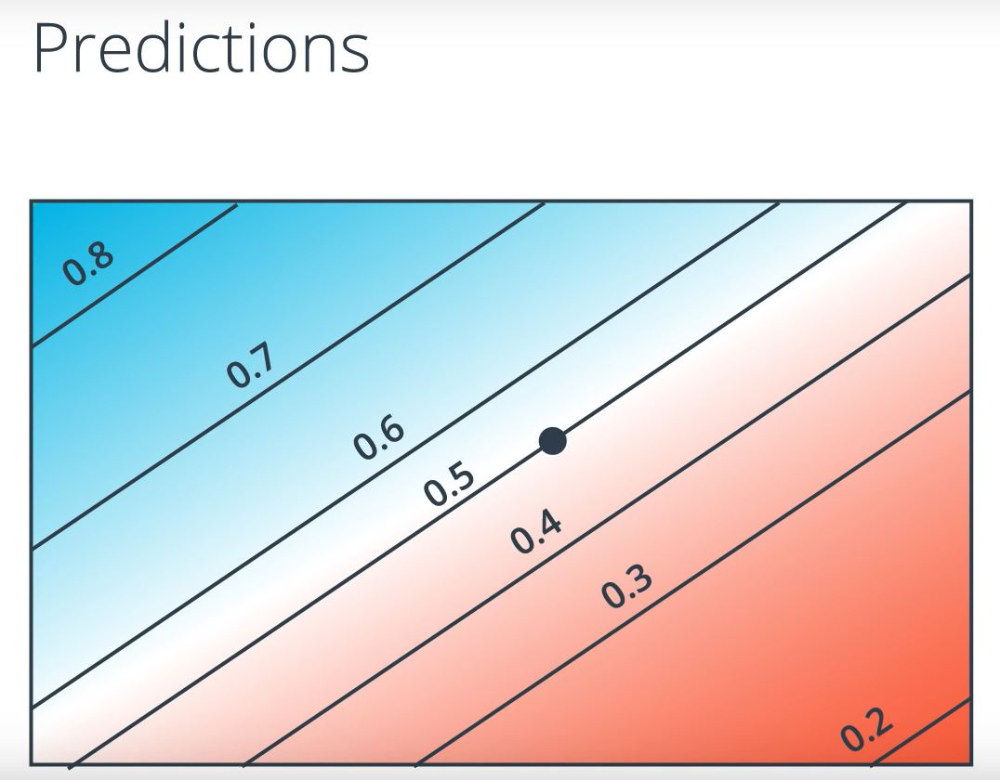

For the following point, the probability of being blue is 40% and red is 60%.

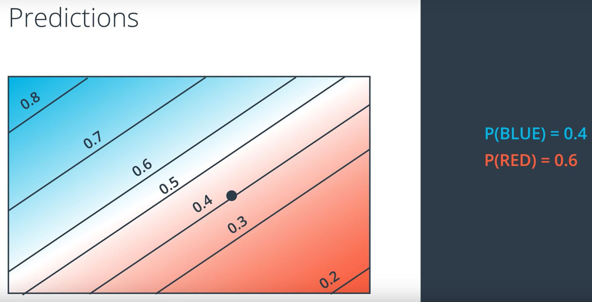

The way we obtain this probability space is simple, we combine the linear space `Wx + b` with the sigmoid function. So, on the left, we have the lines that represent the points for where `Wx + b = 0`, `1`, `2`, `-1`, `-2` etc.

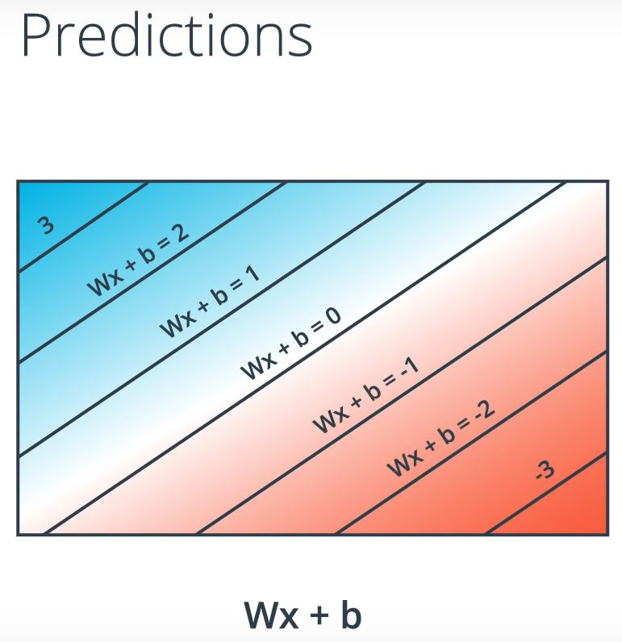

Once we apply the sigmoid function to each of these values in the plane, we then obtain numbers from 0 to 1 for each point. These numbers are just the probabilities of the point being blue. The probability of the point being blue is the prediction of the model `y_hat`, which is `sigmoid` of `Wx + b`. Here we can see the lines for which the prediction is 0.5, 0.6, 0.7, 0.4, 0.3, 0.2. We can see as we get closer to the blue area, the `sigmoid(Wx + b)` function gets closer to 1 and as we move to the red area, the function gets closer to 0. When wew are over the main line, `Wx + b` is 0, which means `sigmoid(Wx + b)` is exactly 0.5

Here on the left we have our old activation function is a step function. On the right we have our new perceptron where the activation function is sigmoid function. What our new perceptron does is take the inputs, multiplies them by the weights in the edges and adds the results, then applies the sigmoid. So instead of returning 1 and 0 like before, it returns values between 0 and 1, such as 0.99 or 0.67, etc. Before it use to say the student got accepted or rejected and now it says the probability that the student is this much:

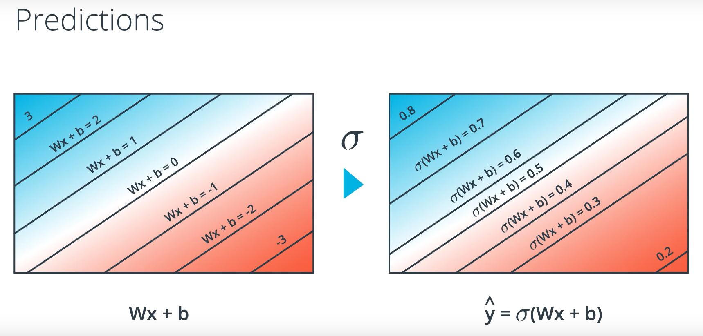

### Quiz: Discrete vs Continuous

Enter the [Discrete vs Continuous quiz](quizzes/discrete-vs-continuous/quiz.md)

## Softmax

So far, we have models that give us an answer of yes/no or the probability of a label being posititve or negative. What if we have more classes and want our model to tell us if something is red, blue, yellow or dog, cat, bird.

### The Softmax Function

We'll learn about the softmax function, which is the equivalent of the sigmoid activation function, but when the problem has 3 or more classes.

Let's switch to a different example. Let's say we have a model that predicts if we receive a gift or not. The probabililty you receive a gift is 0.8, which automatically implies the probabililty you don't receive a gift is 0.2. What does the model do? What the model does is take some inputs. For example, is it your birthday or have you been good all year and based on those inputs, it calculates the linear model, which would be the score. Then the probability that you get the gift or not is the sigmoid function applied to that score:

What if you had more options than just getting a gift or not getting a gift?

Let's say we have a model that tries to tell us what animal we just saw and the options are a duck, beaver and walrus. So, we want a model that tells the answer along the lines of the probability of a duck is 0.67, beaver is 0.24 and walrus is 0.09. Notice that the probabilities need to add to 1. 

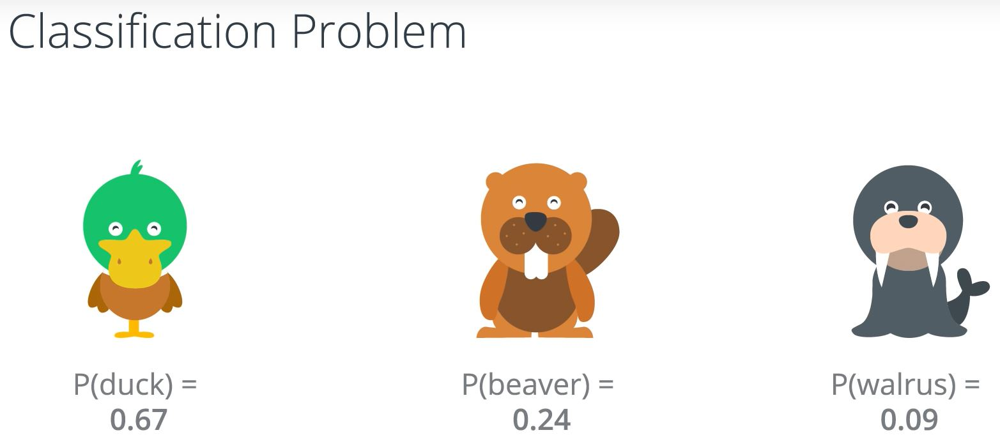

So, let's say we have a linear model based on some inputs. The inputs could be, does it have a beak or not, number of teeth, number of feathers, hair or no hair, does it live in the water, does it fly, etc?
We calculate a linear function based on those inputs. Let's say we get some scores. The duck gets a score of 2, the beaver gets a score of 1 and the walrus gets a score of 0. How do we turn these scores into probabilities?

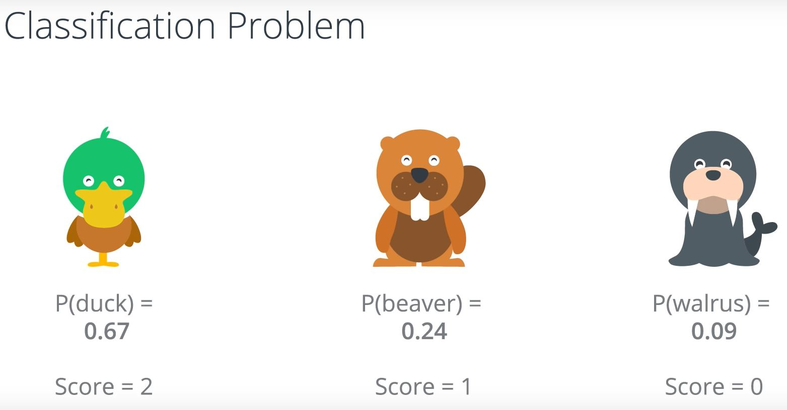

The first thing we need to satisfy with probabilities is that they need to add to 1. So, the 2, 1, 0 do not add to 1. The second thing we need to satisfy is that the probability of the duck is higher than the beaver and the beaver is higher than the walrus. Potential solution is to take each score and divide it by the sum of all the scores:

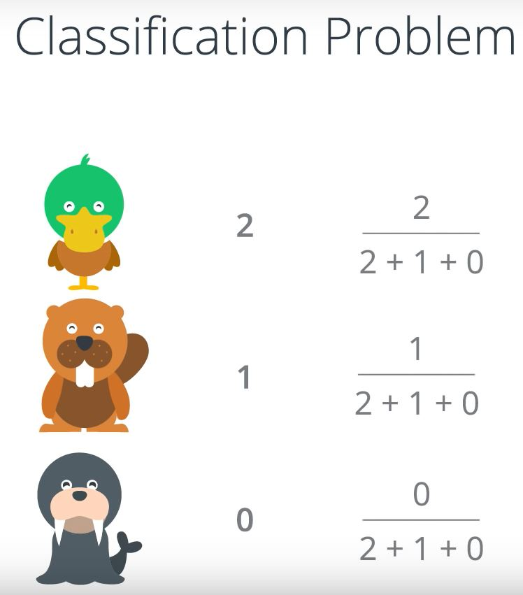

This works, but there is a little problem. What could this problem be? The problem is the following, what happens if our scores are negative? This is completely plausible since score is a linear function, which can give negative values. What if we had scores of 1, 0, -1? Then one of the probabilities would turn into `1/(1+0+(-1))`, which is `1/0`. We can't divide by 0. This solution unfortunately won't work:

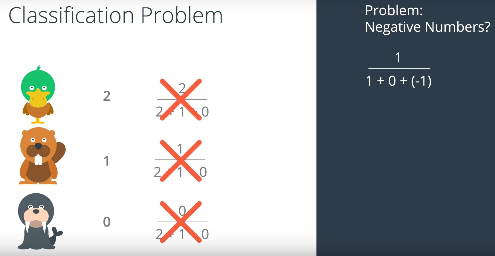

The idea is good. How can we turn this idea into one that works all the time even for negative numbers? It's almost though we need to turn these scores into positive scores. How do we do this? Is there a function that can help us?

### Quiz 1: Softmax

Enter the [Softmax quiz 1](quizzes/softmax-1/quiz.md).

If you said **exp**, that is correct. **e^x** is always a positive number. So instead of 2, 1, 0, we have **e^2**, **e^1**, **e^0**, so the following occurs:

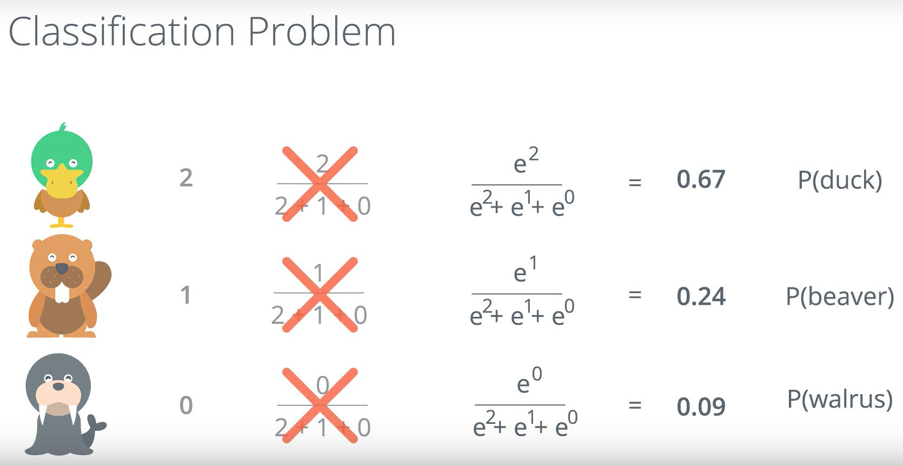

This function is called the **softmax** function and it works like this. Let's say we have n classes and a linear model that gives us the following scores `Z1, ..., Zn`. Each score for each of the classes. What we do to turn them into probabilities is to say the probability that the object is in class i is going to be **e^Zi/(e^Z1 + ... + e^Zn)**. That's how we turn scores into probabilities. Now that we have more classes, we apply the softmax function to the scores. Here's a question for you, Is the Softmax functiton for n=2 the same as the sigmoid function?

**Answer**: Yes

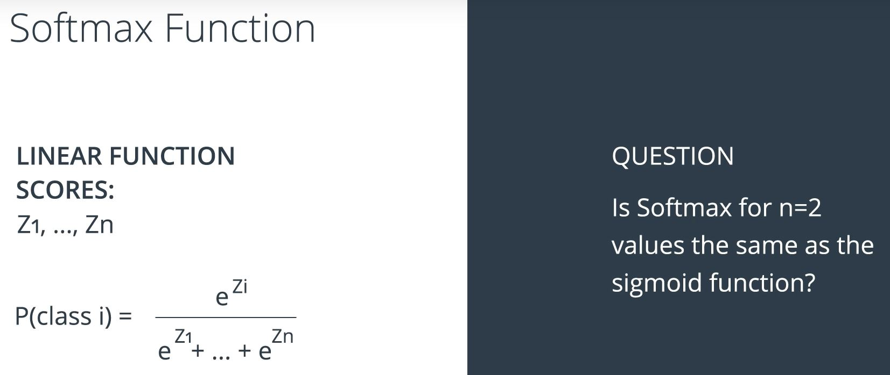

### Quiz 2: Softmax

Enter the [Softmax quiz 2](quizzes/softmax-2/quiz.md).

## One-Hot Encoding

All our algorithms are numerical. So, we need to input numbers, such as a score and a test or the grades, but the input data will not always look like numbers. Sometimes it looks like this. Let's say the model receives as input the fact that you got a gift or didn't get a gift. How do we turn that into numbers? If you got a gift, we'll say that the input variable is 1 and if you didn't get a gift, then the input variable is 0.

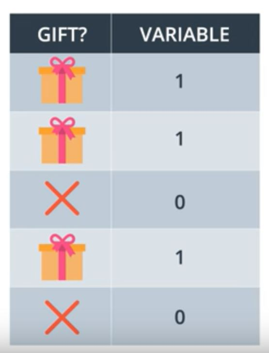

What if we have more classes like before: duck, beaver and walrus. What variable do we input to the algorithm? Maybe we could input a 0, 1 and 2, but that will not work since it will assume dependencies between the classes that we cannot have. So, we come up with 1 variable for each of the classes and our table becomes:

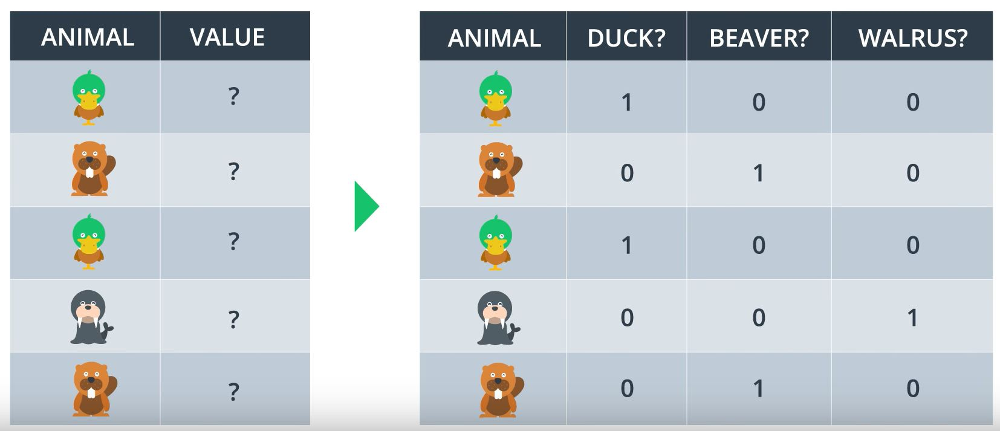

One variable for duck, one for beaver and one for walrus. Each one has it's corresponding column. Now if the input is a duck, then the variable for duck is 1 and the variables for beaver and walrus are 0. Similarly for the beaver and walrus. We may have more columns of data, but at least there are no unnecessary dependencies. This process is called **one-hot encoding**. It will be used a lot for processing data.

## Maximum Likelihood