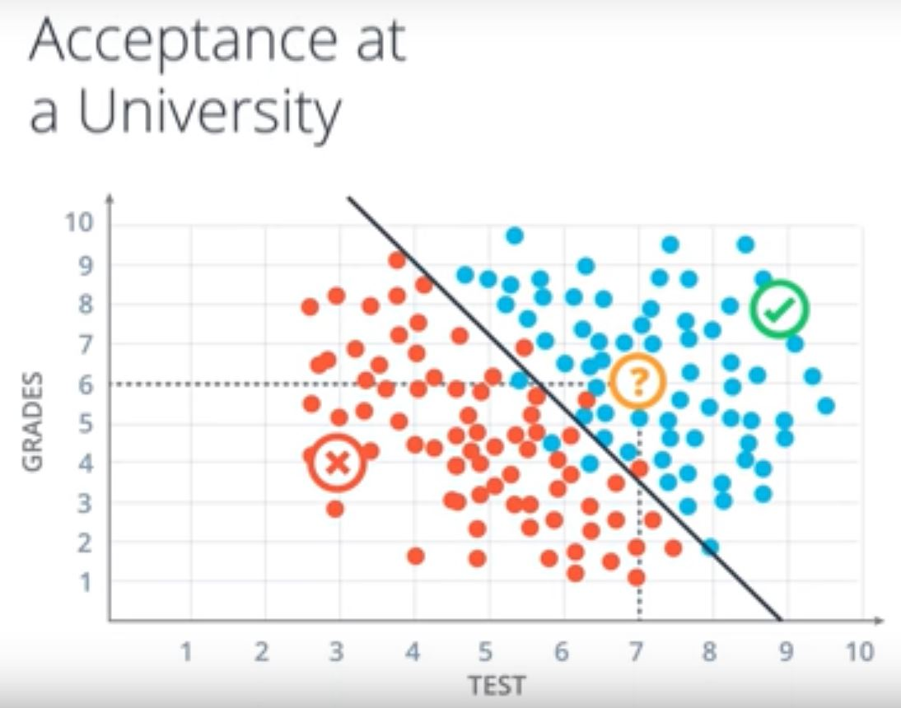

# Quiz Solution: Classification Problems 1

Does the student get accepted?

- Yes

**Explanation**: The student is represented by the point with coordinates (7,6) and this point falls in the positive area of the model.

It seems that this data can be nicely separated by a line and it seems that most students over the line get accepted while most students under the line get rejected. So, this line is going to be our model. The model makes a few mistakes since there are some blue points under the line and red points above the line. So based on this model, we look at the new student and we see they are above the line at point (7,6), which is above the line. Thus, we can assume with some confidence that the student gets accepted.

How do we find this line? We as humans can kind of eyeball it, but the computer can't. So, we'll dedicate the rest of this section to show you algorithms that will find this line not only for this example, but also more general and complicated cases.