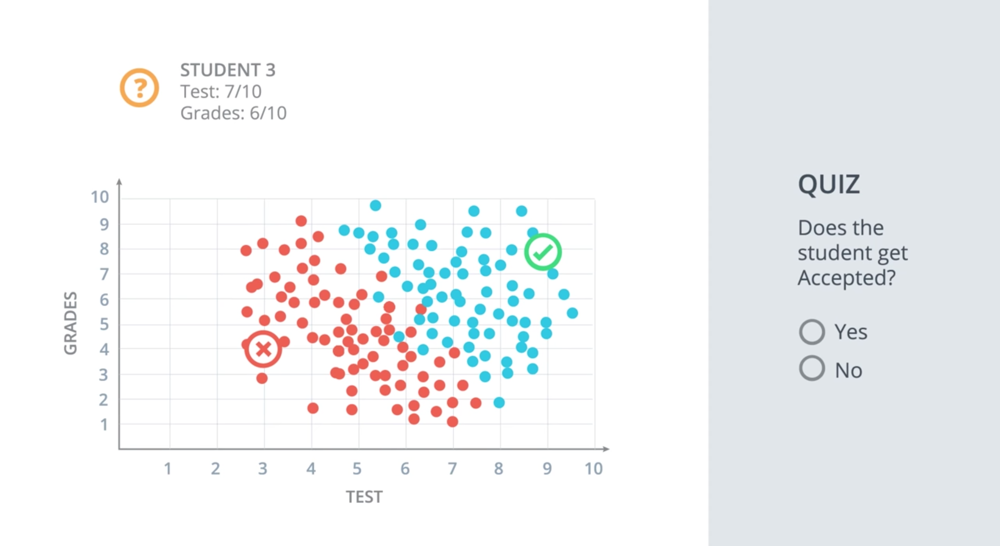

# Quiz: Classification Problems 1

Let's start with one classification example and our job is to accept or reject students. To evaluate students, we have two pieces of information: the results of a test and their grades in school. Let's take a look at some sample students. We'll start with student 1 who got 9/10 on the test and 8/10 in the grades. That student did quite well and got accepted. Then we have student 2 who got 3/10 on the test and 4/10 in the grades and that student got rejected. Now we have a new student 3 who got 7/10 on the test and 6/10 in the grades and we are wondering if that student gets accepted or not?

One way to figure this out is to plot students in a graph with the horizontal axis corresponding to the score on the test and the vertical axis corresponding to the grades. The student who got 3 and 4 is plotted and the student who got 9 and 8 is plotted. Now we will do what we do with most of our algorithms, which is to look at the previous data. All the previous students who got accepted are the blue dots and the students who got rejected are the red dots.

So, in the diagram, we can see that the students who did well on tests and in grades are more likely to get accepted than the students who did more poorly in both.

**Student 1**:

- Test: 9/10
- Grades: 8/10

**Student 2**:

- Test: 9/10
- Grades: 8/10

**Student 3**:

- Test: 7/10
- Grades: 6/10

Does the student 3 get accepted?

- Yes
- No