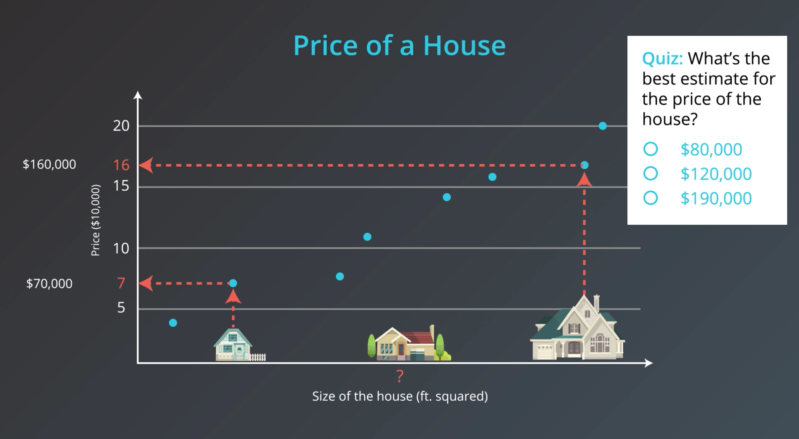
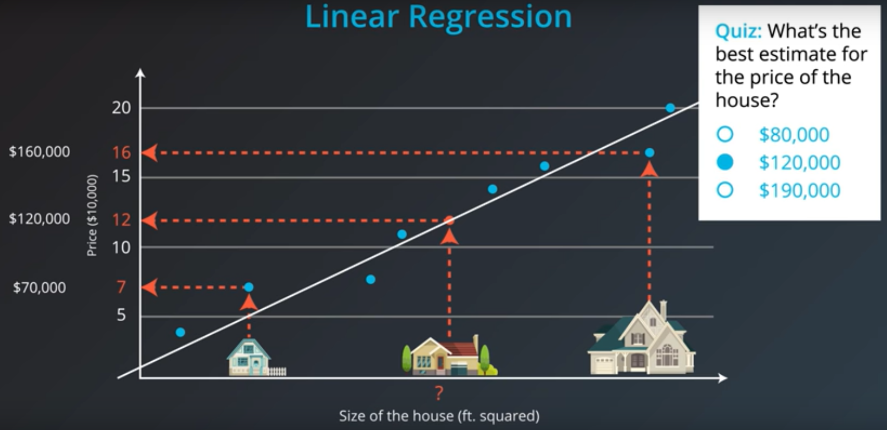

# Quiz Solution: Housing Prices

Today we are studying the housing market and our task is to predict the price of a house given its size. So, we have a small house that costs $70,000 and a big house that costs $160,000. We'd like to estimate the price of this medium-sized house. So, how do we do it?

First we put them in a grid where the x-axis represents the size of the house in square feet and the y-axis represents the price of the house. To help us out, we have collected some previous data in the form of these blue dots. These are other houses we have looked at and we've recorded their prices with respect to their size.

We can see the small house is priced at $70,000 and the big one at $160,000. What is the best estimate for the price of the medium house given this data?

What is the best estimate for the price of the house?

- $120,000

**Explanation:** To help us out, we can see these points kind of form a line and we can draw a line that best fits this data. Now in this line, we can see that our best guess for the price of the house is the point directly above the house in the line, which corresponds to $120,000. This method is known as **linear regression**.

