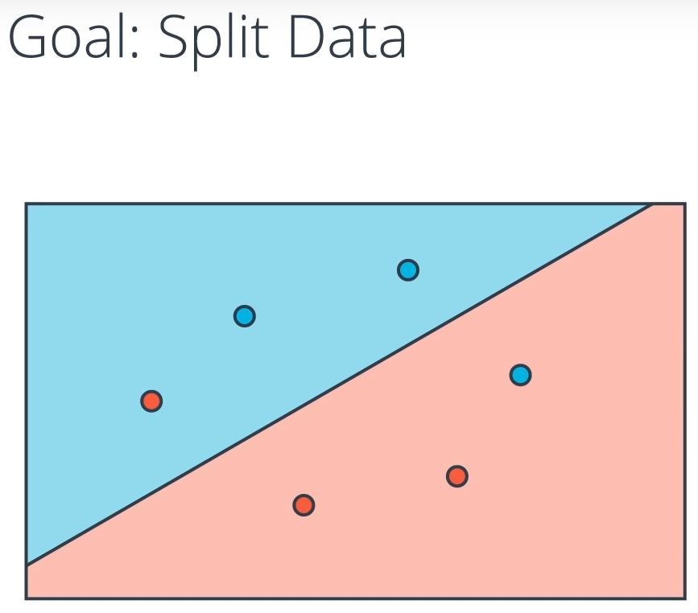
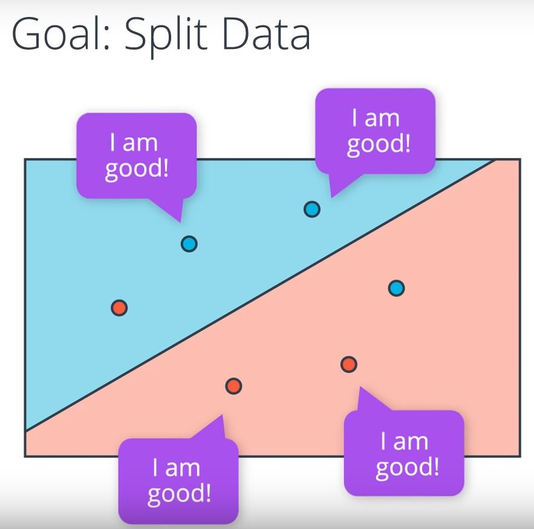
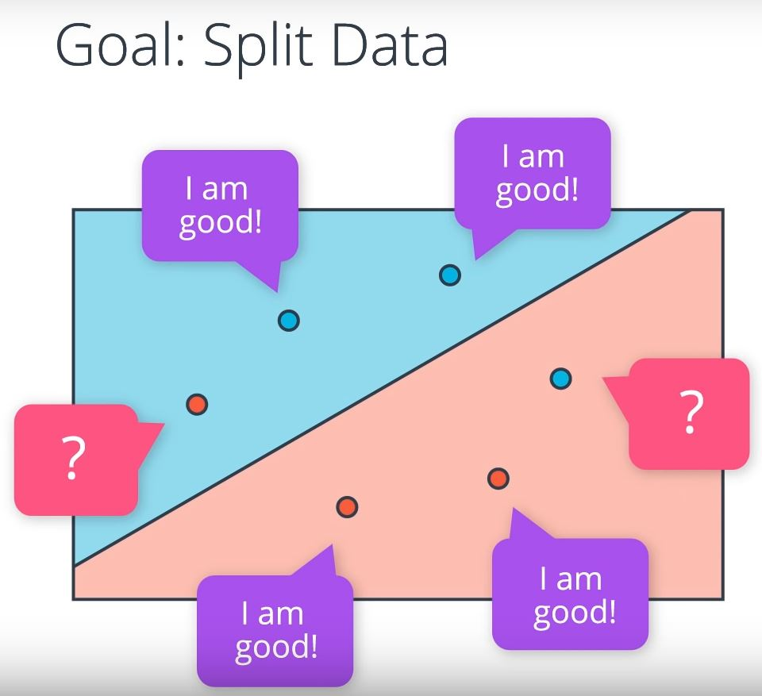
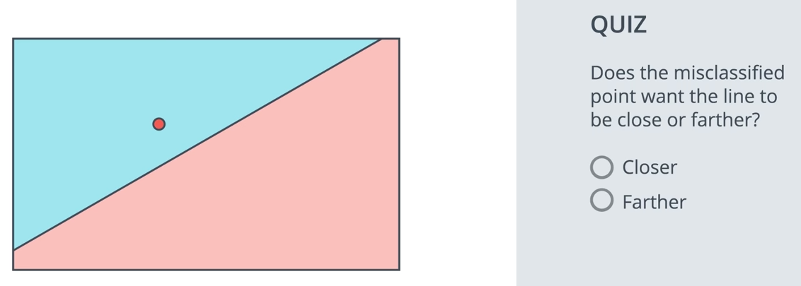

# Quiz 1: Perceptron Trick

How do we find this line that separates the blue points from the red points in the best possible way?

Let's first answer this question with a small example by looking at 3 blue points and 3 red points. We are going to describe an algorithm that splits these points properly. The computer doesn't know where to start. It might as well start at a random place by picking a random linear equation. This equation will define a line in a positive and negative area given in blue and red respectively. 

What we are going to do is look at how badly this line is doing and then move it around to try to get better and better. How do we find how badly this line is doing?

So, let's ask all the points. Here we have 4 points that are correctly classified. They are the 2 blue points in the blue area and the 2 red points in the red area. These points are correctly classified, so they say, I am good:

Then we have these 2 points that are incorrectly classified. That is the red point in the blue area and the blue point in the red area. We want to get as much information from them. So, we want them to tell us something, so we can improve this line.

So, what is it they can tell us?

So, here we have a misclassified point, which is this red point in the blue area. If you were this point, what would you tell the line to do? Would you like it to come closer to you or farther from you?

Does the misclassified point want the line to be closer or farther?

- Closer
- Farther