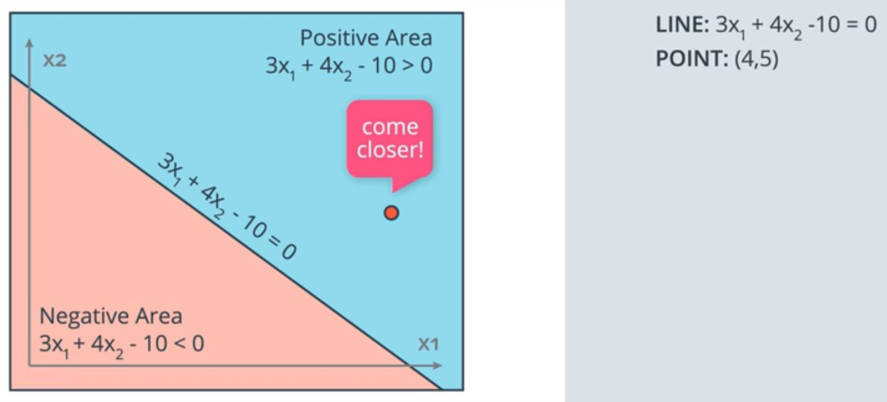
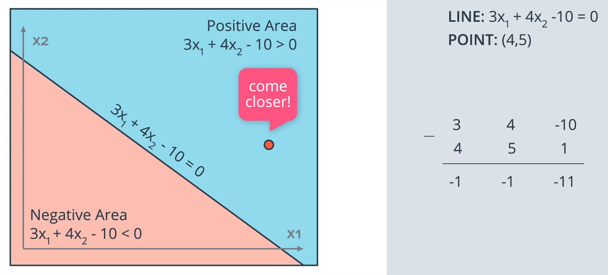
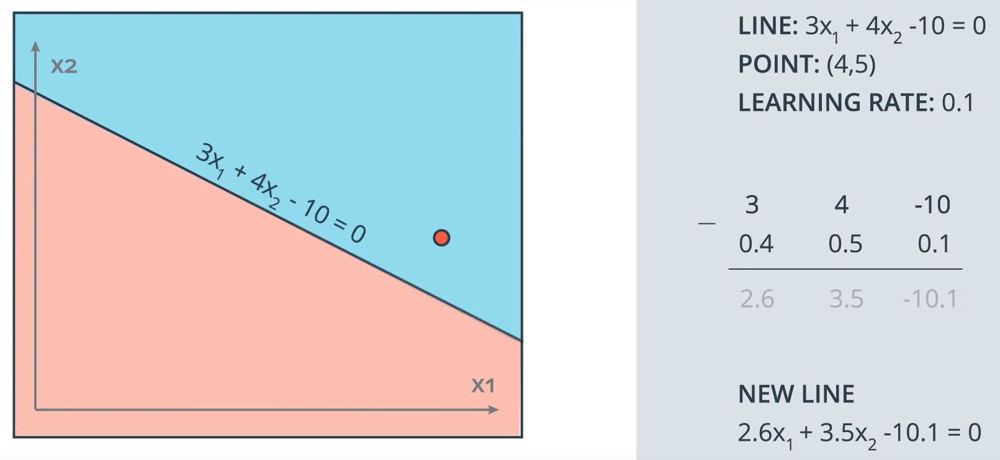
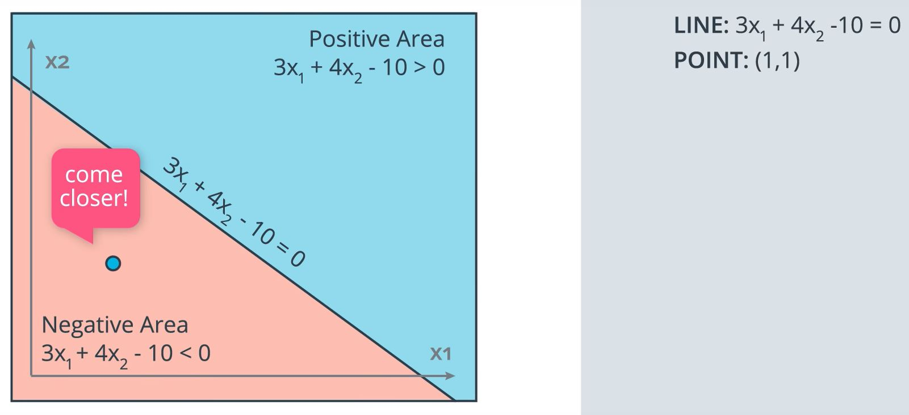
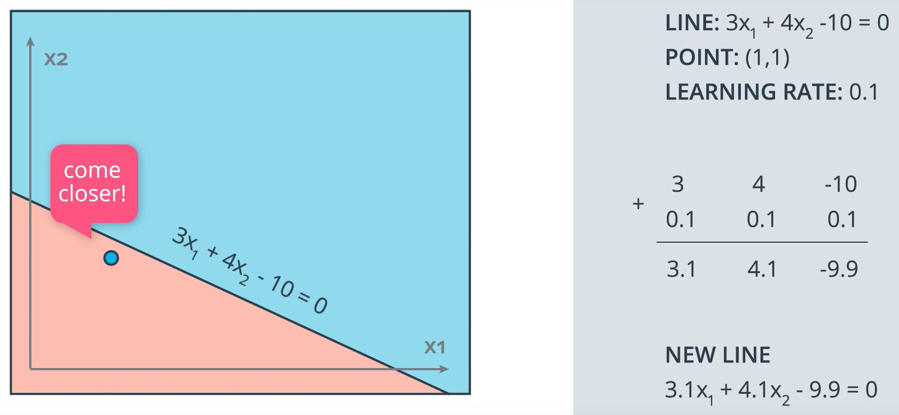

# Quiz 2: Perceptron Trick

**Time for some math!**

We've learned that the points are misclassified, want the line to move closer to them, let's do some math. The following video shows a mathematical trick that modifies the equation of the line, so that it comes closer to a particular point.

So, let me show you a trick that will make a line go closer to a point. Let's say we have our linear equation:

~~~python
LINE = 3x1 + 4x2 - 10 = 0
~~~

That linear equation gives us a line, which is the points where the equation is 0 and two regions: the positive region in blue where the equation result is positive and the negative region in red where the equation result is negative. Here we have our lonely misclassified point:

~~~python
POINT = (4,5)
~~~

which is a red point in the blue area and the point says to the line come closer. 

How do we get that point to come closer to the line? The idea is we are going to take the 4 and 5 and use them to modify the equation of the line in order to get the line to move closer to the point. Here are the parameters of the line:

~~~python
3   4   -10
~~~

The coordinates of the point are 4 and 5 and let's add a 1 for the bias unit. So, what we will do is subtract these numbers from the parameters of the line to get 3 - 4, 4 - 5, -10 - 1 and the new line will have parameters -1, -1, -11. 

~~~python
    3   4   -10
-
    4   5    1
----------------
   -1  -1   -11
~~~

Now this line will move drastically toward the point, possibly even going over it and placing it in the correct area. 

Now since we have a lot of other points, we don't want to make any drastic moves since we may accidently misclassify all our other points. We want the line to make a small move towards the point and for this, we need to make small steps toward the point. So, here's where we introduce the learning rate, which is a small number (ex. 0.1) and what we will do is instead of subtracting 4, 5, 1 from the coordinates of the line, we will multiply these numbers by 0.1 and then subtract them from the equation of the line:

~~~python
    3         4          -10
-
    4*(0.1)   5*(0.1)    1*(0.1)
--------------------------------
    2.6       3.5        -10.1
~~~

which means we will obtain the equation:

~~~python
NEW_LINE = 2.6x1 + 3.5x2 - 10.1 = 0
~~~

This new line will move closer to the red point

In the same way, if we have a blue point in the red area (ex. point (1,1)), this point is also misclassified and it says come closer.

What we do here is the same thing except instead of subtracting the coordinates to the parameters of the line, we add them. Again we multiply by the learning rate in order to make small steps.

~~~python
POINT = (1,1)
LEARNING_RATE = 0.1
~~~

~~~python
    3         4          -10
+
    0.1       0.1        0.1
------------------------------
    3.1       4.1        -9.9
~~~

Now we get a new line:

~~~python
NEW_LINE = 3.1x1 + 4.1x2 - 9.9 = 0
~~~

Thus, this line is closer to the blue point:

This is the trick we are going to use repeatedly for the perceptron algorithm.

**Question**:

For the second example, where the line is described by `3x1+ 4x2 - 10 = 0`, if the learning rate was set to 0.1, how many times would you have to apply the perceptron trick to move the line to a position where the blue point, at (1, 1), is correctly classified?