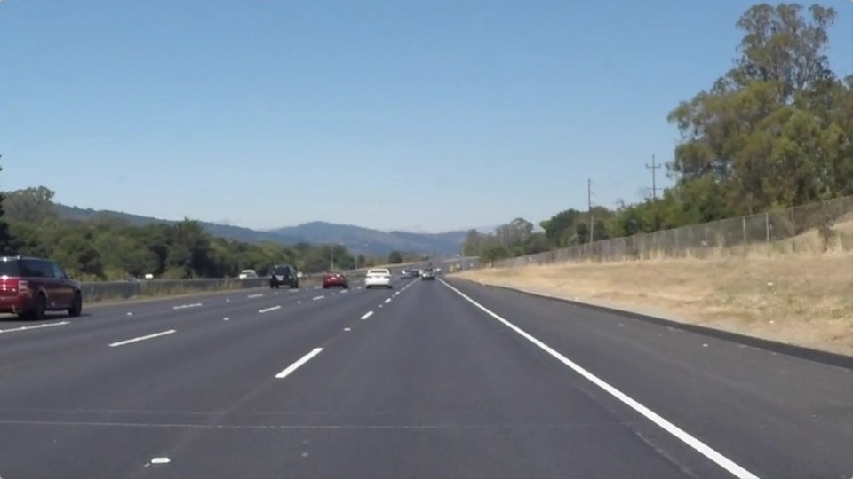
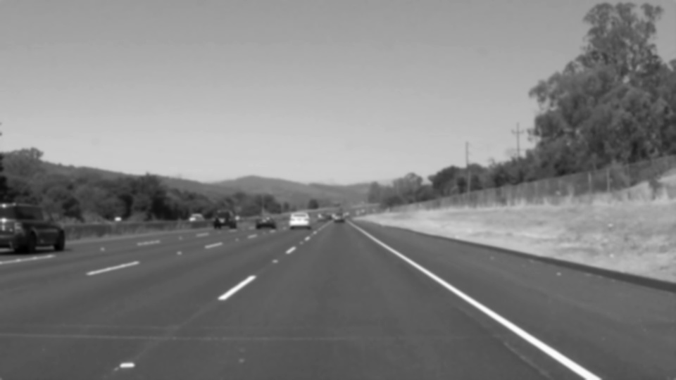
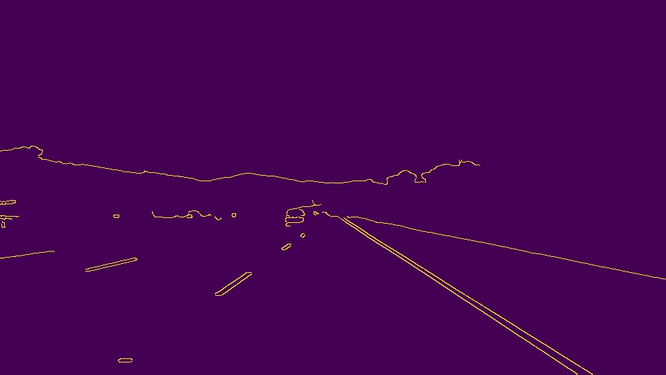
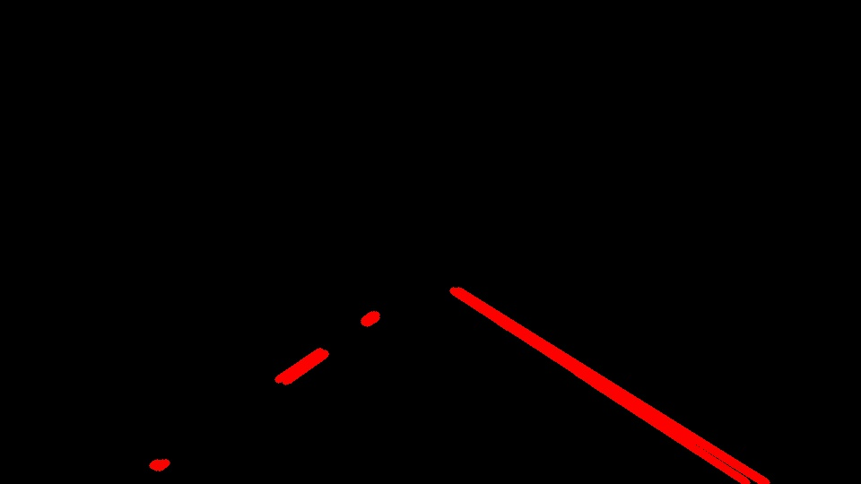
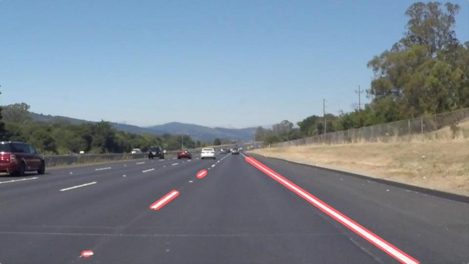
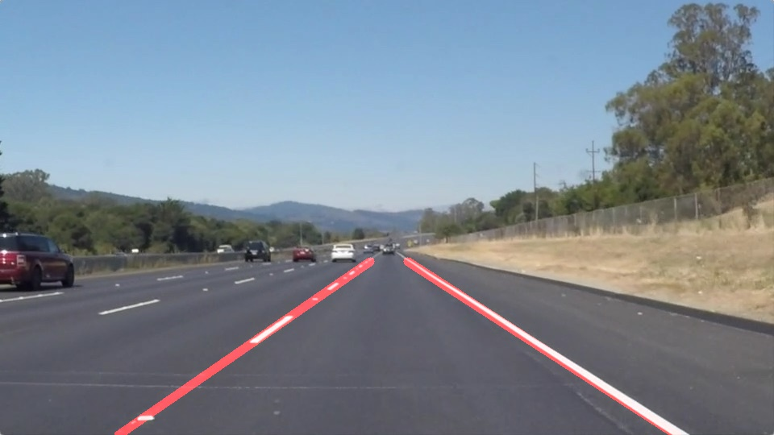
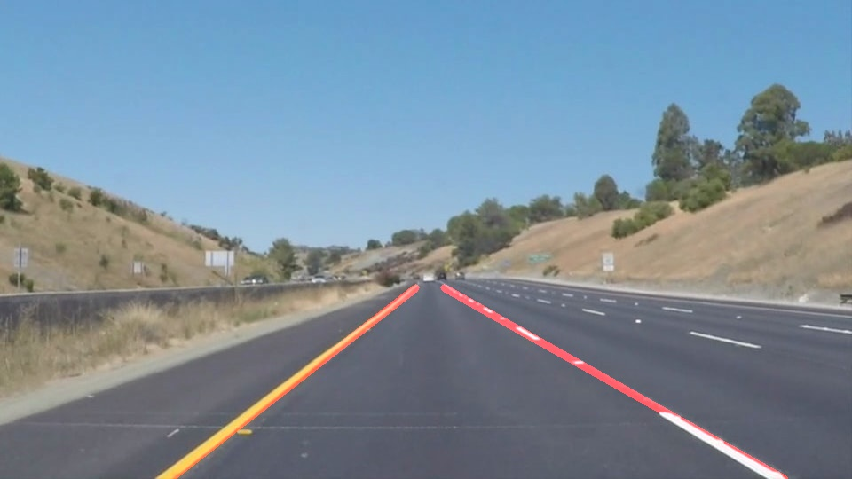

# **Finding Lane Lines on the Road** 

by James Medel, January 17, 2019

## Overview

In this project, I created a data pipeline using Python to detect lane lines in given images and videos. For the python code, check **P1.ipynd** file.

## Reflection

### Lane Detection Pipeline

The data pipeline algorithm:

1\. Ingest RGB image

2\. Convert the RGB image to Grayscale

3\. Reduce noise in image by Gaussian Smoothing

4\. Extract edges from image by Canny Edge Detection

5\. Mask edges by Quadrilateral Region of Interest

6\. Draw red line segments for lane lines by Hough Transform

7\. Overlay detected lane lines onto original image

The first initial version of the data pipeline draws **red line segments** to 
represent the detected lane lines. The second version of the data pipeline
draws **solid red lines** to represent the detected lane lines by using a modified
**draw_lines()** function.

### Modified draw_lines() for Drawing Solid Lines or Line Segments

The **draw_lines()** function was updated to draw solid lines for both the
left lane and right lane. I added the top (**y_min**) and bottom (**y_max**) 
y coordinate for the lane line region of interest. I added computing the 
slope (**m**) and y-intercept (**b**) for each line segment by using its 
start (**x1,y1**) and end (**x2,y2**) coordinate. The slope was used to 
classify line segment coordinate points as left lane line points or right 
lane line points. The average **x1** and **x2** coordinate points for the
left line were computed from the left lane line points. Similar computation
was done using the right lane line points. Solid red lines were drawn to
represent the detected left and right lane lines using **(x1,y_max)** and 
**(x2,y_min)**.

Alternatively step 6, one can also choose to draw red solid lines for lane lines 
and then overlay detected lane lines onto original image:

### 2. Identify potential shortcomings with your current pipeline

One potential shortcoming would be what would happen when lane lines have small white markers between lane line segments. Sometimes the markers are not detected as can be seen below:

Therefore, I need to tune the parameters for Hough Transform, Canny Edge Detection functions, etc to obtain better results.

Another shortcoming could be with the yellow lanes. Sometimes the yellow substances next to the
lane are picked up in the detection and mistaken for being a part of the lane.

Fortunately, I was able to apply Gaussian Smoothing to the above image to remove the noise. 

### 3. Suggest possible improvements to your pipeline

A possible improvement would be to tune the parameters for Canny Edge Detection and Hough Transform functions to make sure that lane line markers between the lane line segments
are detected too.

### References

I want to give credit to Udacity Self-Driving Car Nanodegree lecture and example code. I also want to give thanks to HanByul Yang for publishing a github repo for reference. 

- Udacity, Self-Driving Car, Lesson 5 - Computer Vision Fundamentals
- Yang, Github Repo, Self Driving Car Engineer Nanodegree
