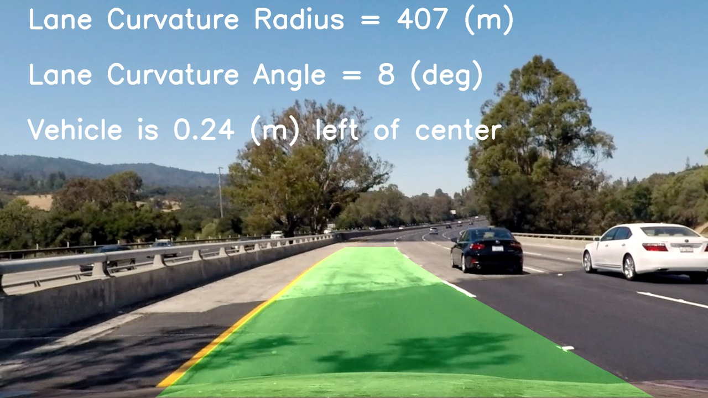

# Advanced Lane Finding

## Overview

The purpose of this project was to build an Advanced Lane Finding application for a real world stretch of highway recorded by video. Regardless of the challenges with lighting changes, color changes, curved lanes, etc, **the application was able to identify lane boundaries, lane curvature and vehicle position with respect to the center of the lane from Camera data (images, videos)**. It was assumed the camera data source was mounted on the center top of a car. Advanced Computer Vision techniques were used for this Self Driving Car use case: Camera Calibration, Distortion Correction, Color & Gradient Thresholding, Perspective Transform, Histogram Peaks, Sliding Window Search, etc.

To meet the specifications in the project, I followed these requirements: [project rubric](https://review.udacity.com/#!/rubrics/1966/view).

## Video Result

The output video is the result after running my pipeline on **project_video.mp4** and it can be found at this link: [project_video_mod.mp4](https://www.youtube.com/watch?v=yI7NUSa4Sfo). Feel free to download it.

## Contents

- **[P2.ipynb](./P2.ipynb)**: application code
- **[writeup.md](./writeup.md)**: explains my advanced lane finding application code, shortcomings, potential improvements and includes each rubric point with a description of how that point was addressed.
- **README.md**: provides overview of the project and how to set it up
- **data/**: data folder contains **input/image/**, **input/video/**, **output/image**, **output/video/** sub folders.
	- **input/image/** folder contains the initial camera image source data (**camera_cal/**, **examples/**, **test_images/**..
	- **input/video/** folder contains the initial camera video source data (**project_video.mp4**, **challenge_video.mp4**, **harder_challenge.mp4**).
	- **output/image/** folder (replaced **output_images**) contains the altered camera source image data after the **input/image/test_images/** data was processed and the result was saved during each stage of my Python Pipeline (**pipeline/**).
	- **output/video/** folder contains the altered camera video source data after the **input/video/project_video.mp4** data was processed and the result was saved by my Python Pipeline. There are multiple video versions based on my testing. The one without a v1-v3 is my final result.
- **lib/** contains Computer Vision python classes used in each stage of my Python Pipeline.
- **notebooks/** contains notebooks that were saved as checkpoints as I progressed through the project
- **writeup_help/** contains resources that helped me with the writeup structure.
- **setup_scripts/** contains shell code for helping with setting up the project

## How To Set Up Project

### Step 1: Setup Python

Python 3 is needed. Python packages that you will use include numpy, matplotlib, OpenCV and scikit-video. Jupyter notebook will be used to display an image from **test_images/** as it is altered after each stage in my Python Pipeline. Finally, the pipeline will be run to process a sequence of frames from the **project_video.mp4** and save the altered video.

Choose **Python 3 Anaconda** install package for your operating system. Download and install it.

~~~bash
conda create --name={project-name} python=3
source activate {project-name}
~~~

### Step 2: Install OpenCV

~~~bash
pip install msgpack
pip install opencv-contrib-python
~~~

### Step 3: Install scikit-video

~~~bash
pip install scikit-video
~~~

### Step 4: Open the project in Jupyter Notebook

~~~bash
jupyter notebook
~~~
 
