# Advanced Lane Finding

by James Medel, April 23, 2019

## Overview

In this project, I created a data pipeline using Python and OpenCV to identify lane boundaries, lane curvature and vehicle position with respect to the center of the lane for video and image. For the Python code, check **[P2.ipynb](./P2.ipynb)**

## Reflection

Building the Advanced Lane Finding Application required the following steps: calibrate the camera and push the calibrated images through a data pipeline that processes them to an enriched frame using image distortion correction, gradient thresholding, color thresholding, perspective transform, histogram peaks, sliding windows search, polynomial fit to each lane line pixels, search from prior polynomial, lane curvature calculation from polynomial, vehicle position calculation from image dimensions and lane boundaries identification through both polynomials.

## Camera Calibration

The purpose of camera calibration is to compute the transformation between 3D object points in the real world and 2D image points. Camera Calibration removes inherent distortions known to affect its perception of the world.

`How did you compute the camera matrix and distortion coefficients?`

I used 20 calibration 9x6 chessboard images at 720p resolution. Then, I computed the camera matrix and distortion coefficients by using OpenCV function **cv2.calibrateCamera()**. This function requires passing in as arguments, object points, image points and image size. Object points are the 3D coordinates (x,y,z) of the corners in the image. Image points are the 2D coordinates (x,y) of the corners in the image. The corners in the image with 2D coordinates were found using OpenCV function **cv2.findChessboardCorners()**. The image size is the width and height of the image. The methods to perform the steps to compute camera calibration can be found in my **[CameraCalibration](./lib/cv/CameraCalibration.py)** class.

`Provide an example of a distortion corrected calibration image.`

The camera distortion matrix was used with OpenCV function **cv2.undistort()** to undistort one of the calibration images for verification that the calibration was correct.

**Figure 1:** Prior to distortion correction applied on calibration3.jpg

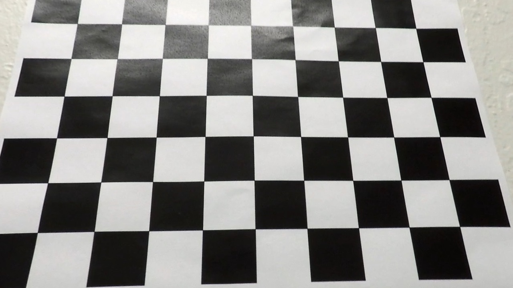

**Figure 2:** distortion correction applied on calibration3.jpg

**Figure 1** and **Figure 2** are a before and after look at image distortion correction applied on **calibration3.jpg** image.

## Pipeline (test images)

### Distortion Correction

`Provide an example of a distortion-corrected image`

Here you will see a before and after look at distortion correction applied to a road image from the **test_images** folder.

**Figure 3:** Before distortion correction applied on road image test5.jpg

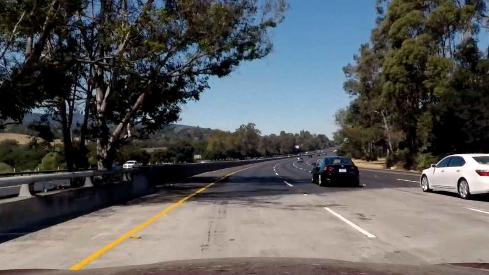

**Figure 4:** After distortion correction applied on road image test5.jpg

Therefore, we can see distortion correction that was calculated via camera calibration has been correctly applied to each image.

### Color & Gradient Threshold

Combined gradient, RGB and HLS thresholding methods were used to create a binary image containing the yellow and white lane line pixels. 

### Combined Gradient Threshold

I combined Sobel X, Gradient Magnitude and Gradient Direction to create a binary image containing the edges for lane line pixels. I converted the color image to grayscale image using **cv2.cvtColor(img, cv2.RGB2GRAY)**. I used Sobel X **cv2.Sobel()** at gradient threshold `(30,100)` and kernel size `(7,7)` to take the derivative of the image in the x direction. Then, I created a binary image with vertical pixels detected. Gradient Magnitude **sqrt((sobelx^2)+(sobely^2))** was used to apply a magnitude threshold `(36,100)` and kernel size `5`. Then, I created a binary image with the overall magnitude of the gradient detected in both x and y. Gradient Magnitude is great at picking up the lane lines well along with a lot of other stuff detected too. Gradient Direction **arctan(sobely/sobelx)** at direction threshold `(0.3,1.3)` and kernel size `3` was used to detect edges of a particular orientation since lane lines are pointing in the forward direction. These gradient thresholding methods are at the heart of Canny edge detection algorithm and is why it does well at picking up all edges. Thus, by combining these gradient methods, I was able to create my own version of Canny edge detection that worked for my needs. The methods for my gradient thresholding can be found in my **[GradientThresholds.py](./lib/cv/GradientThresholds.py)** class.

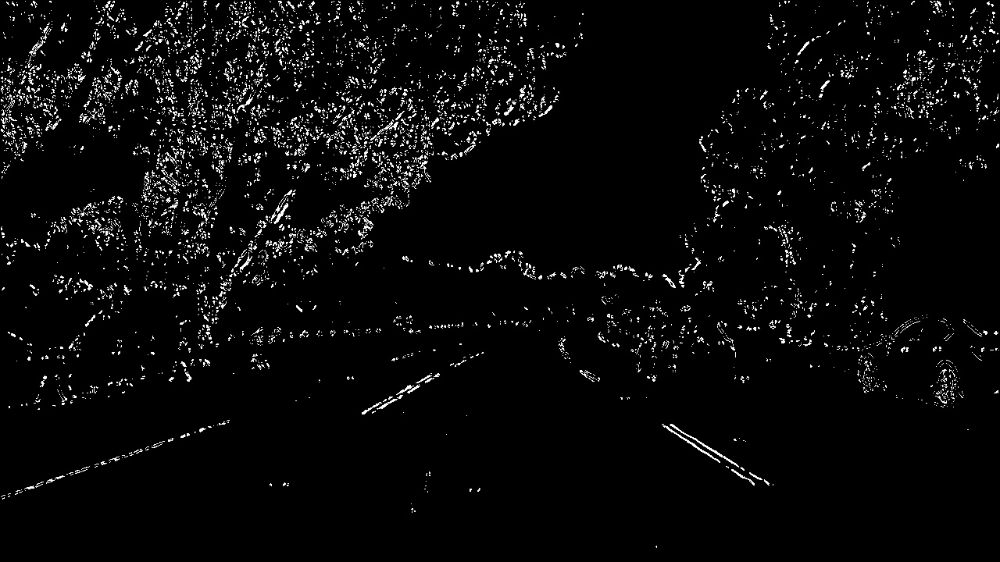

**Figure 5:** Combined Gradient Thresholded Binary Image

In **Figure 5**, we see the binary image **test5.jpg** with combined gradients that detected lane pixels pointing in the y direction.

### Combined RGB Threshold

I combined R, G, B channels to create a binary image containing white lane line pixels detected. I used R channel at red threshold `(130,255)`, G channel at green threshold `(130,255)` and B channel at blue threshold `(195,255)` to create a binary image per channel with white lane line pixels detected. The methods for my individual and combined RGB thresholding can be found in my **[ColorThresholds.py](./lib/cv/ColorThresholds.py)** class.

**Figure 6:** Combined RGB Thresholded Binary Image

In **Figure 6**, we see the binary image **test5.jpg** with combined RGB that detected white lane line pixels.

### Combined HLS Threshold

I combined H, L, S channels to create a binary image containing yellow lane line pixels detected. I converted the RGB image to HLS image using **cv2.cvtColor(img, cv2.RGB2HLS)**. HLS is another color space as there are many different color spaces in Computer Vision. Hue channel represents colors (red, green, blue, yellow, green, etc) based on a range regardless of lightness, darkeness, shadows, etc. Lightness channel represents colors from black (being 0) to white (being 255). Saturation channel represents the colorfulness of a color from 0 being grey to 255 a bright color. I used H channel at Hue threshold `(20,90)` and S channel at Saturation threshold `(100,255)` to create a binary image per channel with yellow lane line pixels detected. I used L channel at Lightness threshold `(120,200)` to create a binary image with white lane line pixels detected. The methods for my individual and combined HLS thresholding can be found in my **[ColorThresholds.py](./lib/cv/ColorThresholds.py)** class.

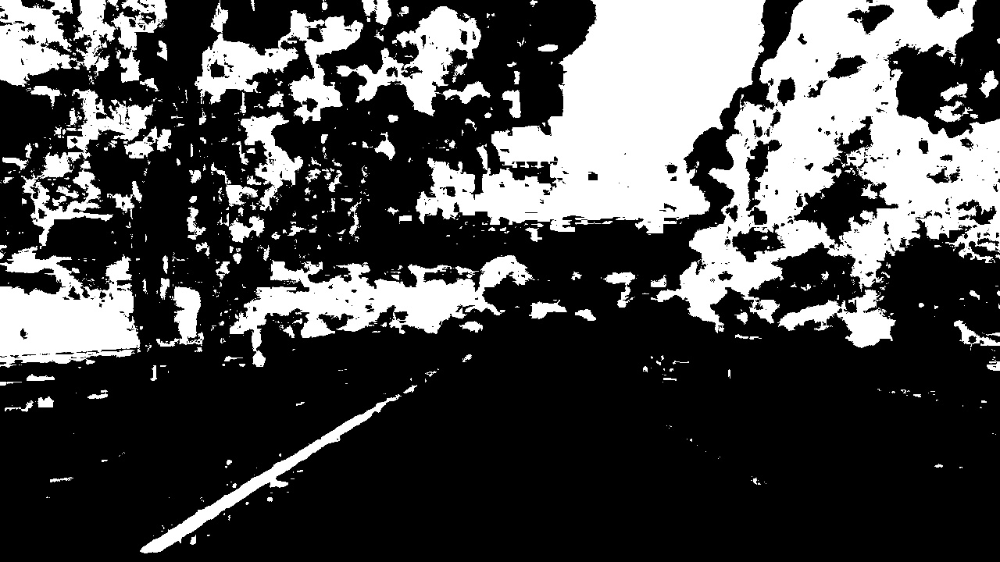

**Figure 7:** Combined HLS Thresholded Binary Image

In **Figure 7**, we see the binary image **test5.jpg** with combined HLS that detected yellow lane line pixels.

### Combined Gradient, RGB & HLS Threshold

I combined Gradient, RGB and HLS binary images to create a binary image containing yellow and white lane line pixels detected. To show the contribution of combined gradients compared to color, I used numpy **np.dstack()**. To see the code, check section **Combined Gradient with RGB and HLS** in **[P2.ipynb](./P2.ipynb)** notebook.

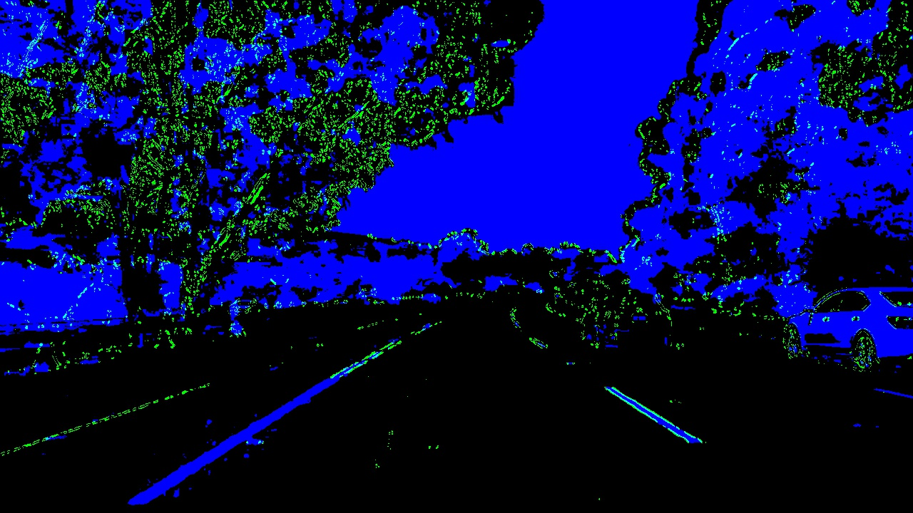

**Figure 8:** Stacked Gradient + Color Thresholded Binary Image

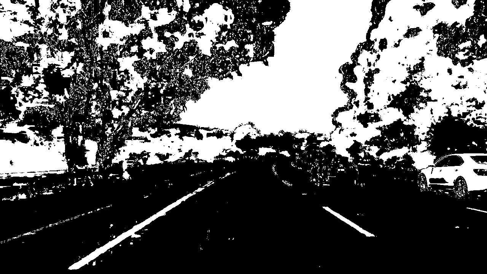

**Figure 9:** Combined Gradient + Color Thresholded Binary Image

**Figure 8** is a stacked image with green being the combined gradient threshold component and blue being the combined color (RGB, HLS) threshold component. **Figure 9** is a combined binary image of gradient, RGB and HLS.

### Perspective Transform

I used perspective transform to change the view of the image to top down view, also known as bird'e eye view.

`How did you perform a perspective transform?`

I performed perspective transform by choosing 4 source points to form a trapezoid around the 2 lane lines and 4 destination points to form a rectangle in between the 2 lane lines. The source and destination points, I passed into OpenCV function **cv2.getPerspectiveTransform()** to create a transform matrix. I passed the combined gradient plus color binary image and transform matrix into OpenCV function **cv2.warpPerspectiveTransform()** to create a warped bird's eye view image. To see the code for my bird's eye view transformation, check my **[CameraPerspective](./lib/cv/CameraPerspective.py)** class.

`Provide an image of a transformed image`

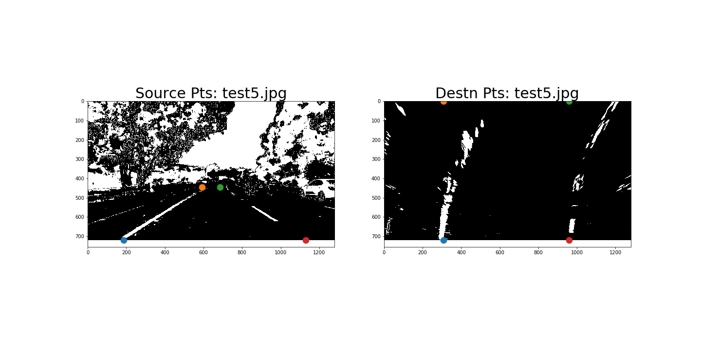

**Figure 10:** Bird's Eye View Transformed Image on Right

**Figure 10** shows two images. On the left is the original image and the right is the bird's eye view transformation applied. You can also see the source points drawn on the left image and the destination points drawn on the right image.

### Detect Lane Lines

`How did you identify lane line pixels?`

I identified lane line pixels using **histogram peaks**, **sliding window** search and **search from prior** methods. **Histogram peaks** was used to determine where the lane lines are in the image. **Sliding window** search was used to determine where the lane lines are going in the image. I was able to fit the polynomial to the lane line pixels. **Search from prior** saved processing time since I was able to use the previously fit polynomial from the last frame instead of fitting a new polynomial to the lane line pixels.

### Explanation of Histogram Peaks

I needed to find where a lane line starts in the image, so I used **histogram peaks** method to determine which pixels belong to a particular lane line. The highest peak represents where each lane line starts and the peak is calculated by summing up the pixels per column in the image.

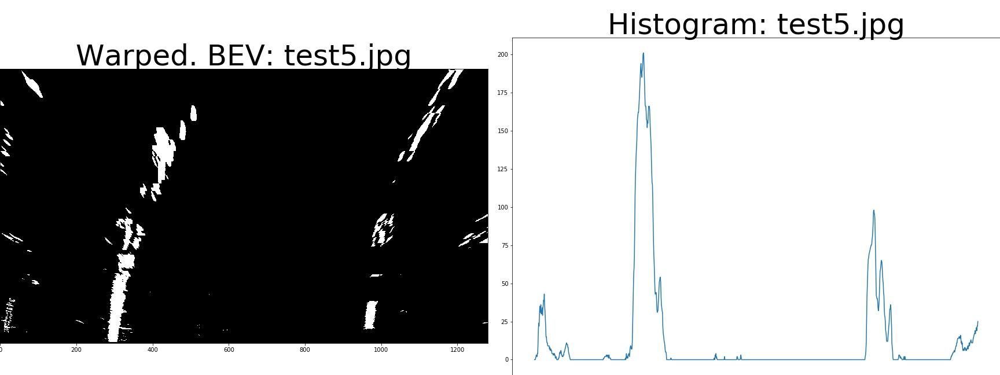

**Figure 11:** Histogram Peaks of Bird's Eye View Image

In **Figure 11**, on the left is the bird's eye view image and on the right is the histogram peaks, which indicate where the lane lines start.

### Explanation of Sliding Window Search

I chose n amount of windows to track curvature of a lane line. I found the boundaries of a window by taking the current window's starting point along with the window's width plus margin. In each window boundary, I found the activated nonzero pixels and appended each to their appropriate left lane and right lane line list. Once the number of pixels found in the current window boundary exceeded the minimum number of pixels needed to recenter the window, our window was re-centered based on the mean position of the current window boundary's pixels.

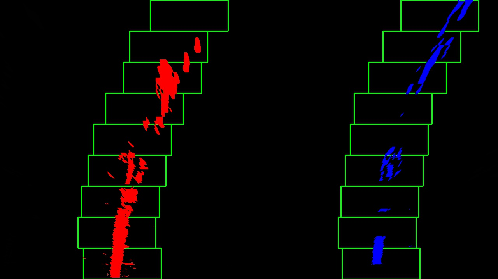

**Figure 12:** Sliding Windows Drawn on Bird's Eye View Image

In **Figure 12**, green sliding windows are drawn for the left and right lane lines from where they start to where they are going.

### Explanation of Fit Polynomial

`How did you fit their positions to a polynomial?`

After finding all pixels belonging to each line using the sliding window search method, I was able to fit a polynomial to all the relevant lane line pixels. I used numpy function **np.polyfit()** to fit second order polynomial to the lane line pixels.

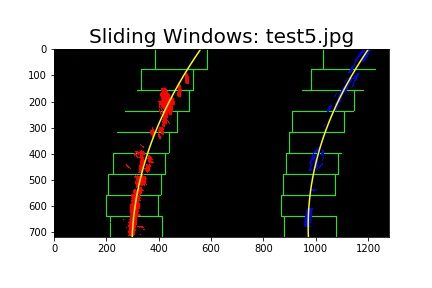

**Figure 13:** Fit Polynomial on Lane Lines

In **Figure 13**, a yellow polynomial is fitted to the left lane line and right lane line.

### Explanation of Search from Prior

**Search from prior** method is used when the lane line from frame to frame doesn't change a lot. The advantage is that the fit polynomial from the previous frame can be used instead of tracking the lane lines out into the distance. Furthermore, with this method, I am able to just search in a margin around the previous line position from the last frame. Therefore, I am able to track lanes through sharp curves and tricky conditions because I am using the equivalent of a customized region of interest. However, if I lost track of the lines, then I re-use sliding windows search to rediscover them.

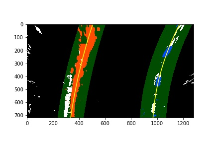

**Figure 14:** Search from Prior Polynomial drawn onto next Image

In **Figure 14**, a yellow fit polynomial for the left and right lane line from the previous frame is drawn on the current frame. The image shows the previous fit polynomial to lane line is slightly off compared to where the current lane line is going. However, for the current frame and the previous frame, the fit polynomial is close enough.

### Lane Curvature & Vehicle Position

### Radius of Lane Curvature

`How did you calculate radius of lane curvature?`

I calculated the [radius of lane curvature](https://www.intmath.com/applications-differentiation/8-radius-curvature.php) by substituting the first and second derivative from the second order polynomial into Rcurve equation. So, the simplified equation for radius of curvature that I used was:

~~~
Rcurve = ((1 + (2Ay + B)^2)^(3/2))/(|2A|)
~~~

The second order polynomial fit to the curved lane line(s):

~~~
f(y) = Ay^2 + By + C
~~~

The first and second derivatives derived from the polynomial equation above:

~~~
f'(y) = dx/dy = 2Ay + B

f''(y) = (d^2)x/d(y^2) = 2A
~~~

The original radius of curvature equation before simplification:

~~~
Rcurve = ([1 + (dx/dy)^2]^(3/2))/(|(d^2)x/d(y^2)|)
~~~

After computing the radius of lane curvature, I can convert pixel space to real world meters by measuring how long and wide the section of lane we're projecting in our warped image. However, Udacity already gives me the ratio conversion for lane width (3.7 meters/700 pixels) and lane height (30 meters/720 pixels). All the code used to calculate lane curvature can be found in my **[LaneLineCurvature](./lib/cv/LaneLineCurvature.py)** class.

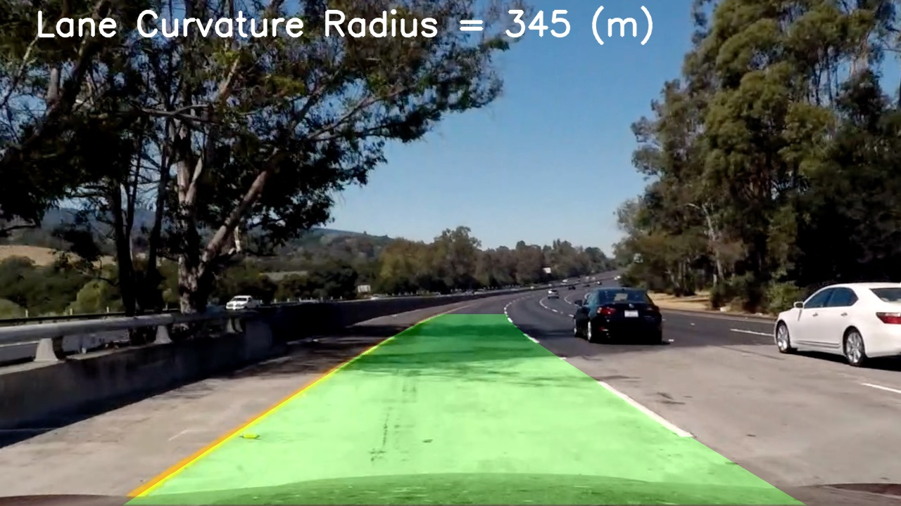

**Figure 15:** Radius of Lane Curvature drawn onto Image

In **Figure 15**, you can see the computation for average radius of lane curvature between the left and right lane line. I will discuss how I drew the lane boundaries soon.

### Angle of Lane Curvature

`How did you calculate angle of lane curvature?`

I calculated the angle of lane curvature by passing in the radius of lane curvature into my angle of lane curvature equation:

~~~
angle_curve = (100 meters/(2*pi*radius_curve meters))*360degrees
~~~

When we calculate degree of lane curvature, the arc length of the circle is typically 100 meters or 100 feet. The video source of how I learned to calculate angle of curvature is [Advanced Geomatics: Degree of Curvature](https://www.youtube.com/watch?v=vki6Jf1HPG4). All the code used to calculate lane curvature can be found in my **[LaneLineCurvature](./lib/cv/LaneLineCurvature.py)** class.

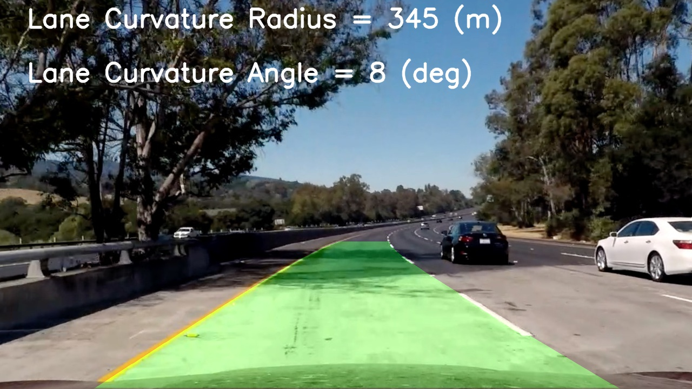

**Figure 16:** Angle of Lane Curvature drawn onto Image

### Vehicle Position with Respect to Center of Lane

`How did you calculate vehicle position with respect to center?`

I assumed the camera was mounted at the center of the car, so I can divide the image width by 2 to calculate vehicle position. To retrieve lane center position, I added the X intercept for the left and right lane line and then divided by 2. I calculated the vehicle position with respect to center of the lane by taking the difference between vehicle position and lane center position. If you want to look at the code, look at my **[LaneVehiclePosition](./lib/cv/LaneVehiclePosition.py)** class.

**Figure 17:** Vehicle Position with Respect to Center of Lane

In **Figure 17**, I pointed out that the vehicle is a certain number of meters left or right of center of the lane.

### Lane Boundary

`How did I plot the lane boundary back onto the road?`

In **Figure 15 - 17**, I showed images with the lane area identified clearly, but also with extra information, such as lane curvature and vehicle position with respect to center of the lane. Now I will discuss how I plotted the lane boundary between the left and right lane line. I took the pixel points for the left and right lane line and stacked them vertically. Then I stacked the left and right points horizontally. Finally, I used OpenCV function **cv2.fillPoly()** to fill the lane boundary area. Furthermore, I applied perspective transform unwarp to change the warped image back to its original image. All the code for filling the lane boundary area can be found in my **[LaneBoundaries](./lib/cv/LaneBoundaries.py)** class.

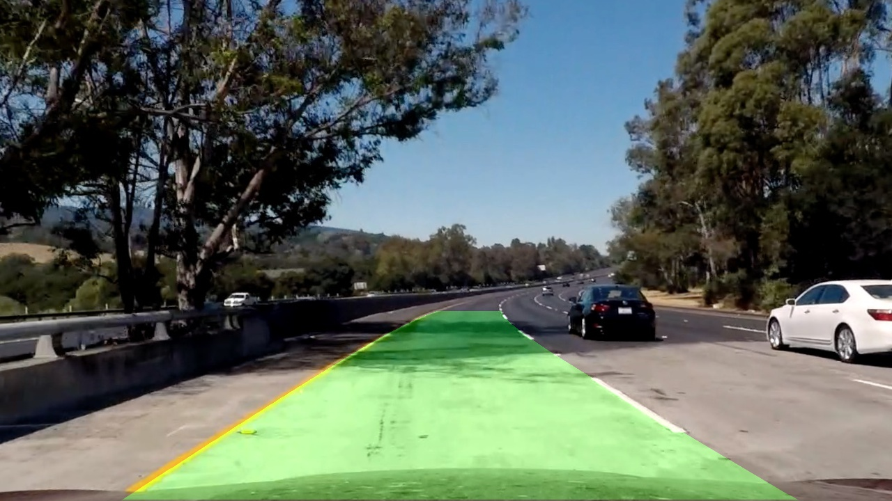

**Figure 18:** Lane boundary highlighted in green

In **Figure 18**, the lane boundary is highlighted in green.

**Figure 19:** Lane boundary, curvature and vehicle position

In **Figure 19**, the unwarped image contains the following information: lane boundary highlighted, radius of lane curvature, angle of lane curvature and vehicle position with respect to center of the lane. To add text to an image, I used **cv2.putText()**.

## Pipeline (video)

After verifying my image processing pipeline finds lane lines in all the test images, I tested it on the **project_video.mp4**. The output was a new video where the lanes are identified, radius of lane curvature and vehicle position within the lane were calculated in every frame. The result video is the pipeline correctly mapped out the curved lines and didn't fail when shadows or pavement color changes were present. The output video is available at hyperlink: **[Advanced Lane Finding Demo](https://www.youtube.com/watch?v=yI7NUSa4Sfo)**

## Discussion

`Any problems faced in your implementation of this project?`

Initially, I tested my implementation on lane image **test5.jpg** and verified it worked successfully meeting the criteria for image processing. However, when I tested my implementation on the **project_video.mp4**, my result failed to stay within highlighting only the lane boundary area. It also highlighted on the left outside the yellow lane. So, I needed to test my implementation on all test images. Eventually, I was able to produce the results needed by the criteria. Toward the end of the project, I was adjusting my color and gradient thresholding to create a final binary image because it majorly impacted the lane boundary being properly highlighted.

`Where will your pipeline likely fail?`

My pipeline occasionally produces the radius of lane curvature that is not similar to its counterpart curvature. However, I didn't notice this issue with angle of lane curvature per frame.

`What could you do to make it more robust?`

To make my implementation more robust, I can incorporate sanity check to check to make sure each lane line has similar curvature. I can also check to make sure the left and right lane are separated by approximating the right distance horizontally. Finally, I could also check that the lane lines are parallel to verify they are heading toward the same direction.

## References

- Udacity, Self-Driving Car, Lesson 7 - Camera Calibration
- Udacity, Self-Driving Car, Lesson 8 - Gradients and Color Spaces
- Udacity, Self-Driving Car, Lesson 9 - Advanced Computer Vision
- Udacity, Self-Driving Car, Project: Advanced Lane Finding
